## 基于Mesos+Docker的云计算环境的配置

## (ZooKeeper + MESOS + Marathon + Docker + Docker Regsitry + Registry web）

----------
 

# 0.	介绍
### 0.1 拓扑结构
DCOS是基于Mesos构建的一个基础数据平台。应用可以直接运行在Mesos上，也可以通过以Docker容器的形式运行。而Docker是运行在Mesos之上。
Mesos是一个分布式系统的管理软件，对集群的资源进行分配和管理。
Marathon 是Mesos的一个Framework，用来执行需要长时间运行的任务。可以类比为守护进程Daemon。它还具备HA，Health Checks，服务发现等功能。如果某个应用进程崩溃，Marathon会重新启动同样的进程在本机或集群的其他机器上。
ZooKeeper主要用来做集群的leader选举。他们的关系参照下图：
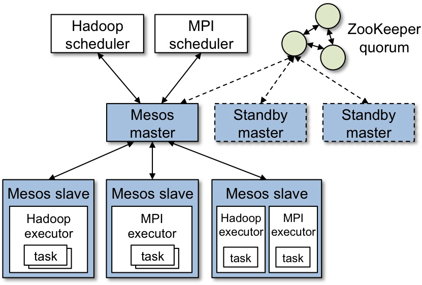
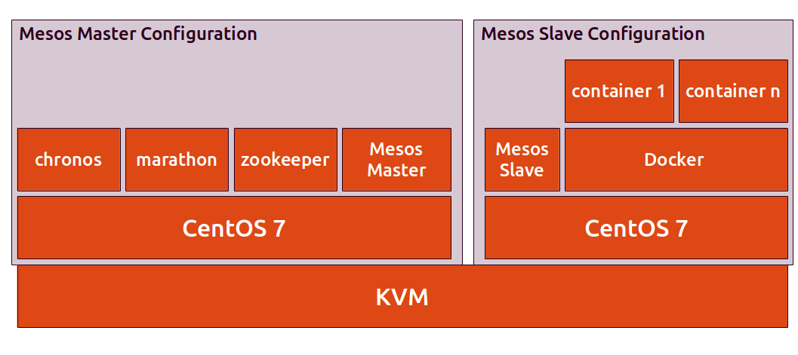

### 0.2 主机IP
    // on node 1
    [root@154]# ifconfig|grep "inet 10"|awk '{print $2}'
    10.142.233.154
    
    
    //one node 2
    [root@155]#  ifconfig|grep "inet 10"|awk '{print $2}'
    10.142.233.155
    
    // one node 3
    [root@156]#  ifconfig|grep "inet 10"|awk '{print $2}'
    10.142.233.156

### 0.3 软件版本
    // OS version
    [root@A5-302-NF8460M3-154 ~]# cat /etc/os-release    
    NAME="CentOS Linux"
    VERSION="7 (Core)"
    ID="centos"
    ID_LIKE="rhel fedora"
    VERSION_ID="7"
    PRETTY_NAME="CentOS Linux 7 (Core)"
    ANSI_COLOR="0;31"
    CPE_NAME="cpe:/o:centos:centos:7"
    HOME_URL="https://www.centos.org/"
    BUG_REPORT_URL="https://bugs.centos.org/"
    
    CENTOS_MANTISBT_PROJECT="CentOS-7"
    CENTOS_MANTISBT_PROJECT_VERSION="7"
    REDHAT_SUPPORT_PRODUCT="centos"
    REDHAT_SUPPORT_PRODUCT_VERSION="7"
    
    // mesos version
    [root@A5-302-NF8460M3-156 ~]# mesos-master --version
    mesos 0.28.0
    
    // zookeeper version
    [root@A5-302-NF8460M3-156 ~]# grep zookeeper.version= /usr/hdp/2.4.0.0-169/zookeeper/logs/zookeeper-root-server-A5-302-NF8460M3-156.log
    2016-08-03 16:01:08,225 [myid:3] - INFO  [QuorumPeer[myid=3]/0:0:0:0:0:0:0:0:2181:Environment@100] - Server environment:zookeeper.version=3.4.6-169--1, built on 02/10/2016 05:49 GMT
    
    // marathon version
    [root@A5-302-NF8460M3-156 logs]# grep "Starting Marathon" /var/log/mesos/marathon.log|head -1
    May 31 14:16:45 localhost marathon[6725]: [2016-05-31 14:16:45,254] INFO Starting Marathon 1.1.1 with --hostname 10.142.233.156 --zk 
    
    // docker version
    [root@A5-302-NF8460M3-156 logs]#  docker -v
    Docker version 1.11.1, build 5604cbe
        
    // docker repostory
    [root@dell ~]# docker ps|grep registry
    d8eaad9dd262        registry:2.3.0                       "/bin/registry /etc/d"   13 days ago         Up 6 days           0.0.0.0:8600->5000/tcp   registry
    

----------
 

# 1. zookeeper
### 1.1 安装以及Config zk IP list
这里面的zookeeper是利用已经存在于hadoop里面的zookeeper，所以没有单独安装。

    [root]# cat /etc/mesos/zk
    zk://10.142.233.154:2181,10.142.233.155:2181,10.142.233.156:2181/mesos

### 1.2 启动

    [root]#/usr/hdp/2.4.0.0-169/zookeeper/bin/zkServer.sh start/restart

log location:

    [root]#pwd
    /usr/hdp/2.4.0.0-169/zookeeper/logs

### 1.3 [注意] zookeeper无法启动

    [root]#/usr/hdp/2.4.0.0-169/zookeeper/bin/zkServer.sh start/restart

**一定要使用start/stop/restart, 如果强制杀死zookeeper，可能无法启动!** 
如果强制杀死，那么参考/usr/hdp/2.4.0.0-169/zookeeper/logs/下log提示, 修改/var/lib/zookeeper/myid.

----------

 
# 2. mesos-Master
### 2.1 安装
使用已经配置好的yum库进行安装

    [root]# yum list |grep mesos
    mesos.x86_64                            0.28.0-2.0.16.centos701406     @mesos  
    [root]# yum install mesos

### 2.2 配置
#### 2.2.1 配置node id
在三台机器上分别配置myid为1/2/3.

    // on node1
    [root]# cat /etc/zookeeper/conf/myid
    1
    
    // on node2
    [root]# cat /etc/zookeeper/conf/myid
    2
    
    // on node3
    [root]# cat /etc/zookeeper/conf/myid
    3

#### 2.2.2 修改/etc/zookeeper/conf/zoo.cfg，文件末尾添加三行如下

    [root]# tail -3 /etc/zookeeper/conf/zoo.cfg
    server.1=10.142.233.154:2888:3888
    server.2=10.142.233.155:2888:3888
    server.3=10.142.233.156:2888:3888

#### 2.2.3 设置 /etc/mesos-master/quorum 为 2. (**master节点数除以2加1**)

    [root]# cat /etc/ mesos-master/quorum
    2

#### 2.2.4 在每个节点上设置自己的ip以及hostname,这里hostname使用ip替代。

    [root]#echo 10.142.233.155| sudo tee /etc/mesos-master/ip 
    [root]#cp  /etc/mesos-master/ip   /etc/mesos-master/hostname

#### 2.2.5 修改mesos-master 的默认端口，从而让外部网页可以访问。目前生产环境的开放端口是8000-9100范围。

    /etc/default/mesos-master
    [root]# cat /etc/default/mesos-master
    PORT=8150
    ZK=`cat /etc/mesos/zk`

#### 2.2.6 启动

    [root]#service mesos-master start (/restart/stop)

#### 2.2.7 log
log路径位于/var/log/mesos/mesos-master.INFO.
mesos-master.INFO/ERROR是一个链接，它指向实际的当前运行的mesos-master进程号的文件。

    [root]# ls -l mesos-master.INFO 
    lrwxrwxrwx 1 root root 77 May 31 14:12 mesos-master.INFO -> mesos-master.A5-302-NF8460M3-154.invalid-user.log.INFO.20160531-141238.101776
    
但是这个有一点不好，就是每次启动，都会起来一个新的log文件，mesos-master.INFO链接上以后，如果使用tail -f来观看更新有时候不会更新。所以可以使用syslog服务，将所有的log归集到一个文件。修改/etc/rsyslog.d/mesos.conf文件，然后重新启动syslog就可以了。

    [root]# cat /etc/rsyslog.d/mesos.conf 
    if $programname == 'marathon' then {
       action(type="omfile" file="/var/log/mesos/marathon.log")
    }
    
    if $programname == 'chronos' then {
       action(type="omfile" file="/var/log/mesos/chronos.log")
    }
    
    if $programname == 'mesos-master' then {
       action(type="omfile" file="/var/log/mesos/mesos-master.log")
    }
    
    if $programname == 'mesos-slave' then {
       action(type="omfile" file="/var/log/mesos/mesos-slave.log")
    }
    
    [root]# service  rsyslog restart
    Redirecting to /bin/systemctl restart  rsyslog.service

然后就可以在指定的目录看到有新产生的log.

    [root]# ls -l *.log
    -rw------- 1 root root 119658177 Jun  7 09:26 marathon.log
    -rw------- 1 root root  22053297 Jun  7 09:28 mesos-master.log
    -rw------- 1 root root   5729998 Jun  7 09:29 mesos-slave.log

检查是否正常

如果zookeeper正常启动以后，mesos-master正常启动并注册到zookeeper以后，mesos-master会进行选举master的过程，然后进入正常的更换信息的状态。这个时候检查mesos-master.INFO以及mesos-master.log里面的信息，如果有问题，查看mesos-master.WARNING以及mesos-master.ERROR文件。

     master.cpp:1650] Successfully attached file '/var/log/mesos/mesos-master.INFO'
     contender.cpp:147] Joining the ZK group
     detector.cpp:152] Detected a new leader: (id='35')
     group.cpp:700] Trying to get '/mesos/log_replicas/0000000031' in ZooKeeper
     group.cpp:700] Trying to get '/mesos/json.info_0000000035' in ZooKeeper
     contender.cpp:263] New candidate (id='38') has entered the contest for leadership
     detector.cpp:479] A new leading master (UPID=master@10.142.233.155:8150) is detected
     group.cpp:700] Trying to get '/mesos/log_replicas/0000000032' in ZooKeeper
     master.cpp:1711] The newly elected leader is master@10.142.233.155:8150 with id 4c57ed91-e91c-4187-ae82-95bb56ce8c5d
     network.hpp:461] ZooKeeper group PIDs: { log-replica(1)@10.142.233.154:8150, log-replica(1)@10.142.233.155:8150, log-replica(1)@10.142.233
    .156:8150 }
     network.hpp:413] ZooKeeper group memberships changed
     group.cpp:700] Trying to get '/mesos/log_replicas/0000000030' in ZooKeeper
     group.cpp:700] Trying to get '/mesos/log_replicas/0000000031' in ZooKeeper
     group.cpp:700] Trying to get '/mesos/log_replicas/0000000032' in ZooKeeper
     group.cpp:700] Trying to get '/mesos/log_replicas/0000000033' in ZooKeeper
     network.hpp:461] ZooKeeper group PIDs: { log-replica(1)@10.142.233.154:8150, log-replica(1)@10.142.233.155:8150, log-replica(1)@10.142.233
    .156:8150 }

### 2.3 检查web端
检查master已经选举出来。
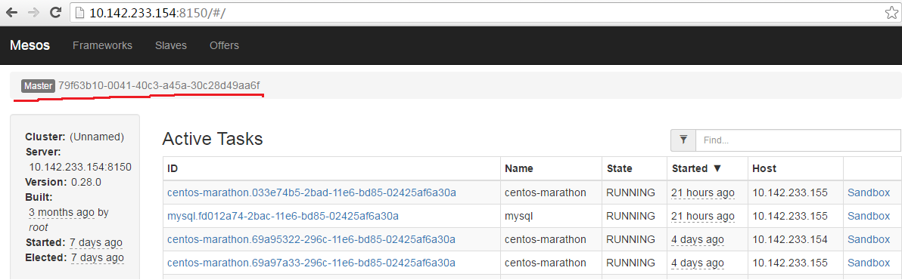

----------

 
# 3. mesos-slave
### 3.1 安装
安装mesos包含mesos-master, mesos-slave两部分。略。

### 3.2 配置
Config ip/hostname

    [root]#echo  10.142.233.156 |sudo tee /etc/mesos-slave/ip 
    [root]#cp  /etc/mesos-slave/ip   /etc/mesos-slave/hostname
    [root]# service mesos-slave start (/restart/stop)

log:
/var/log/mesos/mesos-slave.INFO
mesos-slave.INFO/ERROR是一个链接，它指向实际的当前运行的进程号的文件。

检查log，确保slave注册上master.

    slave.cpp:796] New master detected at master@10.142.233.154:8150
    slave.cpp:821] No credentials provided. Attempting to register without authentication
    slave.cpp:832] Detecting new master
    slave.cpp:971] Registered with master master@10.142.233.154:8150; given slave ID 79f63b10-0041-40c3-a45a-30c28d49aa6f-S4
    status_update_manager.cpp:181] Resuming sending status updates
    slave.cpp:1030] Forwarding total oversubscribed resources

### 3.3 端口资源
运行在mesos-slave之上的executor的端口是根据mesos-slave的port resource来进行分配的，由于默认的是31000开始的端口，在生产环境不能被外部访问，所以需要修改端口范围，从而让运行在mesos-slave上的程序的端口限定在8000-9100之内。为了保留一部分供mesos, marathon用，所以可供分配的端口从8400开始。

    [root]#echo "ports:[8400-9100]"> /etc/mesos-slave/resources
    [root]#cat /etc/mesos-slave/resources
    ports:[8400-9100]

修改完毕后要重新启动mesos-slave。

    [root]# service mesos-slave start (/restart/stop)

### 3.4 检查web端
打开http://10.142.233.154:8150/，点击slaves
 
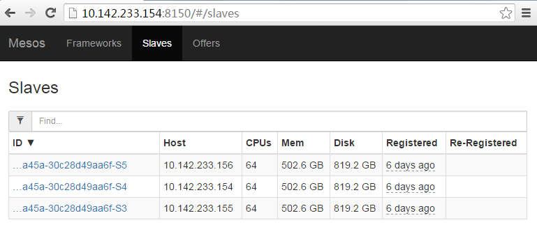

----------

 
# 4. Marathon
Marathon 是Mesos的一个Framework，用来执行需要长时间运行的任务。如果把Mesos比喻成Kernel的话，那么Marathon就是它的守护进程Daemon。它还具备HA，Health Checks，服务发现等功能。如果某个Docker进程崩溃，Marathon会重新启动同样的进程。

通过Marathon进行发布，执行应用程序可以保证在某个节点出现故障的时候，Marathon自动可以将任务迁移到其他正常运行的节点，从而保证可用性，免去人工维护任务。

### 4.1 安装
由于生产环境没有相应的安装包，我们只能从可以上网的centos上进行下载。

    [root@vm]#  yum install marathon --downloadonly

然后将对应的rpm包上传到生产环境的机器上进行安装。

    [root]# rpm -ivh marathon-1.1.1-1.0.472.el7.x86_64.rpm

### 4.2 配置

    [root]#mkdir -p /etc/marathon/conf
    [root]#cp /etc/mesos/zk /etc/marathon/conf/master
    [root]#cp /etc/marathon/conf/master /etc/marathon/conf/zk
    [root]#sed -i 's/mesos/marathon/g' /etc/marathon/conf/zk
    [root]#cat /etc/marathon/conf/zk
    zk://10.142.233.154:2181,10.142.233.155:2181,10.142.233.156:2181/marathon
    [root]#cp /etc/mesos-master/hostname /etc/marathon/conf

### 4.3 运行任务
将

    while true; do ( echo "HTTP/1.0 200 Ok"; echo; echo "Hello World" ) | nc -l $PORT; done

填入command里面。点击Create Application.
 
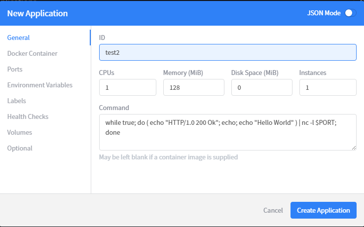
 
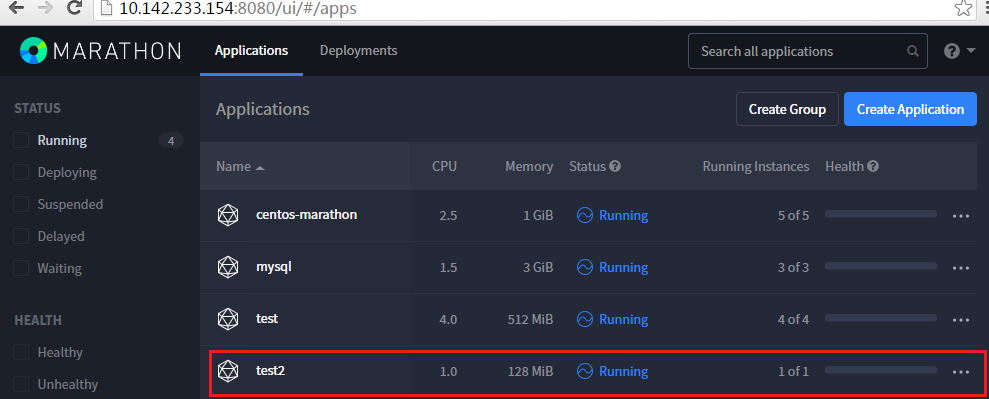
 
点击test2以后，可以看到对应起来的主机和对应的端口：
 
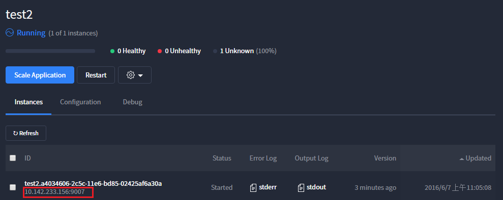
 
在主机上直接请求对应的IP和端口，可以看到有正常的相应，表明marathon已经正确的将任务分发下去。

    [root]# curl 10.142.233.156:9007
    Hello World

 
Marathon可以启动多个实例，只需要点击Scale Application，填上对应的实例的个数就可以了。
 
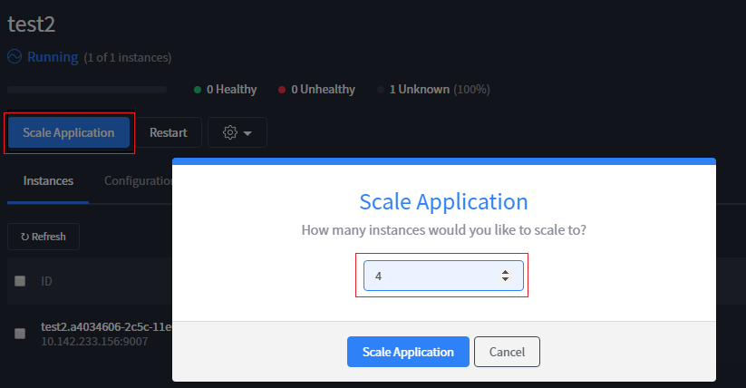
 
可以看到四个实例已经运行在三台机器上了。其中156的机器运行了两个实例。
 
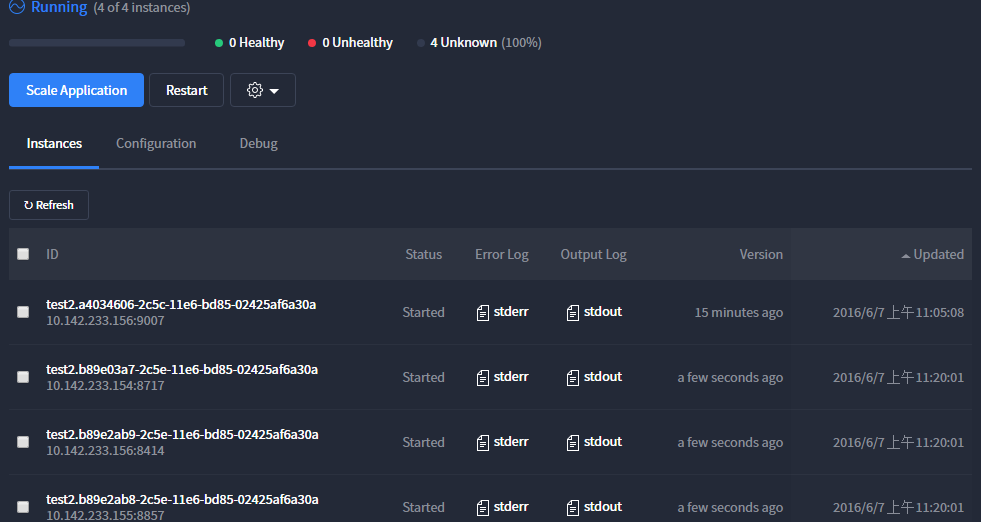

----------
 

# 5. Docker
### 5.1 安装

    [root]# yum install docker-engine.x86_64

### 5.2 配置
docker的配置目前暂时不需要额外配置。使用默认的就可以了。

    [root]# cat /usr/lib/systemd/system/docker.service 
    [Unit]
    Description=Docker Application Container Engine
    Documentation=https://docs.docker.com
    After=network.target docker.socket
    Requires=docker.socket
    
    [Service]
    Type=notify
    # the default is not to use systemd for cgroups because the delegate issues still
    # exists and systemd currently does not support the cgroup feature set required
    # for containers run by docker
    ExecStart=/usr/bin/docker daemon -H fd://
    MountFlags=slave
    LimitNOFILE=1048576
    LimitNPROC=1048576
    LimitCORE=infinity
    TimeoutStartSec=0
    # set delegate yes so that systemd does not reset the cgroups of docker containers
    Delegate=yes
    
    [Install]
    WantedBy=multi-user.target

### 5.3 通过marathon启动docker

由于生产环境里面没有相应的image，所以我们先通过可以上外网的虚拟机去下载一些通用的docker image，然后保存下来，再上传到生产环境的机器。

    [root@vm]docker pull centos:latest
    [root@vm]docker save centos:latest > /tmp/centos.tar

然后上传到生产环境机器

    [root]docker load < /tmp/centos.tar
    [root]# docker images 
    centos     latest              8596123a638e        2 weeks ago         196.7 MB

创建marathon_test.json文件

    [root]# cat marathon-test.json 
    {
      "container": {
        "type": "DOCKER",
        "docker": {
        "image": "centos"
        }
      },
      "id": "centos-marathon",
      "instances": 3,
      "cpus": 0.5,
      "mem": 256,
      "uris": [],
      "cmd": "while sleep 10; do date -u +%T; done"
    }

创建marathon任务

    [root]#curl -X POST -H "Content-Type: application/json" http://10.142.233.154:8080/v2/apps -d@marathon-test.json
    
    [root]# docker ps 
    3fcc29f52928        centos    "/bin/sh -c 'while sl"   3 days ago          Up 3 days                                    mesos-79f63b10-0041-40c3-a45a-30c28d49aa6f-S4.fdafe28e-ed6d-4bd6-bd8a-53a4e7235f04
 
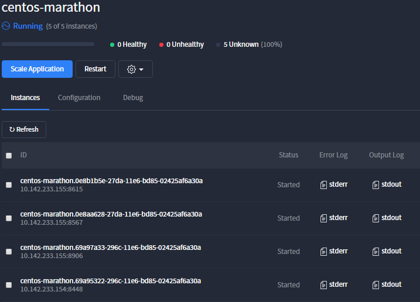
 
可以看到对应的marathon页面上对应的configuration的内容就是marathon_test.json的内容。
 
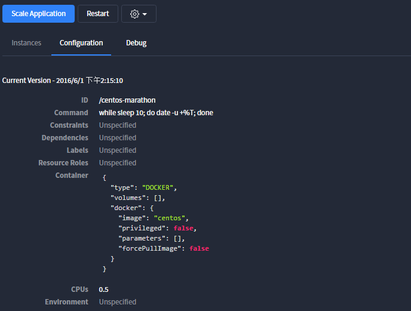
 
检查是否打印出log.

    [root]#docker logs 3fcc29f52928        
    07:32:16
    07:32:26
    07:32:36
    07:32:46
    07:32:56
    07:33:06
    07:33:16
    07:33:26
    07:33:36
    07:33:46
    07:33:56
    07:34:06

至此，marathon已经正确的将centos容器启动起来。

----------
 

# 6. docker 上运行mysql
### 6.1 安装
依然是可以上网的虚拟机上下载mysql image, 然后保存再上传到生产环境。

        [root@vm]docker pull mysql:latest
        [root@vm]docker save mysql:latest>/tmp/mysql.tar
    
在生产环境上
    
        [root]#docker load < /tmp/mysql.tar
    
### 6.2 配置
创建mysql 配置文件。

    [root]# cat mysql.json 
    {
      "id": "mysql",
      "cpus": 0.5,
      "mem": 1024.0,
      "instances": 1,
      "container": {
        "type": "DOCKER",
        "docker": {
          "image": "mysql",
          "network": "BRIDGE",
          "portMappings": [
            { "containerPort": 3306, "hostPort": 0, "servicePort": 0, "protocol": "tcp" }
          ]
        }
      },
      "env": { 
         "MYSQL_ROOT_PASSWORD" : "password",
         "MYSQL_USER" : "test",
         "MYSQL_PASSWORD" : "test", 
         "MYSQL_DB" : "BucketList"
       }
    }
    
    [root]#curl -X POST -H "Content-Type: application/json" http://10.142.233.154:8080/v2/apps -d@mysql.json

### 6.3 注意配置
**内存一定要调大，如果设置成128，那么启动不起来。
端口设置成0, 自动分配，如果指定，可能失败，因为有一个范围。不要指定，因为如果要是在一个机器上起多个mysql docker容器，那么本地端口写死的话，就不能分配多个了。**

### 6.4 检查运行(命令行和客户端)

    [root]#docker ps
    771b0ba79c3d  mysql docker-entrypoint.sh"   About a minute ago  Up About a minute   0.0.0.0:8290->3306/tcp   mesos-5d79c62d-6d0c-49c0-a4d9-56b0f

#### 6.4.1 命令行

    [root]#  mysql -h 10.142.233.155 -P8920 -uroot -ppassword
    MySQL [(none)]> show databases;
    +--------------------+
    | Database           |
    +--------------------+
    | information_schema |
    | mysql              |
    | performance_schema |
    | sys                |
    +--------------------+
    4 rows in set (0.00 sec)
    MySQL [(none)]> use mysql
    Database changed
    MySQL [mysql]> show tables;
    +---------------------------+
    | Tables_in_mysql           |
    +---------------------------+
    | columns_priv              |
    | help_relation             |
    | help_topic                |
    | innodb_index_stats        |
    | innodb_table_stats        |
    | ndb_binlog_index          |
    | plugin                    |
    | proc                      |
    | time_zone_transition_type |
    | user                      |
    +---------------------------+
    31 rows in set (0.01 sec)
    
    MySQL [mysql]>

#### 6.4.2 外部客户端

使用mysql 客户端navicat连接到docker上面的mysql. 在三台主机上，先看一下marathon上mysql运行在哪一台主机上(10.142.233.154/10.142.233.155/10.142.233.156). 再注意一下端口一定要和docker ps里面显示的端口相同。
 
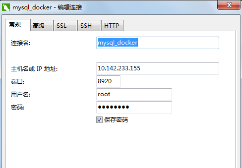
 
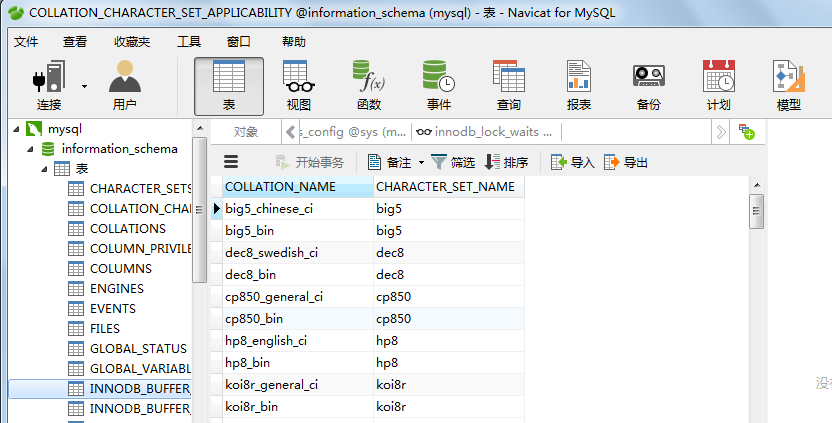
 

----------
 

# 7. 安装docker 私有镜像库

### 7.1下载
在可以联网的虚拟机上下载registry镜像并导出。

    [root@vm]#docker pull registry:2.3.0
    [root@vm]#docker save registry:latest>/tmp/registry.tar

上传到生产环境并导入

    [root]#docker load < /tmp/registry.tar

### 7.2 修改docker 配置
暂时去掉ssh验证
将/usr/lib/systemd/system/docker.service

    ExecStart=/usr/bin/docker daemon -H fd://  

替换为

    ExecStart=/usr/bin/docker daemon -H fd://  --insecure-registry 10.142.233.154:8600

ip地址是本机准备要启动的主机的ip以及映射registry服务的本地端口，供外部访问使用

    [root]# cat /usr/lib/systemd/system/docker.service
    [Unit]
    Description=Docker Application Container Engine
    Documentation=https://docs.docker.com
    After=network.target docker.socket
    Requires=docker.socket
    
    [Service]
    Type=notify
    # the default is not to use systemd for cgroups because the delegate issues still
    # exists and systemd currently does not support the cgroup feature set required
    # for containers run by docker
    ExecStart=/usr/bin/docker daemon -H fd://  --insecure-registry 10.142.233.154:8600
    MountFlags=slave
    LimitNOFILE=1048576
    LimitNPROC=1048576
    LimitCORE=infinity
    TimeoutStartSec=0
    # set delegate yes so that systemd does not reset the cgroups of docker containers
    Delegate=yes
    
    [Install]
    WantedBy=multi-user.target

重新启动docker

    [root]# systemctl daemon-reload
    [root]# service  docker restart
    Redirecting to /bin/systemctl restart  docker.service

### 7.3 启动 registry
/opt/registry是保存的本地镜像路径，防止container挂掉后，不能再服务了

    [root]#docker run -d -v /opt/registry:/var/lib/registry -p 8600:5000 --restart=always --name registry registry:2.3.0

    [root]#docker run -d  -e REGISTRY_STORAGE_DELETE_ENABLED=true -v /opt/registry:/var/lib/registry -p 8600:5000 --restart=always --name registry registry:2.3.0

### 7.4 检查运行
#### 1. 使用docker ps以及docker logs container_id检查一下是否正常起来

    [root]# docker ps
    CONTAINER ID        IMAGE               COMMAND                  CREATED              STATUS              PORTS                    NAMES
    b7607db5d7e6        registry:latest     "docker-registry"        About a minute ago   Up About a minute   0.0.0.0:8600->5000/tcp   registry

#### 2. 查看registry log

    [root]#  docker logs registry
    [2016-06-03 09:12:49 +0000] [1] [INFO] Starting gunicorn 19.1.1
    [2016-06-03 09:12:49 +0000] [1] [INFO] Listening at: http://0.0.0.0:5000 (1)
    [2016-06-03 09:12:49 +0000] [1] [INFO] Using worker: gevent
    [2016-06-03 09:12:49 +0000] [13] [INFO] Booting worker with pid: 13
    [2016-06-03 09:12:50 +0000] [14] [INFO] Booting worker with pid: 14
    [2016-06-03 09:12:50 +0000] [17] [INFO] Booting worker with pid: 17
    [2016-06-03 09:12:50 +0000] [20] [INFO] Booting worker with pid: 20
    03/Jun/2016:09:12:50 +0000 WARNING: Cache storage disabled!
    03/Jun/2016:09:12:50 +0000 WARNING: LRU cache disabled!
    03/Jun/2016:09:12:50 +0000 DEBUG: Will return docker-registry.drivers.file.Storage
    03/Jun/2016:09:12:50 +0000 WARNING: Cache storage disabled!
    03/Jun/2016:09:12:50 +0000 WARNING: LRU cache disabled!
    03/Jun/2016:09:12:50 +0000 DEBUG: Will return docker-registry.drivers.file.Storage
    03/Jun/2016:09:12:50 +0000 WARNING: Cache storage disabled!
    03/Jun/2016:09:12:50 +0000 WARNING: LRU cache disabled!
    03/Jun/2016:09:12:50 +0000 DEBUG: Will return docker-registry.drivers.file.Storage
    03/Jun/2016:09:12:50 +0000 WARNING: Another process is creating the search database
    03/Jun/2016:09:12:50 +0000 WARNING: Cache storage disabled!
    03/Jun/2016:09:12:50 +0000 WARNING: LRU cache disabled!
    03/Jun/2016:09:12:50 +0000 DEBUG: Will return docker-registry.drivers.file.Storage

#### 3. 浏览器查看一下
 
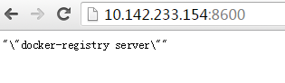
 
#### 4. 创建一个复制的image tag

    [root]# docker images
    REPOSITORY   TAG     IMAGE ID            CREATED             SIZE
    mysql        latest  e583afc2f0e4        2 weeks ago         378.4 MB
    centos       latest  8596123a638e        2 weeks ago         196.7 MB
    ubuntu       latest  c5f1cf30c96b        4 weeks ago         120.7 MB
    registry     latest  bca04f698ba8        4 months ago        422.8 MB
    
    
    [root]# docker tag ubuntu 10.142.233.154:8600/ubuntu:latest
    [root]# docker images
    REPOSITORY                   TAG      IMAGE ID            CREATED             SIZE
    mysql                        latest   e583afc2f0e4        2 weeks ago         378.4 MB
    centos                       latest   8596123a638e        2 weeks ago         196.7 MB
    10.142.233.154:8600/ubuntu   latest   c5f1cf30c96b        4 weeks ago         120.7 MB
    ubuntu                       latest   c5f1cf30c96b        4 weeks ago         120.7 MB
    registry                     latest   bca04f698ba8        4 months ago        422.8 MB

#### 5. 上传和拉取镜像

    [root]# docker push 10.142.233.154:8600/ubuntu
    The push refers to a repository [10.142.233.154:8600/ubuntu]
    5f70bf18a086: Pushed 
    a3b5c80a4eba: Pushed 
    7f18b442972b: Pushed 
    3ce512daaf78: Pushed 
    7aae4540b42d: Pushed 
    latest: digest: sha256:a3e2be57e15d632767d0d3544e09772b0bd068ec5fc562860aa54d0209ded043 size: 1356
    [root]# docker rmi 10.142.233.154:8600/ubuntu
    Untagged: 10.142.233.154:8600/ubuntu:latest
    Deleted: sha256:07e9d25d3095859ebdd2f34fb6c6db0d44121c3062ec1a76f44122c25455360f
    Deleted: sha256:6966dfd905fe3357994340c67347285cfce8a1791fc22806c9c0f427fbdeec40
    Deleted: sha256:65faf101139189314da25357e4704f3412877d4b881d86944e9616630f2a4faa
    Deleted: sha256:713a70d252b71a53cf3d090acef5c1bae668cb489f5d8b1205f2cb9e0a6cd68a
    Deleted: sha256:3417308f5ad0aa1dd0af30817cd1bdedeb11971023a8f54668b17a29078ced1c
    Deleted: sha256:7aae4540b42d10456f8fdc316317b7e0cf3194ba743d69f82e1e8b10198be63c
    [root]# docker pull 10.142.233.154:8600/ubuntu
    Using default tag: latest
    latest: Pulling from ubuntu
    6d28225f8d96: Pull complete 
    166102ec41af: Pull complete 
    d09bfba2bd6a: Pull complete 
    c80dad39a6c0: Pull complete 
    a3ed95caeb02: Pull complete 
    Digest: sha256:a3e2be57e15d632767d0d3544e09772b0bd068ec5fc562860aa54d0209ded043
    Status: Downloaded newer image for 10.142.233.154:8600/ubuntu:latest

#### 6. 挂载在本地目录，检查是否有数据。
由于挂载在本地目录，所以即使docker重启也没关系。否则上传的数据重启后就会丢失。

    [root]# pwd
    /opt/registry/docker/registry/v2/repositories
    
    [root]# ls
    registry  ubuntu

在另外一台机器上拉

    [root@another_node]# docker pull 10.142.233.154:8600/registry:2.3.0
    2.3.0: Pulling from registry
    fdd5d7827f33: Pull complete 
    a3ed95caeb02: Pull complete 
    a79b4a92697e: Pull complete 
    1881c09fc734: Pull complete 
    0f24f5ab4e03: Pull complete 
    Digest: sha256:654c0e82dde7318a6ae845e24859125e012d1a27c3c2b0a102dc1a1211183e5d
    Status: Downloaded newer image for 10.142.233.154:8600/registry:2.3.0

### 7.5 注意
#### 7.5.1 如果上传失败，那么就是安全选项没有配置正确

    [root@dell ~]# docker push 10.142.233.154:8600/ubuntu 
    The push refers to a repository [10.142.233.154:8600/ubuntu]
    Get https:// 10.142.233.154:8600/v1/_ping: tls: oversized record received with length 20527

注意检查 /usr/lib/systemd/system/docker.service里面的 --insecure-registry 10.142.233.154:8600 一定registry的ip与端口.

    [root]# docker ps|grep 8600
    10a3cb579772  registry:2.3.0    "/bin/registry /etc/d" 0.0.0.0:8600->5000/tcp   registry

#### 7.5.2 REGISTRY_STORAGE_DELETE_ENABLED标识
**如果希望接受外部REST删除命令，就必须将REGISTRY_STORAGE_DELETE_ENABLED设置为true.因为默认的是false. 否则就会给REST 服务返回405 not allowed .**

    [root@dell ~]# curl -I -X DELETE http://10.19.156.109:8600/v2/mysql/manifests/sha256:a9ee78d5cc797fd76826c9a70720196cacfb0c79bbc50750e0a4fa134c16a79b
    HTTP/1.1 405 Method Not Allowed
    Content-Type: application/json; charset=utf-8
    Docker-Distribution-Api-Version: registry/2.0
    X-Content-Type-Options: nosniff
    Date: Thu, 21 Jul 2016 07:48:40 GMT
    Content-Length: 78

设置REGISTRY_STORAGE_DELETE_ENABLED设置为true之后，

    [root@dell ~]# curl -I -X DELETE http://10.19.156.109:8600/v2/mysql/manifests/sha256:a9ee78d5cc797fd76826c9a70720196cacfb0c79bbc50750e0a4fa134c16a79b
    HTTP/1.1 202 Accepted
    Docker-Distribution-Api-Version: registry/2.0
    X-Content-Type-Options: nosniff
    Date: Thu, 21 Jul 2016 08:05:51 GMT
    Content-Length: 0
    Content-Type: text/plain; charset=utf-8
    
    [root@dell ~]#

#### 7.5.3 注意v1/v2区别
注意registry版本区别，不要太旧
注意加上insecure-registr local_ip:port， 否则过不了。每一台机器都需要。

#### 7.5.4 删除镜像的磁盘回收
2.4版本之前，如果删除，仅仅是元数据删除，而镜像所占空间没有去除，所以2.4引入了
registry garbage-collect config.yml来进行回收没有元数据指向的那部分镜像空间。
http://www.tuicool.com/articles/y26nyar

----------
 

# 8. 私有镜像库的web页面
### 8.1 安装

    [root]# docker pull hyper/docker-registry-web
    Using default tag: latest
    latest: Pulling from hyper/docker-registry-web
    943c334059c7: Pull complete 
    a1acf99303d2: Pull complete 
    27616aacb7b3: Pull complete 
    35d12cd1c9fc: Pull complete 
    a3ed95caeb02: Pull complete 
    212aee3573fd: Pull complete 
    f2c95e68dde6: Pull complete 
    441f6d433e4b: Pull complete 
    e7d09bc15558: Pull complete 
    3a824644e271: Pull complete 
    66d1a76cee85: Pull complete 
    7963f7806d1b: Pull complete 
    7be626b28f76: Pull complete 
    45d765157342: Pull complete 
    8f22082c90e0: Pull complete 
    9062b3aba0ce: Pull complete 
    4c8524be8167: Pull complete 
    edac7317d12d: Pull complete 
    Digest: sha256:d004e75bd1fc063717872abf7ba1510bea85ce24e8d347f9f6f37a52da798adf
    Status: Downloaded newer image for hyper/docker-registry-web:latest

有时候docker hub会非常慢，多试几次，可能会找到比较快的镜像。
由于hyper/ docker-registry-web官方版的，所以在国内的docker镜像上（如下）是找不到对应的

    docker.cn/docker/mysql
    docker pull dl.dockerpool.com:5000

在联网的虚拟机上把pull下来的image保存下来

    [root]#docker save hyper/docker-registry-web:latest > /tmp/hyper_registry_web.tar

然后上传到生产环境机器

    [root]#docker load < /tmp/hyper_registry_web.tar
    [root]#docker images |grep hyper
    hyper/docker-registry-web   latest     c35e7a257d1a      6 weeks ago         554.4 MB

此外还可以通过Dockfile自行编译

    [root]# pwd
    /tmp/docker-registry-web-master
    [root]# ls
    application.properties  docker-compose.yml  Dockerfile  grails-app  grailsw  LICENSE  README.md  src  test  tomcat  web-app  wrapper
    [root]# docker build -t docker-registry-web .

### 8.2 运行

    [root]#docker run -d -p 8400:8080 -e REGISTRY_HOST=10.142.233.154 -e REGISTRY_PORT=8600 hyper/docker-registry-web
 
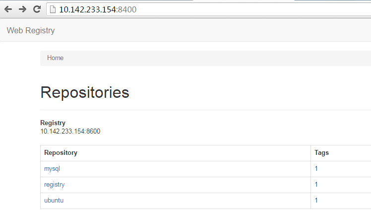

### 8.3 注意

#### 8.3.1  镜像的选择
有另外一个registry web叫 atcol/docker-registry-ui， 这个仅支持registry v1版本，不支持registry v2版本，目前还没有看出更新的计划，除非确认registry使用的是v1版，否则不要使用该app.
 
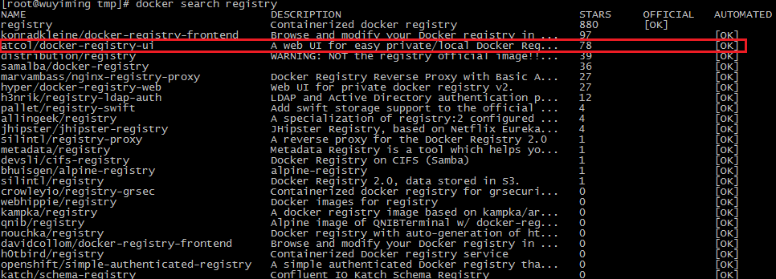

#### 8.3.2 问题定位
如果发现有不能连通或者不能正常工作的问题，请查询对应的registry以及registry web的log
 
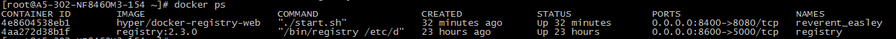
并查询对应的容器里面的log
 
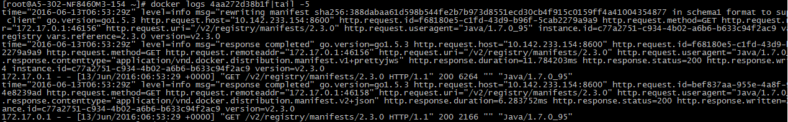
并参考registry HTTP API V2的接口定义来发现问题所在。
https://docs.docker.com/registry/spec/api/

#### 8.3.3 待增强的功能
目前的registry web 页面比较简陋，缺少查找，删除某一层，更新等功能，这个可以是将来可以优化增强的地方。

#### 8.3.4 端口

在启动registry web UI的时候指定的REGISTRY_PORT要和registry启动的时候的外部port要匹配。

    [root]#docker run -d -p 8400:8080 -e REGISTRY_HOST=10.142.233.154 -e REGISTRY_PORT=8600 hyper/docker-registry-web
