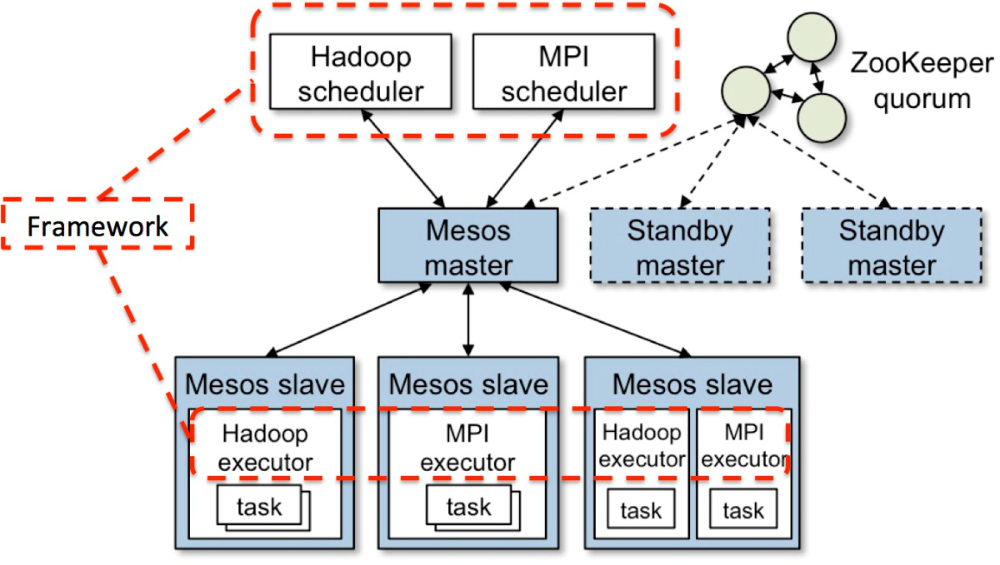
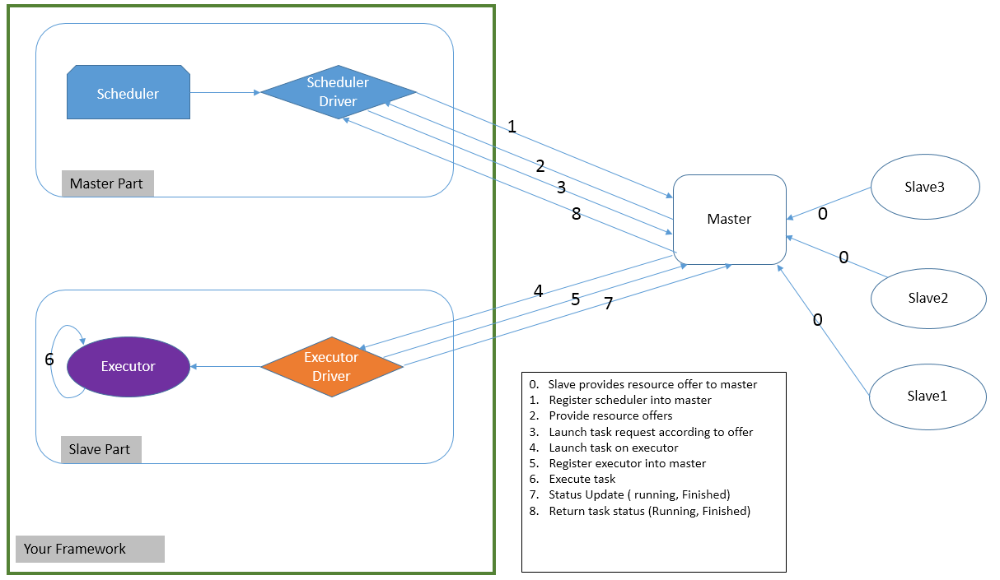

# Mesos自定义框架

----------

# 1.	背景
## 1.1	为什么需要Mesos?

 - 每个框架各自为战，各自管理，混乱
 - 让各个框架共享数据不现实，不好协调
 - 一个集群运行多个框架，要么是静态分区，要么是虚拟机。
 - 细粒度的一个集群调度器

## 1.2	它是什么样子的？
几个概念:  
1. Framework: 运行在Mesos上的一个个的应用，比如Spark, Hadoop, MPI等。Framework由Scheduler和Executor构成。  
2. Scheduler: 运行在Master上，负责调度执行任务。  
3. Executor:  运行在Slave上，负责具体的任务的执行。  
4. Master: 负责收集运行资源，选举主Master节点，应用中的Scheduler与Executor之间通信的媒介等。由于选取的需要，Master节点必须为奇数个。  
5. Slave: 实际运行任务的节点，上面跑的各种应用Executor.  

## 1.3 Resouce offer概念
Mesos是统一管理资源分配的基础平台，所以它将所有可用的资源统称为**Resource Offer**， Mesos Master负责收集所有slave上可用的资源，并将这些资源以offer的形式提供给待运行的框架中的Scheduler,而后，由具体框架的Scheduler来决定是否接受master发送过来的Offer，如果接受，Scheduler就会调用对应的Slave上的executor来执行具体的任务(task).  
Resource Offer的示意图如下:  
1. Agent1 (Slave1) 上报给Mesos Master，说Resource Offer有<S1, 4CPU, 4GB, ....>.   
2. 然后Master就将该消息更新给待运行的framework1.   
3. Framework1告诉Master它将使用其中的部分资源执行两个任务 <task1, s1, 2cpu, 1gb....>以及 <task2, s1, 1cpu, 2gb....>.  
4. Master通知该framework在slave上的executor去执行task1, task2.  
5. Master可以将剩下的资源<s1, 1cpu, 1gb....>更新给其他的节点使用.  
**这里的master根据不同的策略来将可用资源分配给各个Scheduler，这些分配策略可以有多种，并且可以自定义添加**.
  

 
----------

# 2.	实现
## 2.1	为什么需要自己定义框架？
 - 已有的框架不能满足需求
 - 为了改造不是运行在Mesos框架，如hadoop
 - 自己开发的产品需要放在mesos上管理运行
  
## 2.2	怎么实现一个框架
mesos框架的实现分为两部分，一部分是scheduler，另外一部分是executor, 他们与master之间通信都是通过driver来实现的。mesos API已经定义好，按照API说明将对应的函数实现就可以。参看[链接](http://mesos.apache.org/documentation/latest/app-framework-development-guide/ "链接")
 
请参看
[完整代码](https://github.com/ejinqhu/mesos_doc/tree/master/my_mesos_framework "完整代码")
 

## 2.3  my_framework.cpp 解释
	  1  #include <iostream>
	  2  #include <string>
	  3  #include <boost/lexical_cast.hpp>
	  4  #include <mesos/resources.hpp>
	  5  #include <mesos/scheduler.hpp>
	  6  #include <mesos/type_utils.hpp>
	  7  #include <stout/os.hpp>
	  8  #include <stout/path.hpp>
	  9
	 10  using namespace std;
	 11  using namespace mesos;
	 12  using boost::lexical_cast;
	 13  using mesos::Resources;
	 14  using mesos::CommandInfo;
	 15
	 16  const int TOTAL_TASK_NUM  = 9;   // 需要运行的总task数目，如果持续运行，不用管
	 17  const int SLAVE_TASK_NUM  = 3;   // 每个slave上运行task数目
	 18  const int CPUS_PER_TASK   = 1;   // 每个task需要的CPU核数
	 19  const int MEM_PER_TASK    = 32;  // 每个task运行需要的内存数
	 20
	 21
		 // 需要将Scheduler虚函数重新实现一遍
	 22  class MyScheduler : public Scheduler
	 23  {
	 24  public:
	 25      MyScheduler( bool _implicitAck, const ExecutorInfo& _executor, const string& _role)
	 26      {
	 27          implicitAck   = _implicitAck;
	 28          executor      = _executor;
	 29          role          = _role;
	 30          tasksLaunched = 0;
	 31          tasksFinished = 0;
	 32          totalTasks    = TOTAL_TASK_NUM;
	 33          master        = "";
	 34          exeurl        = "";
	 35          useLocalExeFile = true;
	 36          totalTasksPerSlave = SLAVE_TASK_NUM;
	 37      }
	 38
	 39      virtual ~MyScheduler()
	 40      {
	 41          cout << "Scheduler destoryed." << endl;
	 42      }
	 43
	 44
	 45      virtual void registered(SchedulerDriver*, const FrameworkID&, const MasterInfo&)
	 46      {
	 47          cout << "Registered into mesos master." << endl;
	 48      }
	 49
	 50      virtual void reregistered(SchedulerDriver*, const MasterInfo& masterInfo)
	 51      {
	 52          cout << "Master changed, ReRegistered into it."  << endl;
	 53      }
	 54
	 55      virtual void disconnected(SchedulerDriver* driver) { }
	 56      virtual void offerRescinded(SchedulerDriver* driver, const OfferID& offerId) { }
	 57      virtual void frameworkMessage(SchedulerDriver* driver, const ExecutorID& executorId,
	 58                                    const SlaveID& slaveId, const string& data) { }
	 59      virtual void slaveLost(SchedulerDriver* driver, const SlaveID& sid) { }
	 60      virtual void executorLost(SchedulerDriver* driver, const ExecutorID& executorID,
	 61                                const SlaveID& slaveID, int status) { }
	 62      virtual void error(SchedulerDriver* driver, const string& errMsg)
	 63      {
	 64          cout << errMsg << endl;
	 65      }
	 66
	 67      // Implement later in another function.
	 68      virtual void resourceOffers(SchedulerDriver* driver, const vector<Offer>& offers);
	 69      virtual void statusUpdate(SchedulerDriver* driver, const TaskStatus& status);
	 70
	 71
	 72  public:
	 73      string       master;
	 74      string       exeurl;  // fetch url via http/ftp/hdfs, etc.
	 75      bool         useLocalExeFile;
	 76
	 77  private:
	 78      bool implicitAck;
	 79      int  tasksLaunched;
	 80      int  tasksFinished;
	 81      int  totalTasksPerSlave;
	 82      int  totalTasks;
	 83      string       role;
	 84      ExecutorInfo executor;
	 85  };
	 86
	 87
	 88  // when task finished or abnormal status, this function will be called for future handling.
         // 当slave上的executor执行完一个task后，会将状态通过master返回给scheduler，这个时候可以根据这个状态值
         // 进行一定的处理。
	 89  void MyScheduler::statusUpdate(SchedulerDriver* driver, const TaskStatus& status)
	 90  {
	 91      int taskId = lexical_cast<int>(status.task_id().value());
	 92
	 93      cout << "Task " << taskId << " is in state " << status.state() << endl;
	 94
	 95      if (status.state() == TASK_FINISHED)
	 96      {
	 97          ++tasksFinished;
	 98      }
	 99
	100      if (status.state() == TASK_LOST || status.st TASK_KILLED || status.state() == TASK_FAILED)
	101      {
	102          cout << "task " << taskId << " in abnoraml state " << status.state() << " aborted"
	103               << " with reason " << status.reason() << " from source " << status.source() << endl;
	104          driver->abort();
	105      }
	106
	107      // all completed, we may stop driver now.
	108      if (tasksFinished == totalTasks)
	109      {
	110          cout << "All task completed, total num:" << tasksFinished << endl;
	111          driver->stop();
	112      }
	113
	114
	115      // here if implicitAck set to false, we need to send ACK back to executor (slave).
	116      // like this:
	117      // driver->acknowledgeStatusUpdate(status);
	118      // this function is best effort, not reliable. So DON'T DEPEND ON IT in real product env.
	119      //
	120
	121      return;
	122  }
	123
	124
	125  // when recv offer, we may check if we can start corresponding task.
         // 当scheduler注册到master后，master会将满足scheduler要求的资源提供给它，然后scheduler可以根据拿到的
         // 资源来决定如何处理。
	126  void MyScheduler::resourceOffers(SchedulerDriver* driver, const vector<Offer>& offers)
	127  {
	128      static int index  = 0;  
	129      static int taskId = 0;  // 这里使用的静态变量，因为taskID是不能重复的，所以每执行一次就需要做一次累加
	130
	131
	132
	133      cout << "recv offers number:" << offers.size() << endl;
	134      foreach (const Offer& offer, offers)
	135      {
	136          cout << "Index: " << index <<" recv offer " << offer.id() << " with " << offer.resources() << endl;
                 // 我们只关心CPU和内存，所以只解析cpus, mem.
                 // Resource里面包含了可用的资源，包括CPU，内存，磁盘，端口等等。里面的资源可以由自己定义，
                 // 例如缓存，交换区等等。
                 // Resource默认使用JSON格式解析，如果发现解析失败，它就会用分号来解析。
                 // 参照本文3.1 "shell输出"里面的收到master发过来的资源打印结果。
	137          static const Resources TASK_RESOURCES = Resources::parse("cpus:" + stringify(CPUS_PER_TASK) +
	138                                                  "; mem:" + stringify(MEM_PER_TASK)).get();
	139          Resources remaining = offer.resources();
	140
	141          // Launch tasks.
	142          tasksLaunched = 0;
	143          vector<TaskInfo> tasks;
	144          tasks.clear();
                 // 判断资源够不够用，能不能启动task.
                 // 如果资源不够用，那么task就会pending, master会每5秒更新一次resource给scheduler，
                 // 这样可以给scheduler能运行下去的机会
	145          while (tasksLaunched < totalTasksPerSlave && remaining.flatten().contains(TASK_RESOURCES))
	146          {
	147              taskId++;
	148              tasksLaunched++;
	149
	150              cout << "Begin to start task " << taskId << " using offer " << offer.id() << endl;
	151
	152              TaskInfo task;
	153              task.set_name("Task " + lexical_cast<string>(taskId));
	154              task.mutable_task_id()->set_value(lexical_cast<string>(taskId));
	155              task.mutable_slave_id()->MergeFrom(offer.slave_id());
	156
	157              // here, executor/command ONLY set one, don't set both, otherwise, error report.
                     // 一般我们自定义的executor有两种运行方式，一种是指定executor的文件路径，这个时候每次slave执行该task
                     // 的时候他就会去直接执行该路径下的executor. 也就是useLocalExeFile==true的情况。
                     // 另外一种方式更灵活一些就是直接放在远端的一个地址上，比如一个http/ftp/hdfs等地址，
                     // 当slave需要执行的时候就直接从远端下载到本地进行执行。
                     // 如果每次执行都需要下载，显然太耗费，不合理，所以CommandInfo里面有一个属性是cache，
                     // 如果set_cache设置为true，
                     // 那么执行的时候他会首先去cache的目录拷贝到执行目录再进行执行。这里面executor可以是一个tar, tar.gz,
                     // zip之类的压缩包，slave会自动给解压的运行的。
                     // 如果不设置cache属性值，那么默认的就是false，每次执行都会去远端下载。
                     // !!!!!!!!!!!!!!!!!!!!!!!!!!!
                     // !!!!!!!!!!!!!!!!!!!!!!!!!!!
                     // 需要注意的时候task里面的mutable_executor,以及mutable_command只能二选一设置，不能都设置
                     // 否则运行会失败。
	158              if ( useLocalExeFile == true)
	159              {
	160                  //cout << "use local file" << endl;
	161                  task.mutable_executor()->MergeFrom(executor);
	162              }
	163              else
	164              {
	165                  //cout << "use http file" << endl;
                         // CommandInfo的定义在mesos.proto里面，经过编译后在mesos.pb.hpp文件里。
                         // 这个CommandInfo里面的属性值挺多的，目前还有一些正在了解，将来会慢慢更新。
	166                  CommandInfo commandInfo;
	167                  CommandInfo::URI* uri = commandInfo.add_uris();
	168                  // see mesos.pb.h file description.
	169                  //uri->set_cache("true");  
	170                  uri->set_value(exeurl);
	171                  commandInfo.set_value("true"); // Required to specify a value.
	172                  task.mutable_command()->CopyFrom(commandInfo);
	173              }
	174
	175
	176              Option<Resources> resources = remaining.find(TASK_RESOURCES.flatten(role));
	177
	178              CHECK_SOME(resources);
	179              task.mutable_resources()->MergeFrom(resources.get());

                     // 用一点少一点。
	180              remaining -= resources.get();
	181
	182              tasks.push_back(task);
	183          }
	184
	185          cout << "---- Launch task on " << offer.id() << endl;
                 // 真正要执行task，之前的属性已经附加在task。
	186          driver->launchTasks(offer.id(), tasks);
	187          index++;
	188      }
	189
	190      return;
	191  }
	192
	193
	194  int main(int argc, char** argv)
	195  {
             // 两种格式
	196      if ( argc != 3 && argc != 5)
	197      {
	198          cerr << "Usage: \n"
	199               << "./my_framework -master master_ip:port  \n"
	200               << "or: \n"
	201               << "./my_framework -master master_ip:port -uri uri_addr \n" << endl;
	202          exit(1);
	203      }
	204
	205      int  status;
	206      bool implicitAck;
	207      bool useLocalExeFile = true;;
	208      std::string          uri;
	209      std::string          master;
	210      std::string          exeurl;
	211      ExecutorInfo         executor;
	212      FrameworkInfo        framework;
	213      MesosSchedulerDriver *driver;
	214
	215      // find executor path
             // 这里面为了简单，没有使用opt函数。随便看看，没有太考虑健壮性。
             // 请注意这里面为了简单指定的master地址是固定的，实际的生产环境做法是使用zookeeper里面的master配置来替代。
             // 这样当master切换到另外一节点的时候，仍然正常运行。
	216      if ( argc == 3) // find excutor in directory
	217      {
                 // 一定要使用os::realpath去映射Path
	218          uri = path::join(os::realpath(Path(argv[0]).dirname()).get(),"my_executor");
	219      }
	220      else if ( argc == 5) // find executor via protocals (http, ftp, hdfs, etc)
	221      {
	222          uri = argv[4];
	223          exeurl = argv[4];
	224          useLocalExeFile = false;
	225      }
	226
	227      master = argv[2];  // master ip
	228
	229      cout << "master:" << master << ", uri:" << uri << ", exeurl:" << exeurl << endl;
	230
	231      executor.mutable_executor_id()->set_value("executor");
	232      executor.mutable_command()->set_value(uri);
	233      executor.set_name("My Executor");
	234      executor.set_source("mytest");
	235
	236      framework.set_user("");
	237      framework.set_name("My Framework");
             
             // role目前用不上，可以用默认值*来代替。
	238      framework.set_role("role");
	239
	240      implicitAck= true;
	241
             // implicitAck如果设置成true, 那么scheduler在收到slave上的executor消息的时候，不需要发送ack.
             // 将executor和scheduler关联起来。
	242      MyScheduler scheduler(implicitAck, executor, "role");
	243
	244      scheduler.master = master;
	245      scheduler.exeurl = exeurl;
	246      scheduler.useLocalExeFile = useLocalExeFile;
	247
	248      //cout << "++++ scheduler master: " << scheduler.master << ", exeurl:" 
	249      //     << scheduler.exeurl << ", uselocal:" << scheduler.useLocalExeFile << endl;
	250
	251      driver = new MesosSchedulerDriver(&scheduler, framework, master, implicitAck);
	252
	253      status = (driver->run() == DRIVER_STOPPED) ? 0 : 1;
	254
	255      driver->stop();
	256
	257      delete driver;
	258      return status;

## 2.4  my_executor.cpp 解释
     1  #include <iostream>
     2  #include <mesos/executor.hpp>
     3  #include <stout/duration.hpp>
     4  #include <stout/os.hpp>
     5
     6  using namespace mesos;
     7  using namespace std;
     8
     9  class MyExecutor : public Executor
    10  {
    11  public:
    12      MyExecutor()
    13      {
    14          cout << "MyExecutor created." << endl;
    15      }
    16      virtual ~MyExecutor()
    17      {
    18          cout << "MyExecutor destoryed." << endl;
    19      }
    20
    21      virtual void registered(ExecutorDriver* driver, const ExecutorInfo& executorInfo,
    22                              const FrameworkInfo& frameworkInfo, const SlaveInfo& slaveInfo)
    23      {
    24          cout << "Registered executor on " << slaveInfo.hostname() << endl;
    25      }
    26
    27      virtual void reregistered(ExecutorDriver* driver, const SlaveInfo& slaveInfo)
    28      {
    29          cout << "Reregistered executor on " << slaveInfo.hostname() << endl;
    30      }
    31
    32      virtual void disconnected(ExecutorDriver* driver) {}
    33      virtual void killTask(ExecutorDriver* driver, const TaskID& taskId) {}
    34      virtual void frameworkMessage(ExecutorDriver* driver, const string& data) {}
    35      virtual void shutdown(ExecutorDriver* driver) {}
    36      virtual void error(ExecutorDriver* driver, const string& message) {}
    37      virtual void launchTask(ExecutorDriver* driver, const TaskInfo& task);
    38  };
    39
    40
    41  void MyExecutor::launchTask(ExecutorDriver* driver, const TaskInfo& task)
    42  {
    43      cout << "Start task " << task.task_id().value() << endl;
    44
    45      TaskStatus status;
    46      status.mutable_task_id()->MergeFrom(task.task_id());
    47      status.set_state(TASK_RUNNING);
    48
    49      driver->sendStatusUpdate(status);
    50
            // 当状态更改的时候就通知scheduler，然后做实际的事情。
            // 这里有个问题，如果status更新消息丢失了，同时这个task持续很长时间，那么scheduler如何能感知到
            // task的实际运行状态的？需要进一步调查。
    51      // here we may do real work
    52
    53      cout << "Finish task " << task.task_id().value() << endl;
    54
    55      status.mutable_task_id()->MergeFrom(task.task_id());
    56      status.set_state(TASK_FINISHED);
    57
    58      driver->sendStatusUpdate(status);
    59
    60      return;
    61  }
    62
    63
    64  int main(int argc, char** argv)
    65  {
    66      MyExecutor executor;
    67      MesosExecutorDriver driver(&executor);
    68      return (driver.run() == DRIVER_STOPPED) ? 0 : 1;
    69  }

## 2.5 编译
编译很简单，需要注意的时候编译需要mesos库以及protobuf库。必要的时候需要自己编译一下mesos来获取libmesos.so库，protobuf可以在官网下载后安装。

    [root@dell mymesos]# cat Makefile 
    CXX = g++
    CXXFLAGS = -Wall -g -O2 -std=c++11
    LDFLAGS = -lmesos -lprotobuf
    CXXCOMPILE = $(CXX) $(INCLUDES) $(CXXFLAGS) -c -o $@
    CXXLINK = $(CXX) $(INCLUDES) $(CXXFLAGS) -o $@
    
    default: all
    all: my_executor my_framework 
    
    %: %.cpp $(HEADERS)
    	$(CXXLINK) $< $(LDFLAGS)
    
    clean:
    	rm -f my_executor my_framework
 
# 3	运行的日志

----------

framework运行的日志主要分为三部分，首先是运行的shell的输出，这个在生产环境里是需要输出到日志里，这里为了显示方便就直接用cout/cerr来代替了。此外就是对应于scheduler的mesos-master.log，对应于slave上的executor执行日志的mesos-slave.log.log路径在10.142.233.154/155/156三台机器上的/var/log/mesos/目录下。
 
## 3.1 shell输出
注意task在不同slave上运行的状态更新没有先后顺序，所以可能在状态显示的时候TASK_RUNNING, TASK_FINISHED是乱序的。

    [root@A5-302-NF8460M3-154 tmp]#  /tmp/my_framework -master 10.142.233.154:8150
    master:10.142.233.154:8150, uri:/tmp/my_executor, exeurl:
    I0831 17:18:39.562511 63623 sched.cpp:226] Version: 1.0.0
    I0831 17:18:39.569202 63682 sched.cpp:330] New master detected at master@10.142.233.154:8150
    I0831 17:18:39.569955 63682 sched.cpp:341] No credentials provided. Attempting to register without authentication
    I0831 17:18:39.572123 63644 sched.cpp:743] Framework registered with 92e106e2-ad8b-4491-9cb0-9cd5c9cdb08e-0236
    Registered into mesos master.
    recv offers number:3
    Index: 0 recv offer 92e106e2-ad8b-4491-9cb0-9cd5c9cdb08e-O6807 with ports(*):[8400-8514, 8516-8562, 8564-8588, 8590-8651, 8653-8697, 8699-8756, 8758-8944, 8946-9100]; cpus(*):56; mem(*):512500; disk(*):838854
    Begin to start task 1 using offer 92e106e2-ad8b-4491-9cb0-9cd5c9cdb08e-O6807
    Begin to start task 2 using offer 92e106e2-ad8b-4491-9cb0-9cd5c9cdb08e-O6807
    Begin to start task 3 using offer 92e106e2-ad8b-4491-9cb0-9cd5c9cdb08e-O6807
    ---- Launch task on 92e106e2-ad8b-4491-9cb0-9cd5c9cdb08e-O6807
    Index: 1 recv offer 92e106e2-ad8b-4491-9cb0-9cd5c9cdb08e-O6808 with ports(*):[8400-8431, 8433-8567, 8569-8606, 8608-8714, 8716-8861, 8863-8902, 8904-8911, 8913-8937, 8939-9100]; cpus(*):51.5; mem(*):512500; disk(*):838843
    Begin to start task 4 using offer 92e106e2-ad8b-4491-9cb0-9cd5c9cdb08e-O6808
    Begin to start task 5 using offer 92e106e2-ad8b-4491-9cb0-9cd5c9cdb08e-O6808
    Begin to start task 6 using offer 92e106e2-ad8b-4491-9cb0-9cd5c9cdb08e-O6808
    ---- Launch task on 92e106e2-ad8b-4491-9cb0-9cd5c9cdb08e-O6808
    Index: 2 recv offer 92e106e2-ad8b-4491-9cb0-9cd5c9cdb08e-O6809 with ports(*):[8400-8427, 8429-8584, 8586-8657, 8659-8717, 8719-9100]; cpus(*):57.5; mem(*):513268; disk(*):838854
    Begin to start task 7 using offer 92e106e2-ad8b-4491-9cb0-9cd5c9cdb08e-O6809
    Begin to start task 8 using offer 92e106e2-ad8b-4491-9cb0-9cd5c9cdb08e-O6809
    Begin to start task 9 using offer 92e106e2-ad8b-4491-9cb0-9cd5c9cdb08e-O6809
    ---- Launch task on 92e106e2-ad8b-4491-9cb0-9cd5c9cdb08e-O6809
    Task 4 is in state TASK_RUNNING
    Task 5 is in state TASK_RUNNING
    Task 6 is in state TASK_RUNNING
    Task 4 is in state TASK_FINISHED
    Task 5 is in state TASK_FINISHED
    Task 6 is in state TASK_FINISHED
    Task 7 is in state TASK_RUNNING
    Task 8 is in state TASK_RUNNING
    Task 9 is in state TASK_RUNNING
    Task 7 is in state TASK_FINISHED
    Task 8 is in state TASK_FINISHED
    Task 9 is in state TASK_FINISHED
    Task 1 is in state TASK_RUNNING
    Task 2 is in state TASK_RUNNING
    Task 3 is in state TASK_RUNNING
    Task 1 is in state TASK_FINISHED
    Task 2 is in state TASK_FINISHED
    Task 3 is in state TASK_FINISHED
    All task completed, total num:9
    I0831 17:18:39.755455 63636 sched.cpp:1987] Asked to stop the driver
    I0831 17:18:39.755497 63636 sched.cpp:1187] Stopping framework '92e106e2-ad8b-4491-9cb0-9cd5c9cdb08e-0236'
    I0831 17:18:39.755849 63623 sched.cpp:1987] Asked to stop the driver
    Scheduler destoryed.

## 3.2 mesos-master.log
对应3.1执行的任务，master上对应的log。如果在debug的时候还是非常有用的。

    Aug 30 17:04:47 A5-302-NF8460M3-154 mesos-master[49904]: I0830 17:04:47.606391 49973 master.cpp:2424] Received SUBSCRIBE call for framework 'My Framework' at scheduler-3cd236ff-7cd3-4a08-a438-3514cde305d5@10.142.233.154:52250
    Aug 30 17:04:47 A5-302-NF8460M3-154 mesos-master[49904]: I0830 17:04:47.606570 49973 master.cpp:2500] Subscribing framework My Framework with checkpointing disabled and capabilities [  ]
    Aug 30 17:04:47 A5-302-NF8460M3-154 mesos-master[49904]: I0830 17:04:47.607190 49945 hierarchical.cpp:271] Added framework 92e106e2-ad8b-4491-9cb0-9cd5c9cdb08e-0229
    Aug 30 17:04:47 A5-302-NF8460M3-154 mesos-master[49904]: I0830 17:04:47.609004 49940 master.cpp:5709] Sending 3 offers to framework 92e106e2-ad8b-4491-9cb0-9cd5c9cdb08e-0229 (My Framework) at scheduler-3cd236ff-7cd3-4a08-a438-3514cde305d5@10.142.233.154:52250
    Aug 30 17:04:47 A5-302-NF8460M3-154 mesos-master[49904]: I0830 17:04:47.613329 49960 master.cpp:3342] Processing ACCEPT call for offers: [ 92e106e2-ad8b-4491-9cb0-9cd5c9cdb08e-O4550 ] on agent 1008c118-7491-4538-b68e-16df443664c5-S1 at slave(1)@10.142.233.154:5051 (10.142.233.154) for framework 92e106e2-ad8b-4491-9cb0-9cd5c9cdb08e-0229 (My Framework) at scheduler-3cd236ff-7cd3-4a08-a438-3514cde305d5@10.142.233.154:52250
    Aug 30 17:04:47 A5-302-NF8460M3-154 mesos-master[49904]: I0830 17:04:47.614218 49960 master.cpp:3342] Processing ACCEPT call for offers: [ 92e106e2-ad8b-4491-9cb0-9cd5c9cdb08e-O4551 ] on agent 1008c118-7491-4538-b68e-16df443664c5-S2 at slave(1)@10.142.233.155:5051 (10.142.233.155) for framework 92e106e2-ad8b-4491-9cb0-9cd5c9cdb08e-0229 (My Framework) at scheduler-3cd236ff-7cd3-4a08-a438-3514cde305d5@10.142.233.154:52250
    Aug 30 17:04:47 A5-302-NF8460M3-154 mesos-master[49904]: I0830 17:04:47.614754 49960 master.cpp:3342] Processing ACCEPT call for offers: [ 92e106e2-ad8b-4491-9cb0-9cd5c9cdb08e-O4552 ] on agent 1008c118-7491-4538-b68e-16df443664c5-S0 at slave(1)@10.142.233.156:5051 (10.142.233.156) for framework 92e106e2-ad8b-4491-9cb0-9cd5c9cdb08e-0229 (My Framework) at scheduler-3cd236ff-7cd3-4a08-a438-3514cde305d5@10.142.233.154:52250
    Aug 30 17:04:47 A5-302-NF8460M3-154 mesos-master[49904]: W0830 17:04:47.615944 49960 validation.cpp:647] Executor executor for task 1 uses less CPUs (None) than the minimum required (0.01). Please update your executor, as this will be mandatory in future releases.
    Aug 30 17:04:47 A5-302-NF8460M3-154 mesos-master[49904]: W0830 17:04:47.616050 49960 validation.cpp:659] Executor executor for task 1 uses less memory (None) than the minimum required (32MB). Please update your executor, as this will be mandatory in future releases.
    Aug 30 17:04:47 A5-302-NF8460M3-154 mesos-master[49904]: I0830 17:04:47.616183 49960 master.cpp:7439] Adding task 1 with resources cpus(*):1; mem(*):32 on agent 1008c118-7491-4538-b68e-16df443664c5-S1 (10.142.233.154)
    Aug 30 17:04:47 A5-302-NF8460M3-154 mesos-master[49904]: I0830 17:04:47.616256 49960 master.cpp:3831] Launching task 1 of framework 92e106e2-ad8b-4491-9cb0-9cd5c9cdb08e-0229 (My Framework) at scheduler-3cd236ff-7cd3-4a08-a438-3514cde305d5@10.142.233.154:52250 with resources cpus(*):1; mem(*):32 on agent 1008c118-7491-4538-b68e-16df443664c5-S1 at slave(1)@10.142.233.154:5051 (10.142.233.154)
    Aug 30 17:04:47 A5-302-NF8460M3-154 mesos-master[49904]: W0830 17:04:47.616677 49960 validation.cpp:647] Executor executor for task 2 uses less CPUs (None) than the minimum required (0.01). Please update your executor, as this will be mandatory in future releases.
    Aug 30 17:04:47 A5-302-NF8460M3-154 mesos-master[49904]: W0830 17:04:47.616744 49960 validation.cpp:659] Executor executor for task 2 uses less memory (None) than the minimum required (32MB). Please update your executor, as this will be mandatory in future releases.
    Aug 30 17:04:47 A5-302-NF8460M3-154 mesos-master[49904]: I0830 17:04:47.616844 49960 master.cpp:7439] Adding task 2 with resources cpus(*):1; mem(*):32 on agent 1008c118-7491-4538-b68e-16df443664c5-S1 (10.142.233.154)
    Aug 30 17:04:47 A5-302-NF8460M3-154 mesos-master[49904]: I0830 17:04:47.616909 49960 master.cpp:3831] Launching task 2 of framework 92e106e2-ad8b-4491-9cb0-9cd5c9cdb08e-0229 (My Framework) at scheduler-3cd236ff-7cd3-4a08-a438-3514cde305d5@10.142.233.154:52250 with resources cpus(*):1; mem(*):32 on agent 1008c118-7491-4538-b68e-16df443664c5-S1 at slave(1)@10.142.233.154:5051 (10.142.233.154)
    Aug 30 17:04:47 A5-302-NF8460M3-154 mesos-master[49904]: W0830 17:04:47.617226 49960 validation.cpp:647] Executor executor for task 3 uses less CPUs (None) than the minimum required (0.01). Please update your executor, as this will be mandatory in future releases.
    Aug 30 17:04:47 A5-302-NF8460M3-154 mesos-master[49904]: W0830 17:04:47.617295 49960 validation.cpp:659] Executor executor for task 3 uses less memory (None) than the minimum required (32MB). Please update your executor, as this will be mandatory in future releases.
    Aug 30 17:04:47 A5-302-NF8460M3-154 mesos-master[49904]: I0830 17:04:47.617393 49960 master.cpp:7439] Adding task 3 with resources cpus(*):1; mem(*):32 on agent 1008c118-7491-4538-b68e-16df443664c5-S1 (10.142.233.154)
    Aug 30 17:04:47 A5-302-NF8460M3-154 mesos-master[49904]: I0830 17:04:47.617455 49960 master.cpp:3831] Launching task 3 of framework 92e106e2-ad8b-4491-9cb0-9cd5c9cdb08e-0229 (My Framework) at scheduler-3cd236ff-7cd3-4a08-a438-3514cde305d5@10.142.233.154:52250 with resources cpus(*):1; mem(*):32 on agent 1008c118-7491-4538-b68e-16df443664c5-S1 at slave(1)@10.142.233.154:5051 (10.142.233.154)
    Aug 30 17:04:47 A5-302-NF8460M3-154 mesos-master[49904]: W0830 17:04:47.617866 49960 validation.cpp:647] Executor executor for task 4 uses less CPUs (None) than the minimum required (0.01). Please update your executor, as this will be mandatory in future releases.
    Aug 30 17:04:47 A5-302-NF8460M3-154 mesos-master[49904]: W0830 17:04:47.617930 49960 validation.cpp:659] Executor executor for task 4 uses less memory (None) than the minimum required (32MB). Please update your executor, as this will be mandatory in future releases.
    Aug 30 17:04:47 A5-302-NF8460M3-154 mesos-master[49904]: I0830 17:04:47.618048 49960 master.cpp:7439] Adding task 4 with resources cpus(*):1; mem(*):32 on agent 1008c118-7491-4538-b68e-16df443664c5-S2 (10.142.233.155)
    Aug 30 17:04:47 A5-302-NF8460M3-154 mesos-master[49904]: I0830 17:04:47.618111 49960 master.cpp:3831] Launching task 4 of framework 92e106e2-ad8b-4491-9cb0-9cd5c9cdb08e-0229 (My Framework) at scheduler-3cd236ff-7cd3-4a08-a438-3514cde305d5@10.142.233.154:52250 with resources cpus(*):1; mem(*):32 on agent 1008c118-7491-4538-b68e-16df443664c5-S2 at slave(1)@10.142.233.155:5051 (10.142.233.155)
    Aug 30 17:04:47 A5-302-NF8460M3-154 mesos-master[49904]: W0830 17:04:47.618469 49960 validation.cpp:647] Executor executor for task 5 uses less CPUs (None) than the minimum required (0.01). Please update your executor, as this will be mandatory in future releases.
    Aug 30 17:04:47 A5-302-NF8460M3-154 mesos-master[49904]: W0830 17:04:47.618530 49960 validation.cpp:659] Executor executor for task 5 uses less memory (None) than the minimum required (32MB). Please update your executor, as this will be mandatory in future releases.
    Aug 30 17:04:47 A5-302-NF8460M3-154 mesos-master[49904]: I0830 17:04:47.618656 49960 master.cpp:7439] Adding task 5 with resources cpus(*):1; mem(*):32 on agent 1008c118-7491-4538-b68e-16df443664c5-S2 (10.142.233.155)
    Aug 30 17:04:47 A5-302-NF8460M3-154 mesos-master[49904]: I0830 17:04:47.618716 49960 master.cpp:3831] Launching task 5 of framework 92e106e2-ad8b-4491-9cb0-9cd5c9cdb08e-0229 (My Framework) at scheduler-3cd236ff-7cd3-4a08-a438-3514cde305d5@10.142.233.154:52250 with resources cpus(*):1; mem(*):32 on agent 1008c118-7491-4538-b68e-16df443664c5-S2 at slave(1)@10.142.233.155:5051 (10.142.233.155)
    Aug 30 17:04:47 A5-302-NF8460M3-154 mesos-master[49904]: W0830 17:04:47.618993 49960 validation.cpp:647] Executor executor for task 6 uses less CPUs (None) than the minimum required (0.01). Please update your executor, as this will be mandatory in future releases.
    Aug 30 17:04:47 A5-302-NF8460M3-154 mesos-master[49904]: W0830 17:04:47.619048 49960 validation.cpp:659] Executor executor for task 6 uses less memory (None) than the minimum required (32MB). Please update your executor, as this will be mandatory in future releases.
    Aug 30 17:04:47 A5-302-NF8460M3-154 mesos-master[49904]: I0830 17:04:47.619125 49960 master.cpp:7439] Adding task 6 with resources cpus(*):1; mem(*):32 on agent 1008c118-7491-4538-b68e-16df443664c5-S2 (10.142.233.155)
    Aug 30 17:04:47 A5-302-NF8460M3-154 mesos-master[49904]: I0830 17:04:47.619174 49960 master.cpp:3831] Launching task 6 of framework 92e106e2-ad8b-4491-9cb0-9cd5c9cdb08e-0229 (My Framework) at scheduler-3cd236ff-7cd3-4a08-a438-3514cde305d5@10.142.233.154:52250 with resources cpus(*):1; mem(*):32 on agent 1008c118-7491-4538-b68e-16df443664c5-S2 at slave(1)@10.142.233.155:5051 (10.142.233.155)
    Aug 30 17:04:47 A5-302-NF8460M3-154 mesos-master[49904]: W0830 17:04:47.619498 49960 validation.cpp:647] Executor executor for task 7 uses less CPUs (None) than the minimum required (0.01). Please update your executor, as this will be mandatory in future releases.
    Aug 30 17:04:47 A5-302-NF8460M3-154 mesos-master[49904]: W0830 17:04:47.619552 49960 validation.cpp:659] Executor executor for task 7 uses less memory (None) than the minimum required (32MB). Please update your executor, as this will be mandatory in future releases.
    Aug 30 17:04:47 A5-302-NF8460M3-154 mesos-master[49904]: I0830 17:04:47.619657 49960 master.cpp:7439] Adding task 7 with resources cpus(*):1; mem(*):32 on agent 1008c118-7491-4538-b68e-16df443664c5-S0 (10.142.233.156)
    Aug 30 17:04:47 A5-302-NF8460M3-154 mesos-master[49904]: I0830 17:04:47.619712 49960 master.cpp:3831] Launching task 7 of framework 92e106e2-ad8b-4491-9cb0-9cd5c9cdb08e-0229 (My Framework) at scheduler-3cd236ff-7cd3-4a08-a438-3514cde305d5@10.142.233.154:52250 with resources cpus(*):1; mem(*):32 on agent 1008c118-7491-4538-b68e-16df443664c5-S0 at slave(1)@10.142.233.156:5051 (10.142.233.156)
    Aug 30 17:04:47 A5-302-NF8460M3-154 mesos-master[49904]: W0830 17:04:47.620012 49960 validation.cpp:647] Executor executor for task 8 uses less CPUs (None) than the minimum required (0.01). Please update your executor, as this will be mandatory in future releases.
    Aug 30 17:04:47 A5-302-NF8460M3-154 mesos-master[49904]: W0830 17:04:47.620064 49960 validation.cpp:659] Executor executor for task 8 uses less memory (None) than the minimum required (32MB). Please update your executor, as this will be mandatory in future releases.
    Aug 30 17:04:47 A5-302-NF8460M3-154 mesos-master[49904]: I0830 17:04:47.620141 49960 master.cpp:7439] Adding task 8 with resources cpus(*):1; mem(*):32 on agent 1008c118-7491-4538-b68e-16df443664c5-S0 (10.142.233.156)
    Aug 30 17:04:47 A5-302-NF8460M3-154 mesos-master[49904]: I0830 17:04:47.620188 49960 master.cpp:3831] Launching task 8 of framework 92e106e2-ad8b-4491-9cb0-9cd5c9cdb08e-0229 (My Framework) at scheduler-3cd236ff-7cd3-4a08-a438-3514cde305d5@10.142.233.154:52250 with resources cpus(*):1; mem(*):32 on agent 1008c118-7491-4538-b68e-16df443664c5-S0 at slave(1)@10.142.233.156:5051 (10.142.233.156)
    Aug 30 17:04:47 A5-302-NF8460M3-154 mesos-master[49904]: W0830 17:04:47.620465 49960 validation.cpp:647] Executor executor for task 9 uses less CPUs (None) than the minimum required (0.01). Please update your executor, as this will be mandatory in future releases.
    Aug 30 17:04:47 A5-302-NF8460M3-154 mesos-master[49904]: W0830 17:04:47.620513 49960 validation.cpp:659] Executor executor for task 9 uses less memory (None) than the minimum required (32MB). Please update your executor, as this will be mandatory in future releases.
    Aug 30 17:04:47 A5-302-NF8460M3-154 mesos-master[49904]: I0830 17:04:47.620623 49960 master.cpp:7439] Adding task 9 with resources cpus(*):1; mem(*):32 on agent 1008c118-7491-4538-b68e-16df443664c5-S0 (10.142.233.156)
    Aug 30 17:04:47 A5-302-NF8460M3-154 mesos-master[49904]: I0830 17:04:47.620682 49960 master.cpp:3831] Launching task 9 of framework 92e106e2-ad8b-4491-9cb0-9cd5c9cdb08e-0229 (My Framework) at scheduler-3cd236ff-7cd3-4a08-a438-3514cde305d5@10.142.233.154:52250 with resources cpus(*):1; mem(*):32 on agent 1008c118-7491-4538-b68e-16df443664c5-S0 at slave(1)@10.142.233.156:5051 (10.142.233.156)
    Aug 30 17:04:47 A5-302-NF8460M3-154 mesos-master[49904]: I0830 17:04:47.753918 49946 master.cpp:5147] Status update TASK_RUNNING (UUID: 2638ef46-b1c1-45c5-b8b6-353834a2f959) for task 1 of framework 92e106e2-ad8b-4491-9cb0-9cd5c9cdb08e-0229 from agent 1008c118-7491-4538-b68e-16df443664c5-S1 at slave(1)@10.142.233.154:5051 (10.142.233.154)
    Aug 30 17:04:47 A5-302-NF8460M3-154 mesos-master[49904]: I0830 17:04:47.754016 49946 master.cpp:5195] Forwarding status update TASK_RUNNING (UUID: 2638ef46-b1c1-45c5-b8b6-353834a2f959) for task 1 of framework 92e106e2-ad8b-4491-9cb0-9cd5c9cdb08e-0229
    Aug 30 17:04:47 A5-302-NF8460M3-154 mesos-master[49904]: I0830 17:04:47.754184 49946 master.cpp:6833] Updating the state of task 1 of framework 92e106e2-ad8b-4491-9cb0-9cd5c9cdb08e-0229 (latest state: TASK_FINISHED, status update state: TASK_RUNNING)
    Aug 30 17:04:47 A5-302-NF8460M3-154 mesos-master[49904]: I0830 17:04:47.755501 49960 master.cpp:4262] Processing ACKNOWLEDGE call 2638ef46-b1c1-45c5-b8b6-353834a2f959 for task 1 of framework 92e106e2-ad8b-4491-9cb0-9cd5c9cdb08e-0229 (My Framework) at scheduler-3cd236ff-7cd3-4a08-a438-3514cde305d5@10.142.233.154:52250 on agent 1008c118-7491-4538-b68e-16df443664c5-S1
    Aug 30 17:04:47 A5-302-NF8460M3-154 mesos-master[49904]: I0830 17:04:47.756189 49937 master.cpp:5147] Status update TASK_RUNNING (UUID: 0352e284-7e0c-4930-a8a8-bbf2796a653d) for task 2 of framework 92e106e2-ad8b-4491-9cb0-9cd5c9cdb08e-0229 from agent 1008c118-7491-4538-b68e-16df443664c5-S1 at slave(1)@10.142.233.154:5051 (10.142.233.154)
    Aug 30 17:04:47 A5-302-NF8460M3-154 mesos-master[49904]: I0830 17:04:47.756250 49937 master.cpp:5195] Forwarding status update TASK_RUNNING (UUID: 0352e284-7e0c-4930-a8a8-bbf2796a653d) for task 2 of framework 92e106e2-ad8b-4491-9cb0-9cd5c9cdb08e-0229
    Aug 30 17:04:47 A5-302-NF8460M3-154 mesos-master[49904]: I0830 17:04:47.756358 49937 master.cpp:6833] Updating the state of task 2 of framework 92e106e2-ad8b-4491-9cb0-9cd5c9cdb08e-0229 (latest state: TASK_FINISHED, status update state: TASK_RUNNING)
    Aug 30 17:04:47 A5-302-NF8460M3-154 mesos-master[49904]: I0830 17:04:47.756973 49950 master.cpp:5147] Status update TASK_RUNNING (UUID: bcc04e14-1c71-48f2-b7c0-3bb0ee2f5c19) for task 3 of framework 92e106e2-ad8b-4491-9cb0-9cd5c9cdb08e-0229 from agent 1008c118-7491-4538-b68e-16df443664c5-S1 at slave(1)@10.142.233.154:5051 (10.142.233.154)
    Aug 30 17:04:47 A5-302-NF8460M3-154 mesos-master[49904]: I0830 17:04:47.757027 49950 master.cpp:5195] Forwarding status update TASK_RUNNING (UUID: bcc04e14-1c71-48f2-b7c0-3bb0ee2f5c19) for task 3 of framework 92e106e2-ad8b-4491-9cb0-9cd5c9cdb08e-0229
    Aug 30 17:04:47 A5-302-NF8460M3-154 mesos-master[49904]: I0830 17:04:47.757134 49950 master.cpp:6833] Updating the state of task 3 of framework 92e106e2-ad8b-4491-9cb0-9cd5c9cdb08e-0229 (latest state: TASK_FINISHED, status update state: TASK_RUNNING)
    Aug 30 17:04:47 A5-302-NF8460M3-154 mesos-master[49904]: I0830 17:04:47.757591 49950 master.cpp:4262] Processing ACKNOWLEDGE call 0352e284-7e0c-4930-a8a8-bbf2796a653d for task 2 of framework 92e106e2-ad8b-4491-9cb0-9cd5c9cdb08e-0229 (My Framework) at scheduler-3cd236ff-7cd3-4a08-a438-3514cde305d5@10.142.233.154:52250 on agent 1008c118-7491-4538-b68e-16df443664c5-S1
    Aug 30 17:04:47 A5-302-NF8460M3-154 mesos-master[49904]: I0830 17:04:47.757992 49949 master.cpp:4262] Processing ACKNOWLEDGE call bcc04e14-1c71-48f2-b7c0-3bb0ee2f5c19 for task 3 of framework 92e106e2-ad8b-4491-9cb0-9cd5c9cdb08e-0229 (My Framework) at scheduler-3cd236ff-7cd3-4a08-a438-3514cde305d5@10.142.233.154:52250 on agent 1008c118-7491-4538-b68e-16df443664c5-S1
    Aug 30 17:04:47 A5-302-NF8460M3-154 mesos-master[49904]: I0830 17:04:47.758719 49941 master.cpp:5147] Status update TASK_FINISHED (UUID: 781b07f5-d6e8-4ad9-9a8a-8f75033298ee) for task 1 of framework 92e106e2-ad8b-4491-9cb0-9cd5c9cdb08e-0229 from agent 1008c118-7491-4538-b68e-16df443664c5-S1 at slave(1)@10.142.233.154:5051 (10.142.233.154)
    Aug 30 17:04:47 A5-302-NF8460M3-154 mesos-master[49904]: I0830 17:04:47.758779 49941 master.cpp:5195] Forwarding status update TASK_FINISHED (UUID: 781b07f5-d6e8-4ad9-9a8a-8f75033298ee) for task 1 of framework 92e106e2-ad8b-4491-9cb0-9cd5c9cdb08e-0229
    Aug 30 17:04:47 A5-302-NF8460M3-154 mesos-master[49904]: I0830 17:04:47.758879 49941 master.cpp:6833] Updating the state of task 1 of framework 92e106e2-ad8b-4491-9cb0-9cd5c9cdb08e-0229 (latest state: TASK_FINISHED, status update state: TASK_FINISHED)
    Aug 30 17:04:47 A5-302-NF8460M3-154 mesos-master[49904]: I0830 17:04:47.759542 49967 master.cpp:4262] Processing ACKNOWLEDGE call 781b07f5-d6e8-4ad9-9a8a-8f75033298ee for task 1 of framework 92e106e2-ad8b-4491-9cb0-9cd5c9cdb08e-0229 (My Framework) at scheduler-3cd236ff-7cd3-4a08-a438-3514cde305d5@10.142.233.154:52250 on agent 1008c118-7491-4538-b68e-16df443664c5-S1
    Aug 30 17:04:47 A5-302-NF8460M3-154 mesos-master[49904]: I0830 17:04:47.759623 49967 master.cpp:6899] Removing task 1 with resources cpus(*):1; mem(*):32 of framework 92e106e2-ad8b-4491-9cb0-9cd5c9cdb08e-0229 on agent 1008c118-7491-4538-b68e-16df443664c5-S1 at slave(1)@10.142.233.154:5051 (10.142.233.154)
    Aug 30 17:04:47 A5-302-NF8460M3-154 mesos-master[49904]: I0830 17:04:47.760272 49963 master.cpp:5147] Status update TASK_FINISHED (UUID: 212852fd-9596-4e94-9bfe-577b6e8c1f3b) for task 2 of framework 92e106e2-ad8b-4491-9cb0-9cd5c9cdb08e-0229 from agent 1008c118-7491-4538-b68e-16df443664c5-S1 at slave(1)@10.142.233.154:5051 (10.142.233.154)
    Aug 30 17:04:47 A5-302-NF8460M3-154 mesos-master[49904]: I0830 17:04:47.760319 49963 master.cpp:5195] Forwarding status update TASK_FINISHED (UUID: 212852fd-9596-4e94-9bfe-577b6e8c1f3b) for task 2 of framework 92e106e2-ad8b-4491-9cb0-9cd5c9cdb08e-0229
    Aug 30 17:04:47 A5-302-NF8460M3-154 mesos-master[49904]: I0830 17:04:47.760411 49963 master.cpp:6833] Updating the state of task 2 of framework 92e106e2-ad8b-4491-9cb0-9cd5c9cdb08e-0229 (latest state: TASK_FINISHED, status update state: TASK_FINISHED)
    Aug 30 17:04:47 A5-302-NF8460M3-154 mesos-master[49904]: I0830 17:04:47.761018 49981 master.cpp:4262] Processing ACKNOWLEDGE call 212852fd-9596-4e94-9bfe-577b6e8c1f3b for task 2 of framework 92e106e2-ad8b-4491-9cb0-9cd5c9cdb08e-0229 (My Framework) at scheduler-3cd236ff-7cd3-4a08-a438-3514cde305d5@10.142.233.154:52250 on agent 1008c118-7491-4538-b68e-16df443664c5-S1
    Aug 30 17:04:47 A5-302-NF8460M3-154 mesos-master[49904]: I0830 17:04:47.761107 49981 master.cpp:6899] Removing task 2 with resources cpus(*):1; mem(*):32 of framework 92e106e2-ad8b-4491-9cb0-9cd5c9cdb08e-0229 on agent 1008c118-7491-4538-b68e-16df443664c5-S1 at slave(1)@10.142.233.154:5051 (10.142.233.154)
    Aug 30 17:04:47 A5-302-NF8460M3-154 mesos-master[49904]: I0830 17:04:47.761744 49979 master.cpp:5147] Status update TASK_FINISHED (UUID: c399bf7a-c491-46bf-884a-c2235eac0c76) for task 3 of framework 92e106e2-ad8b-4491-9cb0-9cd5c9cdb08e-0229 from agent 1008c118-7491-4538-b68e-16df443664c5-S1 at slave(1)@10.142.233.154:5051 (10.142.233.154)
    Aug 30 17:04:47 A5-302-NF8460M3-154 mesos-master[49904]: I0830 17:04:47.761857 49979 master.cpp:5195] Forwarding status update TASK_FINISHED (UUID: c399bf7a-c491-46bf-884a-c2235eac0c76) for task 3 of framework 92e106e2-ad8b-4491-9cb0-9cd5c9cdb08e-0229
    Aug 30 17:04:47 A5-302-NF8460M3-154 mesos-master[49904]: I0830 17:04:47.762064 49979 master.cpp:6833] Updating the state of task 3 of framework 92e106e2-ad8b-4491-9cb0-9cd5c9cdb08e-0229 (latest state: TASK_FINISHED, status update state: TASK_FINISHED)
    Aug 30 17:04:47 A5-302-NF8460M3-154 mesos-master[49904]: I0830 17:04:47.762662 49977 master.cpp:4262] Processing ACKNOWLEDGE call c399bf7a-c491-46bf-884a-c2235eac0c76 for task 3 of framework 92e106e2-ad8b-4491-9cb0-9cd5c9cdb08e-0229 (My Framework) at scheduler-3cd236ff-7cd3-4a08-a438-3514cde305d5@10.142.233.154:52250 on agent 1008c118-7491-4538-b68e-16df443664c5-S1
    Aug 30 17:04:47 A5-302-NF8460M3-154 mesos-master[49904]: I0830 17:04:47.762725 49977 master.cpp:6899] Removing task 3 with resources cpus(*):1; mem(*):32 of framework 92e106e2-ad8b-4491-9cb0-9cd5c9cdb08e-0229 on agent 1008c118-7491-4538-b68e-16df443664c5-S1 at slave(1)@10.142.233.154:5051 (10.142.233.154)
    Aug 30 17:04:47 A5-302-NF8460M3-154 mesos-master[49904]: I0830 17:04:47.772891 49980 master.cpp:5709] Sending 1 offers to framework 92e106e2-ad8b-4491-9cb0-9cd5c9cdb08e-0229 (My Framework) at scheduler-3cd236ff-7cd3-4a08-a438-3514cde305d5@10.142.233.154:52250
    Aug 30 17:04:47 A5-302-NF8460M3-154 mesos-master[49904]: I0830 17:04:47.774474 49987 master.cpp:3342] Processing ACCEPT call for offers: [ 92e106e2-ad8b-4491-9cb0-9cd5c9cdb08e-O4553 ] on agent 1008c118-7491-4538-b68e-16df443664c5-S1 at slave(1)@10.142.233.154:5051 (10.142.233.154) for framework 92e106e2-ad8b-4491-9cb0-9cd5c9cdb08e-0229 (My Framework) at scheduler-3cd236ff-7cd3-4a08-a438-3514cde305d5@10.142.233.154:52250
    Aug 30 17:04:47 A5-302-NF8460M3-154 mesos-master[49904]: W0830 17:04:47.775162 49971 validation.cpp:647] Executor executor for task 10 uses less CPUs (None) than the minimum required (0.01). Please update your executor, as this will be mandatory in future releases.
    Aug 30 17:04:47 A5-302-NF8460M3-154 mesos-master[49904]: W0830 17:04:47.775224 49971 validation.cpp:659] Executor executor for task 10 uses less memory (None) than the minimum required (32MB). Please update your executor, as this will be mandatory in future releases.
    Aug 30 17:04:47 A5-302-NF8460M3-154 mesos-master[49904]: I0830 17:04:47.775306 49971 master.cpp:7439] Adding task 10 with resources cpus(*):1; mem(*):32 on agent 1008c118-7491-4538-b68e-16df443664c5-S1 (10.142.233.154)
    Aug 30 17:04:47 A5-302-NF8460M3-154 mesos-master[49904]: I0830 17:04:47.775394 49971 master.cpp:3831] Launching task 10 of framework 92e106e2-ad8b-4491-9cb0-9cd5c9cdb08e-0229 (My Framework) at scheduler-3cd236ff-7cd3-4a08-a438-3514cde305d5@10.142.233.154:52250 with resources cpus(*):1; mem(*):32 on agent 1008c118-7491-4538-b68e-16df443664c5-S1 at slave(1)@10.142.233.154:5051 (10.142.233.154)
    Aug 30 17:04:47 A5-302-NF8460M3-154 mesos-master[49904]: W0830 17:04:47.775646 49971 validation.cpp:647] Executor executor for task 11 uses less CPUs (None) than the minimum required (0.01). Please update your executor, as this will be mandatory in future releases.
    Aug 30 17:04:47 A5-302-NF8460M3-154 mesos-master[49904]: W0830 17:04:47.775693 49971 validation.cpp:659] Executor executor for task 11 uses less memory (None) than the minimum required (32MB). Please update your executor, as this will be mandatory in future releases.
    Aug 30 17:04:47 A5-302-NF8460M3-154 mesos-master[49904]: I0830 17:04:47.775758 49971 master.cpp:7439] Adding task 11 with resources cpus(*):1; mem(*):32 on agent 1008c118-7491-4538-b68e-16df443664c5-S1 (10.142.233.154)
    Aug 30 17:04:47 A5-302-NF8460M3-154 mesos-master[49904]: I0830 17:04:47.775810 49971 master.cpp:3831] Launching task 11 of framework 92e106e2-ad8b-4491-9cb0-9cd5c9cdb08e-0229 (My Framework) at scheduler-3cd236ff-7cd3-4a08-a438-3514cde305d5@10.142.233.154:52250 with resources cpus(*):1; mem(*):32 on agent 1008c118-7491-4538-b68e-16df443664c5-S1 at slave(1)@10.142.233.154:5051 (10.142.233.154)
    Aug 30 17:04:47 A5-302-NF8460M3-154 mesos-master[49904]: W0830 17:04:47.776036 49971 validation.cpp:647] Executor executor for task 12 uses less CPUs (None) than the minimum required (0.01). Please update your executor, as this will be mandatory in future releases.
    Aug 30 17:04:47 A5-302-NF8460M3-154 mesos-master[49904]: W0830 17:04:47.776093 49971 validation.cpp:659] Executor executor for task 12 uses less memory (None) than the minimum required (32MB). Please update your executor, as this will be mandatory in future releases.
    Aug 30 17:04:47 A5-302-NF8460M3-154 mesos-master[49904]: I0830 17:04:47.776154 49971 master.cpp:7439] Adding task 12 with resources cpus(*):1; mem(*):32 on agent 1008c118-7491-4538-b68e-16df443664c5-S1 (10.142.233.154)
    Aug 30 17:04:47 A5-302-NF8460M3-154 mesos-master[49904]: I0830 17:04:47.776198 49971 master.cpp:3831] Launching task 12 of framework 92e106e2-ad8b-4491-9cb0-9cd5c9cdb08e-0229 (My Framework) at scheduler-3cd236ff-7cd3-4a08-a438-3514cde305d5@10.142.233.154:52250 with resources cpus(*):1; mem(*):32 on agent 1008c118-7491-4538-b68e-16df443664c5-S1 at slave(1)@10.142.233.154:5051 (10.142.233.154)
    Aug 30 17:04:47 A5-302-NF8460M3-154 mesos-master[49904]: I0830 17:04:47.783200 49952 master.cpp:5147] Status update TASK_RUNNING (UUID: bf49d314-2eb6-4173-9496-70de007ef209) for task 7 of framework 92e106e2-ad8b-4491-9cb0-9cd5c9cdb08e-0229 from agent 1008c118-7491-4538-b68e-16df443664c5-S0 at slave(1)@10.142.233.156:5051 (10.142.233.156)
    Aug 30 17:04:47 A5-302-NF8460M3-154 mesos-master[49904]: I0830 17:04:47.783284 49952 master.cpp:5195] Forwarding status update TASK_RUNNING (UUID: bf49d314-2eb6-4173-9496-70de007ef209) for task 7 of framework 92e106e2-ad8b-4491-9cb0-9cd5c9cdb08e-0229
    Aug 30 17:04:47 A5-302-NF8460M3-154 mesos-master[49904]: I0830 17:04:47.783392 49952 master.cpp:6833] Updating the state of task 7 of framework 92e106e2-ad8b-4491-9cb0-9cd5c9cdb08e-0229 (latest state: TASK_FINISHED, status update state: TASK_RUNNING)
    Aug 30 17:04:47 A5-302-NF8460M3-154 mesos-master[49904]: I0830 17:04:47.783557 49952 master.cpp:5147] Status update TASK_RUNNING (UUID: 772497cb-e2f5-4b40-9ade-e14513da738b) for task 8 of framework 92e106e2-ad8b-4491-9cb0-9cd5c9cdb08e-0229 from agent 1008c118-7491-4538-b68e-16df443664c5-S0 at slave(1)@10.142.233.156:5051 (10.142.233.156)
    Aug 30 17:04:47 A5-302-NF8460M3-154 mesos-master[49904]: I0830 17:04:47.783612 49952 master.cpp:5195] Forwarding status update TASK_RUNNING (UUID: 772497cb-e2f5-4b40-9ade-e14513da738b) for task 8 of framework 92e106e2-ad8b-4491-9cb0-9cd5c9cdb08e-0229
    Aug 30 17:04:47 A5-302-NF8460M3-154 mesos-master[49904]: I0830 17:04:47.783704 49952 master.cpp:6833] Updating the state of task 8 of framework 92e106e2-ad8b-4491-9cb0-9cd5c9cdb08e-0229 (latest state: TASK_RUNNING, status update state: TASK_RUNNING)
    Aug 30 17:04:47 A5-302-NF8460M3-154 mesos-master[49904]: I0830 17:04:47.784121 49933 master.cpp:4262] Processing ACKNOWLEDGE call bf49d314-2eb6-4173-9496-70de007ef209 for task 7 of framework 92e106e2-ad8b-4491-9cb0-9cd5c9cdb08e-0229 (My Framework) at scheduler-3cd236ff-7cd3-4a08-a438-3514cde305d5@10.142.233.154:52250 on agent 1008c118-7491-4538-b68e-16df443664c5-S0
    Aug 30 17:04:47 A5-302-NF8460M3-154 mesos-master[49904]: I0830 17:04:47.784258 49933 master.cpp:4262] Processing ACKNOWLEDGE call 772497cb-e2f5-4b40-9ade-e14513da738b for task 8 of framework 92e106e2-ad8b-4491-9cb0-9cd5c9cdb08e-0229 (My Framework) at scheduler-3cd236ff-7cd3-4a08-a438-3514cde305d5@10.142.233.154:52250 on agent 1008c118-7491-4538-b68e-16df443664c5-S0
    Aug 30 17:04:47 A5-302-NF8460M3-154 mesos-master[49904]: I0830 17:04:47.784607 49954 master.cpp:5147] Status update TASK_RUNNING (UUID: cb3c6800-5cd1-4c2e-95cf-d7fb73a14c29) for task 10 of framework 92e106e2-ad8b-4491-9cb0-9cd5c9cdb08e-0229 from agent 1008c118-7491-4538-b68e-16df443664c5-S1 at slave(1)@10.142.233.154:5051 (10.142.233.154)
    Aug 30 17:04:47 A5-302-NF8460M3-154 mesos-master[49904]: I0830 17:04:47.784654 49954 master.cpp:5195] Forwarding status update TASK_RUNNING (UUID: cb3c6800-5cd1-4c2e-95cf-d7fb73a14c29) for task 10 of framework 92e106e2-ad8b-4491-9cb0-9cd5c9cdb08e-0229
    Aug 30 17:04:47 A5-302-NF8460M3-154 mesos-master[49904]: I0830 17:04:47.784757 49954 master.cpp:6833] Updating the state of task 10 of framework 92e106e2-ad8b-4491-9cb0-9cd5c9cdb08e-0229 (latest state: TASK_RUNNING, status update state: TASK_RUNNING)
    Aug 30 17:04:47 A5-302-NF8460M3-154 mesos-master[49904]: I0830 17:04:47.785318 49970 master.cpp:4262] Processing ACKNOWLEDGE call cb3c6800-5cd1-4c2e-95cf-d7fb73a14c29 for task 10 of framework 92e106e2-ad8b-4491-9cb0-9cd5c9cdb08e-0229 (My Framework) at scheduler-3cd236ff-7cd3-4a08-a438-3514cde305d5@10.142.233.154:52250 on agent 1008c118-7491-4538-b68e-16df443664c5-S1
    Aug 30 17:04:47 A5-302-NF8460M3-154 mesos-master[49904]: I0830 17:04:47.786644 49966 master.cpp:5147] Status update TASK_RUNNING (UUID: 8f138000-2e35-49c5-86be-12ec9de92d52) for task 4 of framework 92e106e2-ad8b-4491-9cb0-9cd5c9cdb08e-0229 from agent 1008c118-7491-4538-b68e-16df443664c5-S2 at slave(1)@10.142.233.155:5051 (10.142.233.155)
    Aug 30 17:04:47 A5-302-NF8460M3-154 mesos-master[49904]: I0830 17:04:47.786694 49966 master.cpp:5195] Forwarding status update TASK_RUNNING (UUID: 8f138000-2e35-49c5-86be-12ec9de92d52) for task 4 of framework 92e106e2-ad8b-4491-9cb0-9cd5c9cdb08e-0229
    Aug 30 17:04:47 A5-302-NF8460M3-154 mesos-master[49904]: I0830 17:04:47.786793 49966 master.cpp:6833] Updating the state of task 4 of framework 92e106e2-ad8b-4491-9cb0-9cd5c9cdb08e-0229 (latest state: TASK_FINISHED, status update state: TASK_RUNNING)
    Aug 30 17:04:47 A5-302-NF8460M3-154 mesos-master[49904]: I0830 17:04:47.787385 49973 master.cpp:4262] Processing ACKNOWLEDGE call 8f138000-2e35-49c5-86be-12ec9de92d52 for task 4 of framework 92e106e2-ad8b-4491-9cb0-9cd5c9cdb08e-0229 (My Framework) at scheduler-3cd236ff-7cd3-4a08-a438-3514cde305d5@10.142.233.154:52250 on agent 1008c118-7491-4538-b68e-16df443664c5-S2
    Aug 30 17:04:47 A5-302-NF8460M3-154 mesos-master[49904]: I0830 17:04:47.789036 49979 master.cpp:5147] Status update TASK_RUNNING (UUID: 1e26b25d-82ec-4c13-89d0-21eb6688df19) for task 11 of framework 92e106e2-ad8b-4491-9cb0-9cd5c9cdb08e-0229 from agent 1008c118-7491-4538-b68e-16df443664c5-S1 at slave(1)@10.142.233.154:5051 (10.142.233.154)
    Aug 30 17:04:47 A5-302-NF8460M3-154 mesos-master[49904]: I0830 17:04:47.789093 49979 master.cpp:5195] Forwarding status update TASK_RUNNING (UUID: 1e26b25d-82ec-4c13-89d0-21eb6688df19) for task 11 of framework 92e106e2-ad8b-4491-9cb0-9cd5c9cdb08e-0229
    Aug 30 17:04:47 A5-302-NF8460M3-154 mesos-master[49904]: I0830 17:04:47.789189 49979 master.cpp:6833] Updating the state of task 11 of framework 92e106e2-ad8b-4491-9cb0-9cd5c9cdb08e-0229 (latest state: TASK_FINISHED, status update state: TASK_RUNNING)
    Aug 30 17:04:47 A5-302-NF8460M3-154 mesos-master[49904]: I0830 17:04:47.789820 49977 master.cpp:4262] Processing ACKNOWLEDGE call 1e26b25d-82ec-4c13-89d0-21eb6688df19 for task 11 of framework 92e106e2-ad8b-4491-9cb0-9cd5c9cdb08e-0229 (My Framework) at scheduler-3cd236ff-7cd3-4a08-a438-3514cde305d5@10.142.233.154:52250 on agent 1008c118-7491-4538-b68e-16df443664c5-S1
    Aug 30 17:04:47 A5-302-NF8460M3-154 mesos-master[49904]: I0830 17:04:47.790720 49983 master.cpp:5147] Status update TASK_RUNNING (UUID: db290420-e37c-48f9-9caf-61aae973fa34) for task 12 of framework 92e106e2-ad8b-4491-9cb0-9cd5c9cdb08e-0229 from agent 1008c118-7491-4538-b68e-16df443664c5-S1 at slave(1)@10.142.233.154:5051 (10.142.233.154)
    Aug 30 17:04:47 A5-302-NF8460M3-154 mesos-master[49904]: I0830 17:04:47.790791 49983 master.cpp:5195] Forwarding status update TASK_RUNNING (UUID: db290420-e37c-48f9-9caf-61aae973fa34) for task 12 of framework 92e106e2-ad8b-4491-9cb0-9cd5c9cdb08e-0229
    Aug 30 17:04:47 A5-302-NF8460M3-154 mesos-master[49904]: I0830 17:04:47.790904 49983 master.cpp:6833] Updating the state of task 12 of framework 92e106e2-ad8b-4491-9cb0-9cd5c9cdb08e-0229 (latest state: TASK_FINISHED, status update state: TASK_RUNNING)
    Aug 30 17:04:47 A5-302-NF8460M3-154 mesos-master[49904]: I0830 17:04:47.791090 49983 master.cpp:5147] Status update TASK_RUNNING (UUID: 2cad1c1e-80df-4343-be0c-72ad11ddd499) for task 9 of framework 92e106e2-ad8b-4491-9cb0-9cd5c9cdb08e-0229 from agent 1008c118-7491-4538-b68e-16df443664c5-S0 at slave(1)@10.142.233.156:5051 (10.142.233.156)
    Aug 30 17:04:47 A5-302-NF8460M3-154 mesos-master[49904]: I0830 17:04:47.791131 49983 master.cpp:5195] Forwarding status update TASK_RUNNING (UUID: 2cad1c1e-80df-4343-be0c-72ad11ddd499) for task 9 of framework 92e106e2-ad8b-4491-9cb0-9cd5c9cdb08e-0229
    Aug 30 17:04:47 A5-302-NF8460M3-154 mesos-master[49904]: I0830 17:04:47.791234 49983 master.cpp:6833] Updating the state of task 9 of framework 92e106e2-ad8b-4491-9cb0-9cd5c9cdb08e-0229 (latest state: TASK_RUNNING, status update state: TASK_RUNNING)
    Aug 30 17:04:47 A5-302-NF8460M3-154 mesos-master[49904]: I0830 17:04:47.791299 49983 master.cpp:5147] Status update TASK_FINISHED (UUID: 034573c7-c8ae-43ee-bcf4-4e2d8f5c03c9) for task 7 of framework 92e106e2-ad8b-4491-9cb0-9cd5c9cdb08e-0229 from agent 1008c118-7491-4538-b68e-16df443664c5-S0 at slave(1)@10.142.233.156:5051 (10.142.233.156)
    Aug 30 17:04:47 A5-302-NF8460M3-154 mesos-master[49904]: I0830 17:04:47.791335 49983 master.cpp:5195] Forwarding status update TASK_FINISHED (UUID: 034573c7-c8ae-43ee-bcf4-4e2d8f5c03c9) for task 7 of framework 92e106e2-ad8b-4491-9cb0-9cd5c9cdb08e-0229
    Aug 30 17:04:47 A5-302-NF8460M3-154 mesos-master[49904]: I0830 17:04:47.791424 49983 master.cpp:6833] Updating the state of task 7 of framework 92e106e2-ad8b-4491-9cb0-9cd5c9cdb08e-0229 (latest state: TASK_FINISHED, status update state: TASK_FINISHED)
    Aug 30 17:04:47 A5-302-NF8460M3-154 mesos-master[49904]: I0830 17:04:47.791486 49983 master.cpp:4262] Processing ACKNOWLEDGE call db290420-e37c-48f9-9caf-61aae973fa34 for task 12 of framework 92e106e2-ad8b-4491-9cb0-9cd5c9cdb08e-0229 (My Framework) at scheduler-3cd236ff-7cd3-4a08-a438-3514cde305d5@10.142.233.154:52250 on agent 1008c118-7491-4538-b68e-16df443664c5-S1
    Aug 30 17:04:47 A5-302-NF8460M3-154 mesos-master[49904]: I0830 17:04:47.791606 49983 master.cpp:5147] Status update TASK_FINISHED (UUID: ebc6f4b7-68fe-454a-adaa-c82cbc243c19) for task 10 of framework 92e106e2-ad8b-4491-9cb0-9cd5c9cdb08e-0229 from agent 1008c118-7491-4538-b68e-16df443664c5-S1 at slave(1)@10.142.233.154:5051 (10.142.233.154)
    Aug 30 17:04:47 A5-302-NF8460M3-154 mesos-master[49904]: I0830 17:04:47.791651 49983 master.cpp:5195] Forwarding status update TASK_FINISHED (UUID: ebc6f4b7-68fe-454a-adaa-c82cbc243c19) for task 10 of framework 92e106e2-ad8b-4491-9cb0-9cd5c9cdb08e-0229
    Aug 30 17:04:47 A5-302-NF8460M3-154 mesos-master[49904]: I0830 17:04:47.791731 49983 master.cpp:6833] Updating the state of task 10 of framework 92e106e2-ad8b-4491-9cb0-9cd5c9cdb08e-0229 (latest state: TASK_FINISHED, status update state: TASK_FINISHED)
    Aug 30 17:04:47 A5-302-NF8460M3-154 mesos-master[49904]: I0830 17:04:47.791906 49983 master.cpp:5147] Status update TASK_RUNNING (UUID: 64fd5151-d1c0-48fe-a69b-19aafd0c4c22) for task 5 of framework 92e106e2-ad8b-4491-9cb0-9cd5c9cdb08e-0229 from agent 1008c118-7491-4538-b68e-16df443664c5-S2 at slave(1)@10.142.233.155:5051 (10.142.233.155)
    Aug 30 17:04:47 A5-302-NF8460M3-154 mesos-master[49904]: I0830 17:04:47.791947 49983 master.cpp:5195] Forwarding status update TASK_RUNNING (UUID: 64fd5151-d1c0-48fe-a69b-19aafd0c4c22) for task 5 of framework 92e106e2-ad8b-4491-9cb0-9cd5c9cdb08e-0229
    Aug 30 17:04:47 A5-302-NF8460M3-154 mesos-master[49904]: I0830 17:04:47.792026 49983 master.cpp:6833] Updating the state of task 5 of framework 92e106e2-ad8b-4491-9cb0-9cd5c9cdb08e-0229 (latest state: TASK_FINISHED, status update state: TASK_RUNNING)
    Aug 30 17:04:47 A5-302-NF8460M3-154 mesos-master[49904]: I0830 17:04:47.792147 49983 master.cpp:4262] Processing ACKNOWLEDGE call 2cad1c1e-80df-4343-be0c-72ad11ddd499 for task 9 of framework 92e106e2-ad8b-4491-9cb0-9cd5c9cdb08e-0229 (My Framework) at scheduler-3cd236ff-7cd3-4a08-a438-3514cde305d5@10.142.233.154:52250 on agent 1008c118-7491-4538-b68e-16df443664c5-S0
    Aug 30 17:04:47 A5-302-NF8460M3-154 mesos-master[49904]: I0830 17:04:47.792228 49983 master.cpp:4262] Processing ACKNOWLEDGE call 034573c7-c8ae-43ee-bcf4-4e2d8f5c03c9 for task 7 of framework 92e106e2-ad8b-4491-9cb0-9cd5c9cdb08e-0229 (My Framework) at scheduler-3cd236ff-7cd3-4a08-a438-3514cde305d5@10.142.233.154:52250 on agent 1008c118-7491-4538-b68e-16df443664c5-S0
    Aug 30 17:04:47 A5-302-NF8460M3-154 mesos-master[49904]: I0830 17:04:47.792259 49983 master.cpp:6899] Removing task 7 with resources cpus(*):1; mem(*):32 of framework 92e106e2-ad8b-4491-9cb0-9cd5c9cdb08e-0229 on agent 1008c118-7491-4538-b68e-16df443664c5-S0 at slave(1)@10.142.233.156:5051 (10.142.233.156)
    Aug 30 17:04:47 A5-302-NF8460M3-154 mesos-master[49904]: I0830 17:04:47.792389 49983 master.cpp:5147] Status update TASK_RUNNING (UUID: 780ea489-4f9b-4e6e-8a33-4a2f815d5f32) for task 6 of framework 92e106e2-ad8b-4491-9cb0-9cd5c9cdb08e-0229 from agent 1008c118-7491-4538-b68e-16df443664c5-S2 at slave(1)@10.142.233.155:5051 (10.142.233.155)
    Aug 30 17:04:47 A5-302-NF8460M3-154 mesos-master[49904]: I0830 17:04:47.792421 49983 master.cpp:5195] Forwarding status update TASK_RUNNING (UUID: 780ea489-4f9b-4e6e-8a33-4a2f815d5f32) for task 6 of framework 92e106e2-ad8b-4491-9cb0-9cd5c9cdb08e-0229
    Aug 30 17:04:47 A5-302-NF8460M3-154 mesos-master[49904]: I0830 17:04:47.792495 49983 master.cpp:6833] Updating the state of task 6 of framework 92e106e2-ad8b-4491-9cb0-9cd5c9cdb08e-0229 (latest state: TASK_FINISHED, status update state: TASK_RUNNING)
    Aug 30 17:04:47 A5-302-NF8460M3-154 mesos-master[49904]: I0830 17:04:47.792666 49983 master.cpp:4262] Processing ACKNOWLEDGE call ebc6f4b7-68fe-454a-adaa-c82cbc243c19 for task 10 of framework 92e106e2-ad8b-4491-9cb0-9cd5c9cdb08e-0229 (My Framework) at scheduler-3cd236ff-7cd3-4a08-a438-3514cde305d5@10.142.233.154:52250 on agent 1008c118-7491-4538-b68e-16df443664c5-S1
    Aug 30 17:04:47 A5-302-NF8460M3-154 mesos-master[49904]: I0830 17:04:47.792703 49983 master.cpp:6899] Removing task 10 with resources cpus(*):1; mem(*):32 of framework 92e106e2-ad8b-4491-9cb0-9cd5c9cdb08e-0229 on agent 1008c118-7491-4538-b68e-16df443664c5-S1 at slave(1)@10.142.233.154:5051 (10.142.233.154)
    Aug 30 17:04:47 A5-302-NF8460M3-154 mesos-master[49904]: I0830 17:04:47.792843 49983 master.cpp:5147] Status update TASK_FINISHED (UUID: ad7252b0-e149-458e-9843-7cbadb26d986) for task 4 of framework 92e106e2-ad8b-4491-9cb0-9cd5c9cdb08e-0229 from agent 1008c118-7491-4538-b68e-16df443664c5-S2 at slave(1)@10.142.233.155:5051 (10.142.233.155)
    Aug 30 17:04:47 A5-302-NF8460M3-154 mesos-master[49904]: I0830 17:04:47.792886 49983 master.cpp:5195] Forwarding status update TASK_FINISHED (UUID: ad7252b0-e149-458e-9843-7cbadb26d986) for task 4 of framework 92e106e2-ad8b-4491-9cb0-9cd5c9cdb08e-0229
    Aug 30 17:04:47 A5-302-NF8460M3-154 mesos-master[49904]: I0830 17:04:47.792963 49983 master.cpp:6833] Updating the state of task 4 of framework 92e106e2-ad8b-4491-9cb0-9cd5c9cdb08e-0229 (latest state: TASK_FINISHED, status update state: TASK_FINISHED)
    Aug 30 17:04:47 A5-302-NF8460M3-154 mesos-master[49904]: I0830 17:04:47.793009 49983 master.cpp:4262] Processing ACKNOWLEDGE call 64fd5151-d1c0-48fe-a69b-19aafd0c4c22 for task 5 of framework 92e106e2-ad8b-4491-9cb0-9cd5c9cdb08e-0229 (My Framework) at scheduler-3cd236ff-7cd3-4a08-a438-3514cde305d5@10.142.233.154:52250 on agent 1008c118-7491-4538-b68e-16df443664c5-S2
    Aug 30 17:04:47 A5-302-NF8460M3-154 mesos-master[49904]: I0830 17:04:47.793099 49983 master.cpp:5147] Status update TASK_FINISHED (UUID: d813ceb7-0bfe-4c55-a779-1482b5d20848) for task 11 of framework 92e106e2-ad8b-4491-9cb0-9cd5c9cdb08e-0229 from agent 1008c118-7491-4538-b68e-16df443664c5-S1 at slave(1)@10.142.233.154:5051 (10.142.233.154)
    Aug 30 17:04:47 A5-302-NF8460M3-154 mesos-master[49904]: I0830 17:04:47.793138 49983 master.cpp:5195] Forwarding status update TASK_FINISHED (UUID: d813ceb7-0bfe-4c55-a779-1482b5d20848) for task 11 of framework 92e106e2-ad8b-4491-9cb0-9cd5c9cdb08e-0229
    Aug 30 17:04:47 A5-302-NF8460M3-154 mesos-master[49904]: I0830 17:04:47.793211 49983 master.cpp:6833] Updating the state of task 11 of framework 92e106e2-ad8b-4491-9cb0-9cd5c9cdb08e-0229 (latest state: TASK_FINISHED, status update state: TASK_FINISHED)
    Aug 30 17:04:47 A5-302-NF8460M3-154 mesos-master[49904]: I0830 17:04:47.793256 49983 master.cpp:4262] Processing ACKNOWLEDGE call 780ea489-4f9b-4e6e-8a33-4a2f815d5f32 for task 6 of framework 92e106e2-ad8b-4491-9cb0-9cd5c9cdb08e-0229 (My Framework) at scheduler-3cd236ff-7cd3-4a08-a438-3514cde305d5@10.142.233.154:52250 on agent 1008c118-7491-4538-b68e-16df443664c5-S2
    Aug 30 17:04:47 A5-302-NF8460M3-154 mesos-master[49904]: I0830 17:04:47.793354 49983 master.cpp:5147] Status update TASK_FINISHED (UUID: d0a91c88-f446-48db-98b7-d59213ea375f) for task 8 of framework 92e106e2-ad8b-4491-9cb0-9cd5c9cdb08e-0229 from agent 1008c118-7491-4538-b68e-16df443664c5-S0 at slave(1)@10.142.233.156:5051 (10.142.233.156)
    Aug 30 17:04:47 A5-302-NF8460M3-154 mesos-master[49904]: I0830 17:04:47.793391 49983 master.cpp:5195] Forwarding status update TASK_FINISHED (UUID: d0a91c88-f446-48db-98b7-d59213ea375f) for task 8 of framework 92e106e2-ad8b-4491-9cb0-9cd5c9cdb08e-0229
    Aug 30 17:04:47 A5-302-NF8460M3-154 mesos-master[49904]: I0830 17:04:47.793483 49983 master.cpp:6833] Updating the state of task 8 of framework 92e106e2-ad8b-4491-9cb0-9cd5c9cdb08e-0229 (latest state: TASK_FINISHED, status update state: TASK_FINISHED)
    Aug 30 17:04:47 A5-302-NF8460M3-154 mesos-master[49904]: I0830 17:04:47.793632 49983 master.cpp:5147] Status update TASK_FINISHED (UUID: 6b597e8c-c406-4c51-948a-5908ea44a54a) for task 12 of framework 92e106e2-ad8b-4491-9cb0-9cd5c9cdb08e-0229 from agent 1008c118-7491-4538-b68e-16df443664c5-S1 at slave(1)@10.142.233.154:5051 (10.142.233.154)
    Aug 30 17:04:47 A5-302-NF8460M3-154 mesos-master[49904]: I0830 17:04:47.793675 49983 master.cpp:5195] Forwarding status update TASK_FINISHED (UUID: 6b597e8c-c406-4c51-948a-5908ea44a54a) for task 12 of framework 92e106e2-ad8b-4491-9cb0-9cd5c9cdb08e-0229
    Aug 30 17:04:47 A5-302-NF8460M3-154 mesos-master[49904]: I0830 17:04:47.793768 49983 master.cpp:6833] Updating the state of task 12 of framework 92e106e2-ad8b-4491-9cb0-9cd5c9cdb08e-0229 (latest state: TASK_FINISHED, status update state: TASK_FINISHED)
    Aug 30 17:04:47 A5-302-NF8460M3-154 mesos-master[49904]: I0830 17:04:47.793815 49983 master.cpp:4262] Processing ACKNOWLEDGE call ad7252b0-e149-458e-9843-7cbadb26d986 for task 4 of framework 92e106e2-ad8b-4491-9cb0-9cd5c9cdb08e-0229 (My Framework) at scheduler-3cd236ff-7cd3-4a08-a438-3514cde305d5@10.142.233.154:52250 on agent 1008c118-7491-4538-b68e-16df443664c5-S2
    Aug 30 17:04:47 A5-302-NF8460M3-154 mesos-master[49904]: I0830 17:04:47.793856 49983 master.cpp:6899] Removing task 4 with resources cpus(*):1; mem(*):32 of framework 92e106e2-ad8b-4491-9cb0-9cd5c9cdb08e-0229 on agent 1008c118-7491-4538-b68e-16df443664c5-S2 at slave(1)@10.142.233.155:5051 (10.142.233.155)
    Aug 30 17:04:47 A5-302-NF8460M3-154 mesos-master[49904]: I0830 17:04:47.793972 49983 master.cpp:4262] Processing ACKNOWLEDGE call d813ceb7-0bfe-4c55-a779-1482b5d20848 for task 11 of framework 92e106e2-ad8b-4491-9cb0-9cd5c9cdb08e-0229 (My Framework) at scheduler-3cd236ff-7cd3-4a08-a438-3514cde305d5@10.142.233.154:52250 on agent 1008c118-7491-4538-b68e-16df443664c5-S1
    Aug 30 17:04:47 A5-302-NF8460M3-154 mesos-master[49904]: I0830 17:04:47.794018 49983 master.cpp:6899] Removing task 11 with resources cpus(*):1; mem(*):32 of framework 92e106e2-ad8b-4491-9cb0-9cd5c9cdb08e-0229 on agent 1008c118-7491-4538-b68e-16df443664c5-S1 at slave(1)@10.142.233.154:5051 (10.142.233.154)
    Aug 30 17:04:47 A5-302-NF8460M3-154 mesos-master[49904]: I0830 17:04:47.794154 49983 master.cpp:4262] Processing ACKNOWLEDGE call d0a91c88-f446-48db-98b7-d59213ea375f for task 8 of framework 92e106e2-ad8b-4491-9cb0-9cd5c9cdb08e-0229 (My Framework) at scheduler-3cd236ff-7cd3-4a08-a438-3514cde305d5@10.142.233.154:52250 on agent 1008c118-7491-4538-b68e-16df443664c5-S0
    Aug 30 17:04:47 A5-302-NF8460M3-154 mesos-master[49904]: I0830 17:04:47.794189 49983 master.cpp:6899] Removing task 8 with resources cpus(*):1; mem(*):32 of framework 92e106e2-ad8b-4491-9cb0-9cd5c9cdb08e-0229 on agent 1008c118-7491-4538-b68e-16df443664c5-S0 at slave(1)@10.142.233.156:5051 (10.142.233.156)
    Aug 30 17:04:47 A5-302-NF8460M3-154 mesos-master[49904]: I0830 17:04:47.794302 49983 master.cpp:6284] Processing TEARDOWN call for framework 92e106e2-ad8b-4491-9cb0-9cd5c9cdb08e-0229 (My Framework) at scheduler-3cd236ff-7cd3-4a08-a438-3514cde305d5@10.142.233.154:52250
    Aug 30 17:04:47 A5-302-NF8460M3-154 mesos-master[49904]: I0830 17:04:47.794332 49983 master.cpp:6296] Removing framework 92e106e2-ad8b-4491-9cb0-9cd5c9cdb08e-0229 (My Framework) at scheduler-3cd236ff-7cd3-4a08-a438-3514cde305d5@10.142.233.154:52250
    Aug 30 17:04:47 A5-302-NF8460M3-154 mesos-master[49904]: I0830 17:04:47.794441 49979 hierarchical.cpp:382] Deactivated framework 92e106e2-ad8b-4491-9cb0-9cd5c9cdb08e-0229
    Aug 30 17:04:47 A5-302-NF8460M3-154 mesos-master[49904]: I0830 17:04:47.794486 49983 master.cpp:6833] Updating the state of task 12 of framework 92e106e2-ad8b-4491-9cb0-9cd5c9cdb08e-0229 (latest state: TASK_FINISHED, status update state: TASK_KILLED)
    Aug 30 17:04:47 A5-302-NF8460M3-154 mesos-master[49904]: I0830 17:04:47.794530 49983 master.cpp:6899] Removing task 12 with resources cpus(*):1; mem(*):32 of framework 92e106e2-ad8b-4491-9cb0-9cd5c9cdb08e-0229 on agent 1008c118-7491-4538-b68e-16df443664c5-S1 at slave(1)@10.142.233.154:5051 (10.142.233.154)
    Aug 30 17:04:47 A5-302-NF8460M3-154 mesos-master[49904]: I0830 17:04:47.794633 49983 master.cpp:6833] Updating the state of task 9 of framework 92e106e2-ad8b-4491-9cb0-9cd5c9cdb08e-0229 (latest state: TASK_KILLED, status update state: TASK_KILLED)
    Aug 30 17:04:47 A5-302-NF8460M3-154 mesos-master[49904]: I0830 17:04:47.794785 49983 master.cpp:6899] Removing task 9 with resources cpus(*):1; mem(*):32 of framework 92e106e2-ad8b-4491-9cb0-9cd5c9cdb08e-0229 on agent 1008c118-7491-4538-b68e-16df443664c5-S0 at slave(1)@10.142.233.156:5051 (10.142.233.156)
    Aug 30 17:04:47 A5-302-NF8460M3-154 mesos-master[49904]: I0830 17:04:47.794877 49983 master.cpp:6833] Updating the state of task 6 of framework 92e106e2-ad8b-4491-9cb0-9cd5c9cdb08e-0229 (latest state: TASK_FINISHED, status update state: TASK_KILLED)
    Aug 30 17:04:47 A5-302-NF8460M3-154 mesos-master[49904]: I0830 17:04:47.794909 49983 master.cpp:6899] Removing task 6 with resources cpus(*):1; mem(*):32 of framework 92e106e2-ad8b-4491-9cb0-9cd5c9cdb08e-0229 on agent 1008c118-7491-4538-b68e-16df443664c5-S2 at slave(1)@10.142.233.155:5051 (10.142.233.155)
    Aug 30 17:04:47 A5-302-NF8460M3-154 mesos-master[49904]: I0830 17:04:47.794988 49983 master.cpp:6833] Updating the state of task 5 of framework 92e106e2-ad8b-4491-9cb0-9cd5c9cdb08e-0229 (latest state: TASK_FINISHED, status update state: TASK_KILLED)
    Aug 30 17:04:47 A5-302-NF8460M3-154 mesos-master[49904]: I0830 17:04:47.795016 49983 master.cpp:6899] Removing task 5 with resources cpus(*):1; mem(*):32 of framework 92e106e2-ad8b-4491-9cb0-9cd5c9cdb08e-0229 on agent 1008c118-7491-4538-b68e-16df443664c5-S2 at slave(1)@10.142.233.155:5051 (10.142.233.155)
    Aug 30 17:04:47 A5-302-NF8460M3-154 mesos-master[49904]: I0830 17:04:47.795092 49983 master.cpp:6928] Removing executor 'executor' with resources  of framework 92e106e2-ad8b-4491-9cb0-9cd5c9cdb08e-0229 on agent 1008c118-7491-4538-b68e-16df443664c5-S0 at slave(1)@10.142.233.156:5051 (10.142.233.156)
    Aug 30 17:04:47 A5-302-NF8460M3-154 mesos-master[49904]: I0830 17:04:47.795202 49983 master.cpp:6928] Removing executor 'executor' with resources  of framework 92e106e2-ad8b-4491-9cb0-9cd5c9cdb08e-0229 on agent 1008c118-7491-4538-b68e-16df443664c5-S2 at slave(1)@10.142.233.155:5051 (10.142.233.155)
    Aug 30 17:04:47 A5-302-NF8460M3-154 mesos-master[49904]: I0830 17:04:47.795668 49983 master.cpp:6928] Removing executor 'executor' with resources  of framework 92e106e2-ad8b-4491-9cb0-9cd5c9cdb08e-0229 on agent 1008c118-7491-4538-b68e-16df443664c5-S1 at slave(1)@10.142.233.154:5051 (10.142.233.154)
    Aug 30 17:04:47 A5-302-NF8460M3-154 mesos-master[49904]: W0830 17:04:47.795899 49983 master.cpp:5140] Ignoring status update TASK_FINISHED (UUID: 4f727c28-c950-4d82-bf04-98bb5b6de245) for task 9 of framework 92e106e2-ad8b-4491-9cb0-9cd5c9cdb08e-0229 from agent 1008c118-7491-4538-b68e-16df443664c5-S0 at slave(1)@10.142.233.156:5051 (10.142.233.156) because the framework is unknown
    Aug 30 17:04:47 A5-302-NF8460M3-154 mesos-master[49904]: I0830 17:04:47.795930 49940 hierarchical.cpp:333] Removed framework 92e106e2-ad8b-4491-9cb0-9cd5c9cdb08e-0229
    Aug 30 17:04:47 A5-302-NF8460M3-154 mesos-master[49904]: W0830 17:04:47.798388 49953 master.cpp:5140] Ignoring status update TASK_FINISHED (UUID: c66d4552-2372-43bc-ac15-c6cb0295854f) for task 5 of framework 92e106e2-ad8b-4491-9cb0-9cd5c9cdb08e-0229 from agent 1008c118-7491-4538-b68e-16df443664c5-S2 at slave(1)@10.142.233.155:5051 (10.142.233.155) because the framework is unknown
    Aug 30 17:04:47 A5-302-NF8460M3-154 mesos-master[49904]: W0830 17:04:47.800420 49938 master.cpp:5140] Ignoring status update TASK_FINISHED (UUID: 66b46327-5e0b-4fb7-a346-caaa802c9aaa) for task 6 of framework 92e106e2-ad8b-4491-9cb0-9cd5c9cdb08e-0229 from agent 1008c118-7491-4538-b68e-16df443664c5-S2 at slave(1)@10.142.233.155:5051 (10.142.233.155) because the framework is unknown

## 3.3 mesos-slave.log

    Aug 30 17:04:47 A5-302-NF8460M3-154 mesos-slave[64877]: I0830 17:04:47.616888 64964 slave.cpp:1495] Got assigned task 1 for framework 92e106e2-ad8b-4491-9cb0-9cd5c9cdb08e-0229
    Aug 30 17:04:47 A5-302-NF8460M3-154 mesos-slave[64877]: I0830 17:04:47.617769 64964 slave.cpp:1495] Got assigned task 2 for framework 92e106e2-ad8b-4491-9cb0-9cd5c9cdb08e-0229
    Aug 30 17:04:47 A5-302-NF8460M3-154 mesos-slave[64877]: I0830 17:04:47.618026 64964 slave.cpp:1614] Launching task 1 for framework 92e106e2-ad8b-4491-9cb0-9cd5c9cdb08e-0229
    Aug 30 17:04:47 A5-302-NF8460M3-154 mesos-slave[64877]: I0830 17:04:47.618829 64964 paths.cpp:528] Trying to chown '/var/lib/mesos/slaves/1008c118-7491-4538-b68e-16df443664c5-S1/frameworks/92e106e2-ad8b-4491-9cb0-9cd5c9cdb08e-0229/executors/executor/runs/a16b41ca-9151-41cb-952b-4b7bfe8dc68a' to user 'root'
    Aug 30 17:04:47 A5-302-NF8460M3-154 mesos-slave[64877]: I0830 17:04:47.631278 64964 slave.cpp:5674] Launching executor executor of framework 92e106e2-ad8b-4491-9cb0-9cd5c9cdb08e-0229 with resources  in work directory '/var/lib/mesos/slaves/1008c118-7491-4538-b68e-16df443664c5-S1/frameworks/92e106e2-ad8b-4491-9cb0-9cd5c9cdb08e-0229/executors/executor/runs/a16b41ca-9151-41cb-952b-4b7bfe8dc68a'
    Aug 30 17:04:47 A5-302-NF8460M3-154 mesos-slave[64877]: I0830 17:04:47.631774 64964 slave.cpp:1840] Queuing task '1' for executor 'executor' of framework 92e106e2-ad8b-4491-9cb0-9cd5c9cdb08e-0229
    Aug 30 17:04:47 A5-302-NF8460M3-154 mesos-slave[64877]: I0830 17:04:47.631875 64937 docker.cpp:1015] No container info found, skipping launch
    Aug 30 17:04:47 A5-302-NF8460M3-154 mesos-slave[64877]: I0830 17:04:47.631988 64964 slave.cpp:1495] Got assigned task 3 for framework 92e106e2-ad8b-4491-9cb0-9cd5c9cdb08e-0229
    Aug 30 17:04:47 A5-302-NF8460M3-154 mesos-slave[64877]: I0830 17:04:47.632174 64964 slave.cpp:1614] Launching task 2 for framework 92e106e2-ad8b-4491-9cb0-9cd5c9cdb08e-0229
    Aug 30 17:04:47 A5-302-NF8460M3-154 mesos-slave[64877]: I0830 17:04:47.632238 64964 slave.cpp:1840] Queuing task '2' for executor 'executor' of framework 92e106e2-ad8b-4491-9cb0-9cd5c9cdb08e-0229
    Aug 30 17:04:47 A5-302-NF8460M3-154 mesos-slave[64877]: I0830 17:04:47.632302 64964 slave.cpp:1614] Launching task 3 for framework 92e106e2-ad8b-4491-9cb0-9cd5c9cdb08e-0229
    Aug 30 17:04:47 A5-302-NF8460M3-154 mesos-slave[64877]: I0830 17:04:47.632297 64950 containerizer.cpp:781] Starting container 'a16b41ca-9151-41cb-952b-4b7bfe8dc68a' for executor 'executor' of framework '92e106e2-ad8b-4491-9cb0-9cd5c9cdb08e-0229'
    Aug 30 17:04:47 A5-302-NF8460M3-154 mesos-slave[64877]: I0830 17:04:47.632361 64964 slave.cpp:1840] Queuing task '3' for executor 'executor' of framework 92e106e2-ad8b-4491-9cb0-9cd5c9cdb08e-0229
    Aug 30 17:04:47 A5-302-NF8460M3-154 mesos-slave[64877]: I0830 17:04:47.634258 64930 linux_launcher.cpp:281] Cloning child process with flags =
    Aug 30 17:04:47 A5-302-NF8460M3-154 mesos-slave[64877]: I0830 17:04:47.637732 64930 systemd.cpp:96] Assigned child process '55696' to 'mesos_executors.slice'
    Aug 30 17:04:47 A5-302-NF8460M3-154 mesos-slave[64877]: I0830 17:04:47.742275 64914 slave.cpp:2828] Got registration for executor 'executor' of framework 92e106e2-ad8b-4491-9cb0-9cd5c9cdb08e-0229 from executor(1)@10.142.233.154:59562
    Aug 30 17:04:47 A5-302-NF8460M3-154 mesos-slave[64877]: I0830 17:04:47.744428 64919 slave.cpp:2005] Sending queued task '1' to executor 'executor' of framework 92e106e2-ad8b-4491-9cb0-9cd5c9cdb08e-0229 at executor(1)@10.142.233.154:59562
    Aug 30 17:04:47 A5-302-NF8460M3-154 mesos-slave[64877]: I0830 17:04:47.744704 64919 slave.cpp:2005] Sending queued task '2' to executor 'executor' of framework 92e106e2-ad8b-4491-9cb0-9cd5c9cdb08e-0229 at executor(1)@10.142.233.154:59562
    Aug 30 17:04:47 A5-302-NF8460M3-154 mesos-slave[64877]: I0830 17:04:47.744815 64919 slave.cpp:2005] Sending queued task '3' to executor 'executor' of framework 92e106e2-ad8b-4491-9cb0-9cd5c9cdb08e-0229 at executor(1)@10.142.233.154:59562
    Aug 30 17:04:47 A5-302-NF8460M3-154 mesos-slave[64877]: I0830 17:04:47.745862 64930 slave.cpp:3211] Handling status update TASK_RUNNING (UUID: 2638ef46-b1c1-45c5-b8b6-353834a2f959) for task 1 of framework 92e106e2-ad8b-4491-9cb0-9cd5c9cdb08e-0229 from executor(1)@10.142.233.154:59562
    Aug 30 17:04:47 A5-302-NF8460M3-154 mesos-slave[64877]: I0830 17:04:47.746273 64930 slave.cpp:3211] Handling status update TASK_FINISHED (UUID: 781b07f5-d6e8-4ad9-9a8a-8f75033298ee) for task 1 of framework 92e106e2-ad8b-4491-9cb0-9cd5c9cdb08e-0229 from executor(1)@10.142.233.154:59562
    Aug 30 17:04:47 A5-302-NF8460M3-154 mesos-slave[64877]: I0830 17:04:47.746533 64930 slave.cpp:3211] Handling status update TASK_RUNNING (UUID: 0352e284-7e0c-4930-a8a8-bbf2796a653d) for task 2 of framework 92e106e2-ad8b-4491-9cb0-9cd5c9cdb08e-0229 from executor(1)@10.142.233.154:59562
    Aug 30 17:04:47 A5-302-NF8460M3-154 mesos-slave[64877]: I0830 17:04:47.746798 64930 slave.cpp:3211] Handling status update TASK_FINISHED (UUID: 212852fd-9596-4e94-9bfe-577b6e8c1f3b) for task 2 of framework 92e106e2-ad8b-4491-9cb0-9cd5c9cdb08e-0229 from executor(1)@10.142.233.154:59562
    Aug 30 17:04:47 A5-302-NF8460M3-154 mesos-slave[64877]: I0830 17:04:47.747930 64930 slave.cpp:3211] Handling status update TASK_RUNNING (UUID: bcc04e14-1c71-48f2-b7c0-3bb0ee2f5c19) for task 3 of framework 92e106e2-ad8b-4491-9cb0-9cd5c9cdb08e-0229 from executor(1)@10.142.233.154:59562
    Aug 30 17:04:47 A5-302-NF8460M3-154 mesos-slave[64877]: I0830 17:04:47.749284 64930 slave.cpp:3211] Handling status update TASK_FINISHED (UUID: c399bf7a-c491-46bf-884a-c2235eac0c76) for task 3 of framework 92e106e2-ad8b-4491-9cb0-9cd5c9cdb08e-0229 from executor(1)@10.142.233.154:59562
    Aug 30 17:04:47 A5-302-NF8460M3-154 mesos-slave[64877]: I0830 17:04:47.751309 64924 status_update_manager.cpp:320] Received status update TASK_RUNNING (UUID: 2638ef46-b1c1-45c5-b8b6-353834a2f959) for task 1 of framework 92e106e2-ad8b-4491-9cb0-9cd5c9cdb08e-0229
    Aug 30 17:04:47 A5-302-NF8460M3-154 mesos-slave[64877]: I0830 17:04:47.753176 64961 slave.cpp:3604] Forwarding the update TASK_RUNNING (UUID: 2638ef46-b1c1-45c5-b8b6-353834a2f959) for task 1 of framework 92e106e2-ad8b-4491-9cb0-9cd5c9cdb08e-0229 to master@10.142.233.154:8150
    Aug 30 17:04:47 A5-302-NF8460M3-154 mesos-slave[64877]: I0830 17:04:47.753365 64961 slave.cpp:3514] Sending acknowledgement for status update TASK_RUNNING (UUID: 2638ef46-b1c1-45c5-b8b6-353834a2f959) for task 1 of framework 92e106e2-ad8b-4491-9cb0-9cd5c9cdb08e-0229 to executor(1)@10.142.233.154:59562
    Aug 30 17:04:47 A5-302-NF8460M3-154 mesos-slave[64877]: I0830 17:04:47.754647 64920 status_update_manager.cpp:320] Received status update TASK_RUNNING (UUID: 0352e284-7e0c-4930-a8a8-bbf2796a653d) for task 2 of framework 92e106e2-ad8b-4491-9cb0-9cd5c9cdb08e-0229
    Aug 30 17:04:47 A5-302-NF8460M3-154 mesos-slave[64877]: I0830 17:04:47.755533 64942 slave.cpp:3604] Forwarding the update TASK_RUNNING (UUID: 0352e284-7e0c-4930-a8a8-bbf2796a653d) for task 2 of framework 92e106e2-ad8b-4491-9cb0-9cd5c9cdb08e-0229 to master@10.142.233.154:8150
    Aug 30 17:04:47 A5-302-NF8460M3-154 mesos-slave[64877]: I0830 17:04:47.755565 64920 status_update_manager.cpp:320] Received status update TASK_RUNNING (UUID: bcc04e14-1c71-48f2-b7c0-3bb0ee2f5c19) for task 3 of framework 92e106e2-ad8b-4491-9cb0-9cd5c9cdb08e-0229
    Aug 30 17:04:47 A5-302-NF8460M3-154 mesos-slave[64877]: I0830 17:04:47.755818 64942 slave.cpp:3514] Sending acknowledgement for status update TASK_RUNNING (UUID: 0352e284-7e0c-4930-a8a8-bbf2796a653d) for task 2 of framework 92e106e2-ad8b-4491-9cb0-9cd5c9cdb08e-0229 to executor(1)@10.142.233.154:59562
    Aug 30 17:04:47 A5-302-NF8460M3-154 mesos-slave[64877]: I0830 17:04:47.756254 64942 slave.cpp:3604] Forwarding the update TASK_RUNNING (UUID: bcc04e14-1c71-48f2-b7c0-3bb0ee2f5c19) for task 3 of framework 92e106e2-ad8b-4491-9cb0-9cd5c9cdb08e-0229 to master@10.142.233.154:8150
    Aug 30 17:04:47 A5-302-NF8460M3-154 mesos-slave[64877]: I0830 17:04:47.756283 64962 status_update_manager.cpp:392] Received status update acknowledgement (UUID: 2638ef46-b1c1-45c5-b8b6-353834a2f959) for task 1 of framework 92e106e2-ad8b-4491-9cb0-9cd5c9cdb08e-0229
    Aug 30 17:04:47 A5-302-NF8460M3-154 mesos-slave[64877]: I0830 17:04:47.756477 64942 slave.cpp:3514] Sending acknowledgement for status update TASK_RUNNING (UUID: bcc04e14-1c71-48f2-b7c0-3bb0ee2f5c19) for task 3 of framework 92e106e2-ad8b-4491-9cb0-9cd5c9cdb08e-0229 to executor(1)@10.142.233.154:59562
    Aug 30 17:04:47 A5-302-NF8460M3-154 mesos-slave[64877]: I0830 17:04:47.757418 64961 status_update_manager.cpp:320] Received status update TASK_FINISHED (UUID: 781b07f5-d6e8-4ad9-9a8a-8f75033298ee) for task 1 of framework 92e106e2-ad8b-4491-9cb0-9cd5c9cdb08e-0229
    Aug 30 17:04:47 A5-302-NF8460M3-154 mesos-slave[64877]: I0830 17:04:47.758159 64935 slave.cpp:3604] Forwarding the update TASK_FINISHED (UUID: 781b07f5-d6e8-4ad9-9a8a-8f75033298ee) for task 1 of framework 92e106e2-ad8b-4491-9cb0-9cd5c9cdb08e-0229 to master@10.142.233.154:8150
    Aug 30 17:04:47 A5-302-NF8460M3-154 mesos-slave[64877]: I0830 17:04:47.758384 64935 slave.cpp:3514] Sending acknowledgement for status update TASK_FINISHED (UUID: 781b07f5-d6e8-4ad9-9a8a-8f75033298ee) for task 1 of framework 92e106e2-ad8b-4491-9cb0-9cd5c9cdb08e-0229 to executor(1)@10.142.233.154:59562
    Aug 30 17:04:47 A5-302-NF8460M3-154 mesos-slave[64877]: I0830 17:04:47.758671 64916 status_update_manager.cpp:320] Received status update TASK_FINISHED (UUID: 212852fd-9596-4e94-9bfe-577b6e8c1f3b) for task 2 of framework 92e106e2-ad8b-4491-9cb0-9cd5c9cdb08e-0229
    Aug 30 17:04:47 A5-302-NF8460M3-154 mesos-slave[64877]: I0830 17:04:47.758898 64916 status_update_manager.cpp:392] Received status update acknowledgement (UUID: 0352e284-7e0c-4930-a8a8-bbf2796a653d) for task 2 of framework 92e106e2-ad8b-4491-9cb0-9cd5c9cdb08e-0229
    Aug 30 17:04:47 A5-302-NF8460M3-154 mesos-slave[64877]: I0830 17:04:47.759133 64916 status_update_manager.cpp:392] Received status update acknowledgement (UUID: bcc04e14-1c71-48f2-b7c0-3bb0ee2f5c19) for task 3 of framework 92e106e2-ad8b-4491-9cb0-9cd5c9cdb08e-0229
    Aug 30 17:04:47 A5-302-NF8460M3-154 mesos-slave[64877]: I0830 17:04:47.759698 64950 slave.cpp:3514] Sending acknowledgement for status update TASK_FINISHED (UUID: 212852fd-9596-4e94-9bfe-577b6e8c1f3b) for task 2 of framework 92e106e2-ad8b-4491-9cb0-9cd5c9cdb08e-0229 to executor(1)@10.142.233.154:59562
    Aug 30 17:04:47 A5-302-NF8460M3-154 mesos-slave[64877]: I0830 17:04:47.759871 64950 slave.cpp:3604] Forwarding the update TASK_FINISHED (UUID: 212852fd-9596-4e94-9bfe-577b6e8c1f3b) for task 2 of framework 92e106e2-ad8b-4491-9cb0-9cd5c9cdb08e-0229 to master@10.142.233.154:8150
    Aug 30 17:04:47 A5-302-NF8460M3-154 mesos-slave[64877]: I0830 17:04:47.760702 64911 status_update_manager.cpp:320] Received status update TASK_FINISHED (UUID: c399bf7a-c491-46bf-884a-c2235eac0c76) for task 3 of framework 92e106e2-ad8b-4491-9cb0-9cd5c9cdb08e-0229
    Aug 30 17:04:47 A5-302-NF8460M3-154 mesos-slave[64877]: I0830 17:04:47.760998 64911 status_update_manager.cpp:392] Received status update acknowledgement (UUID: 781b07f5-d6e8-4ad9-9a8a-8f75033298ee) for task 1 of framework 92e106e2-ad8b-4491-9cb0-9cd5c9cdb08e-0229
    Aug 30 17:04:47 A5-302-NF8460M3-154 mesos-slave[64877]: I0830 17:04:47.761132 64947 slave.cpp:3604] Forwarding the update TASK_FINISHED (UUID: c399bf7a-c491-46bf-884a-c2235eac0c76) for task 3 of framework 92e106e2-ad8b-4491-9cb0-9cd5c9cdb08e-0229 to master@10.142.233.154:8150
    Aug 30 17:04:47 A5-302-NF8460M3-154 mesos-slave[64877]: I0830 17:04:47.761304 64947 slave.cpp:3514] Sending acknowledgement for status update TASK_FINISHED (UUID: c399bf7a-c491-46bf-884a-c2235eac0c76) for task 3 of framework 92e106e2-ad8b-4491-9cb0-9cd5c9cdb08e-0229 to executor(1)@10.142.233.154:59562
    Aug 30 17:04:47 A5-302-NF8460M3-154 mesos-slave[64877]: I0830 17:04:47.761735 64968 status_update_manager.cpp:392] Received status update acknowledgement (UUID: 212852fd-9596-4e94-9bfe-577b6e8c1f3b) for task 2 of framework 92e106e2-ad8b-4491-9cb0-9cd5c9cdb08e-0229
    Aug 30 17:04:47 A5-302-NF8460M3-154 mesos-slave[64877]: I0830 17:04:47.763306 64929 status_update_manager.cpp:392] Received status update acknowledgement (UUID: c399bf7a-c491-46bf-884a-c2235eac0c76) for task 3 of framework 92e106e2-ad8b-4491-9cb0-9cd5c9cdb08e-0229
    Aug 30 17:04:47 A5-302-NF8460M3-154 mesos-slave[64877]: I0830 17:04:47.775993 64912 slave.cpp:1495] Got assigned task 10 for framework 92e106e2-ad8b-4491-9cb0-9cd5c9cdb08e-0229
    Aug 30 17:04:47 A5-302-NF8460M3-154 mesos-slave[64877]: I0830 17:04:47.776216 64912 slave.cpp:1495] Got assigned task 11 for framework 92e106e2-ad8b-4491-9cb0-9cd5c9cdb08e-0229
    Aug 30 17:04:47 A5-302-NF8460M3-154 mesos-slave[64877]: I0830 17:04:47.776325 64912 slave.cpp:1614] Launching task 10 for framework 92e106e2-ad8b-4491-9cb0-9cd5c9cdb08e-0229
    Aug 30 17:04:47 A5-302-NF8460M3-154 mesos-slave[64877]: I0830 17:04:47.776371 64912 slave.cpp:1853] Queuing task '10' for executor 'executor' of framework 92e106e2-ad8b-4491-9cb0-9cd5c9cdb08e-0229 at executor(1)@10.142.233.154:59562
    Aug 30 17:04:47 A5-302-NF8460M3-154 mesos-slave[64877]: I0830 17:04:47.776480 64912 slave.cpp:1614] Launching task 11 for framework 92e106e2-ad8b-4491-9cb0-9cd5c9cdb08e-0229
    Aug 30 17:04:47 A5-302-NF8460M3-154 mesos-slave[64877]: I0830 17:04:47.776530 64912 slave.cpp:1853] Queuing task '11' for executor 'executor' of framework 92e106e2-ad8b-4491-9cb0-9cd5c9cdb08e-0229 at executor(1)@10.142.233.154:59562
    Aug 30 17:04:47 A5-302-NF8460M3-154 mesos-slave[64877]: I0830 17:04:47.776726 64912 slave.cpp:1495] Got assigned task 12 for framework 92e106e2-ad8b-4491-9cb0-9cd5c9cdb08e-0229
    Aug 30 17:04:47 A5-302-NF8460M3-154 mesos-slave[64877]: I0830 17:04:47.776832 64912 slave.cpp:1614] Launching task 12 for framework 92e106e2-ad8b-4491-9cb0-9cd5c9cdb08e-0229
    Aug 30 17:04:47 A5-302-NF8460M3-154 mesos-slave[64877]: I0830 17:04:47.776873 64912 slave.cpp:1853] Queuing task '12' for executor 'executor' of framework 92e106e2-ad8b-4491-9cb0-9cd5c9cdb08e-0229 at executor(1)@10.142.233.154:59562
    Aug 30 17:04:47 A5-302-NF8460M3-154 mesos-slave[64877]: I0830 17:04:47.778278 64955 slave.cpp:2005] Sending queued task '10' to executor 'executor' of framework 92e106e2-ad8b-4491-9cb0-9cd5c9cdb08e-0229 at executor(1)@10.142.233.154:59562
    Aug 30 17:04:47 A5-302-NF8460M3-154 mesos-slave[64877]: I0830 17:04:47.779860 64917 slave.cpp:2005] Sending queued task '11' to executor 'executor' of framework 92e106e2-ad8b-4491-9cb0-9cd5c9cdb08e-0229 at executor(1)@10.142.233.154:59562
    Aug 30 17:04:47 A5-302-NF8460M3-154 mesos-slave[64877]: I0830 17:04:47.781056 64920 slave.cpp:3211] Handling status update TASK_RUNNING (UUID: cb3c6800-5cd1-4c2e-95cf-d7fb73a14c29) for task 10 of framework 92e106e2-ad8b-4491-9cb0-9cd5c9cdb08e-0229 from executor(1)@10.142.233.154:59562
    Aug 30 17:04:47 A5-302-NF8460M3-154 mesos-slave[64877]: I0830 17:04:47.781416 64920 slave.cpp:3211] Handling status update TASK_FINISHED (UUID: ebc6f4b7-68fe-454a-adaa-c82cbc243c19) for task 10 of framework 92e106e2-ad8b-4491-9cb0-9cd5c9cdb08e-0229 from executor(1)@10.142.233.154:59562
    Aug 30 17:04:47 A5-302-NF8460M3-154 mesos-slave[64877]: I0830 17:04:47.781543 64920 slave.cpp:3211] Handling status update TASK_RUNNING (UUID: 1e26b25d-82ec-4c13-89d0-21eb6688df19) for task 11 of framework 92e106e2-ad8b-4491-9cb0-9cd5c9cdb08e-0229 from executor(1)@10.142.233.154:59562
    Aug 30 17:04:47 A5-302-NF8460M3-154 mesos-slave[64877]: I0830 17:04:47.781661 64920 slave.cpp:3211] Handling status update TASK_FINISHED (UUID: d813ceb7-0bfe-4c55-a779-1482b5d20848) for task 11 of framework 92e106e2-ad8b-4491-9cb0-9cd5c9cdb08e-0229 from executor(1)@10.142.233.154:59562
    Aug 30 17:04:47 A5-302-NF8460M3-154 mesos-slave[64877]: I0830 17:04:47.781817 64920 slave.cpp:2005] Sending queued task '12' to executor 'executor' of framework 92e106e2-ad8b-4491-9cb0-9cd5c9cdb08e-0229 at executor(1)@10.142.233.154:59562
    Aug 30 17:04:47 A5-302-NF8460M3-154 mesos-slave[64877]: I0830 17:04:47.783824 64920 status_update_manager.cpp:320] Received status update TASK_RUNNING (UUID: cb3c6800-5cd1-4c2e-95cf-d7fb73a14c29) for task 10 of framework 92e106e2-ad8b-4491-9cb0-9cd5c9cdb08e-0229
    Aug 30 17:04:47 A5-302-NF8460M3-154 mesos-slave[64877]: I0830 17:04:47.783921 64938 slave.cpp:3211] Handling status update TASK_RUNNING (UUID: db290420-e37c-48f9-9caf-61aae973fa34) for task 12 of framework 92e106e2-ad8b-4491-9cb0-9cd5c9cdb08e-0229 from executor(1)@10.142.233.154:59562
    Aug 30 17:04:47 A5-302-NF8460M3-154 mesos-slave[64877]: I0830 17:04:47.784137 64938 slave.cpp:3211] Handling status update TASK_FINISHED (UUID: 6b597e8c-c406-4c51-948a-5908ea44a54a) for task 12 of framework 92e106e2-ad8b-4491-9cb0-9cd5c9cdb08e-0229 from executor(1)@10.142.233.154:59562
    Aug 30 17:04:47 A5-302-NF8460M3-154 mesos-slave[64877]: I0830 17:04:47.784248 64938 slave.cpp:3604] Forwarding the update TASK_RUNNING (UUID: cb3c6800-5cd1-4c2e-95cf-d7fb73a14c29) for task 10 of framework 92e106e2-ad8b-4491-9cb0-9cd5c9cdb08e-0229 to master@10.142.233.154:8150
    Aug 30 17:04:47 A5-302-NF8460M3-154 mesos-slave[64877]: I0830 17:04:47.784373 64938 slave.cpp:3514] Sending acknowledgement for status update TASK_RUNNING (UUID: cb3c6800-5cd1-4c2e-95cf-d7fb73a14c29) for task 10 of framework 92e106e2-ad8b-4491-9cb0-9cd5c9cdb08e-0229 to executor(1)@10.142.233.154:59562
    Aug 30 17:04:47 A5-302-NF8460M3-154 mesos-slave[64877]: I0830 17:04:47.786558 64969 status_update_manager.cpp:392] Received status update acknowledgement (UUID: cb3c6800-5cd1-4c2e-95cf-d7fb73a14c29) for task 10 of framework 92e106e2-ad8b-4491-9cb0-9cd5c9cdb08e-0229
    Aug 30 17:04:47 A5-302-NF8460M3-154 mesos-slave[64877]: I0830 17:04:47.787502 64910 status_update_manager.cpp:320] Received status update TASK_RUNNING (UUID: 1e26b25d-82ec-4c13-89d0-21eb6688df19) for task 11 of framework 92e106e2-ad8b-4491-9cb0-9cd5c9cdb08e-0229
    Aug 30 17:04:47 A5-302-NF8460M3-154 mesos-slave[64877]: I0830 17:04:47.788687 64931 slave.cpp:3604] Forwarding the update TASK_RUNNING (UUID: 1e26b25d-82ec-4c13-89d0-21eb6688df19) for task 11 of framework 92e106e2-ad8b-4491-9cb0-9cd5c9cdb08e-0229 to master@10.142.233.154:8150
    Aug 30 17:04:47 A5-302-NF8460M3-154 mesos-slave[64877]: I0830 17:04:47.788825 64931 slave.cpp:3514] Sending acknowledgement for status update TASK_RUNNING (UUID: 1e26b25d-82ec-4c13-89d0-21eb6688df19) for task 11 of framework 92e106e2-ad8b-4491-9cb0-9cd5c9cdb08e-0229 to executor(1)@10.142.233.154:59562
    Aug 30 17:04:47 A5-302-NF8460M3-154 mesos-slave[64877]: I0830 17:04:47.789489 64923 status_update_manager.cpp:320] Received status update TASK_RUNNING (UUID: db290420-e37c-48f9-9caf-61aae973fa34) for task 12 of framework 92e106e2-ad8b-4491-9cb0-9cd5c9cdb08e-0229
    Aug 30 17:04:47 A5-302-NF8460M3-154 mesos-slave[64877]: I0830 17:04:47.790145 64923 status_update_manager.cpp:320] Received status update TASK_FINISHED (UUID: ebc6f4b7-68fe-454a-adaa-c82cbc243c19) for task 10 of framework 92e106e2-ad8b-4491-9cb0-9cd5c9cdb08e-0229
    Aug 30 17:04:47 A5-302-NF8460M3-154 mesos-slave[64877]: I0830 17:04:47.790148 64961 slave.cpp:3604] Forwarding the update TASK_RUNNING (UUID: db290420-e37c-48f9-9caf-61aae973fa34) for task 12 of framework 92e106e2-ad8b-4491-9cb0-9cd5c9cdb08e-0229 to master@10.142.233.154:8150
    Aug 30 17:04:47 A5-302-NF8460M3-154 mesos-slave[64877]: I0830 17:04:47.790983 64945 status_update_manager.cpp:392] Received status update acknowledgement (UUID: 1e26b25d-82ec-4c13-89d0-21eb6688df19) for task 11 of framework 92e106e2-ad8b-4491-9cb0-9cd5c9cdb08e-0229
    Aug 30 17:04:47 A5-302-NF8460M3-154 mesos-slave[64877]: I0830 17:04:47.790971 64961 slave.cpp:3514] Sending acknowledgement for status update TASK_RUNNING (UUID: db290420-e37c-48f9-9caf-61aae973fa34) for task 12 of framework 92e106e2-ad8b-4491-9cb0-9cd5c9cdb08e-0229 to executor(1)@10.142.233.154:59562
    Aug 30 17:04:47 A5-302-NF8460M3-154 mesos-slave[64877]: I0830 17:04:47.791152 64961 slave.cpp:3604] Forwarding the update TASK_FINISHED (UUID: ebc6f4b7-68fe-454a-adaa-c82cbc243c19) for task 10 of framework 92e106e2-ad8b-4491-9cb0-9cd5c9cdb08e-0229 to master@10.142.233.154:8150
    Aug 30 17:04:47 A5-302-NF8460M3-154 mesos-slave[64877]: I0830 17:04:47.791263 64961 slave.cpp:3514] Sending acknowledgement for status update TASK_FINISHED (UUID: ebc6f4b7-68fe-454a-adaa-c82cbc243c19) for task 10 of framework 92e106e2-ad8b-4491-9cb0-9cd5c9cdb08e-0229 to executor(1)@10.142.233.154:59562
    Aug 30 17:04:47 A5-302-NF8460M3-154 mesos-slave[64877]: I0830 17:04:47.791810 64956 status_update_manager.cpp:320] Received status update TASK_FINISHED (UUID: d813ceb7-0bfe-4c55-a779-1482b5d20848) for task 11 of framework 92e106e2-ad8b-4491-9cb0-9cd5c9cdb08e-0229
    Aug 30 17:04:47 A5-302-NF8460M3-154 mesos-slave[64877]: I0830 17:04:47.792594 64956 status_update_manager.cpp:392] Received status update acknowledgement (UUID: db290420-e37c-48f9-9caf-61aae973fa34) for task 12 of framework 92e106e2-ad8b-4491-9cb0-9cd5c9cdb08e-0229
    Aug 30 17:04:47 A5-302-NF8460M3-154 mesos-slave[64877]: I0830 17:04:47.792598 64921 slave.cpp:3604] Forwarding the update TASK_FINISHED (UUID: d813ceb7-0bfe-4c55-a779-1482b5d20848) for task 11 of framework 92e106e2-ad8b-4491-9cb0-9cd5c9cdb08e-0229 to master@10.142.233.154:8150
    Aug 30 17:04:47 A5-302-NF8460M3-154 mesos-slave[64877]: I0830 17:04:47.792984 64959 status_update_manager.cpp:320] Received status update TASK_FINISHED (UUID: 6b597e8c-c406-4c51-948a-5908ea44a54a) for task 12 of framework 92e106e2-ad8b-4491-9cb0-9cd5c9cdb08e-0229
    Aug 30 17:04:47 A5-302-NF8460M3-154 mesos-slave[64877]: I0830 17:04:47.792984 64921 slave.cpp:3514] Sending acknowledgement for status update TASK_FINISHED (UUID: d813ceb7-0bfe-4c55-a779-1482b5d20848) for task 11 of framework 92e106e2-ad8b-4491-9cb0-9cd5c9cdb08e-0229 to executor(1)@10.142.233.154:59562
    Aug 30 17:04:47 A5-302-NF8460M3-154 mesos-slave[64877]: I0830 17:04:47.793200 64921 slave.cpp:3604] Forwarding the update TASK_FINISHED (UUID: 6b597e8c-c406-4c51-948a-5908ea44a54a) for task 12 of framework 92e106e2-ad8b-4491-9cb0-9cd5c9cdb08e-0229 to master@10.142.233.154:8150
    Aug 30 17:04:47 A5-302-NF8460M3-154 mesos-slave[64877]: I0830 17:04:47.793241 64959 status_update_manager.cpp:392] Received status update acknowledgement (UUID: ebc6f4b7-68fe-454a-adaa-c82cbc243c19) for task 10 of framework 92e106e2-ad8b-4491-9cb0-9cd5c9cdb08e-0229
    Aug 30 17:04:47 A5-302-NF8460M3-154 mesos-slave[64877]: I0830 17:04:47.793334 64921 slave.cpp:3514] Sending acknowledgement for status update TASK_FINISHED (UUID: 6b597e8c-c406-4c51-948a-5908ea44a54a) for task 12 of framework 92e106e2-ad8b-4491-9cb0-9cd5c9cdb08e-0229 to executor(1)@10.142.233.154:59562
    Aug 30 17:04:47 A5-302-NF8460M3-154 mesos-slave[64877]: I0830 17:04:47.794467 64924 status_update_manager.cpp:392] Received status update acknowledgement (UUID: d813ceb7-0bfe-4c55-a779-1482b5d20848) for task 11 of framework 92e106e2-ad8b-4491-9cb0-9cd5c9cdb08e-0229
    Aug 30 17:04:47 A5-302-NF8460M3-154 mesos-slave[64877]: I0830 17:04:47.795030 64929 slave.cpp:2218] Asked to shut down framework 92e106e2-ad8b-4491-9cb0-9cd5c9cdb08e-0229 by master@10.142.233.154:8150
    Aug 30 17:04:47 A5-302-NF8460M3-154 mesos-slave[64877]: I0830 17:04:47.795083 64929 slave.cpp:2243] Shutting down framework 92e106e2-ad8b-4491-9cb0-9cd5c9cdb08e-0229
    Aug 30 17:04:47 A5-302-NF8460M3-154 mesos-slave[64877]: I0830 17:04:47.795105 64929 slave.cpp:4407] Shutting down executor 'executor' of framework 92e106e2-ad8b-4491-9cb0-9cd5c9cdb08e-0229 at executor(1)@10.142.233.154:59562
    Aug 30 17:04:52 A5-302-NF8460M3-154 mesos-slave[64877]: I0830 17:04:52.796367 64916 slave.cpp:4480] Killing executor 'executor' of framework 92e106e2-ad8b-4491-9cb0-9cd5c9cdb08e-0229 at executor(1)@10.142.233.154:59562
    Aug 30 17:04:52 A5-302-NF8460M3-154 mesos-slave[64877]: I0830 17:04:52.796754 64914 containerizer.cpp:1622] Destroying container 'a16b41ca-9151-41cb-952b-4b7bfe8dc68a'
    Aug 30 17:04:52 A5-302-NF8460M3-154 mesos-slave[64877]: I0830 17:04:52.800680 64912 cgroups.cpp:2670] Freezing cgroup /sys/fs/cgroup/freezer/mesos/a16b41ca-9151-41cb-952b-4b7bfe8dc68a
    Aug 30 17:04:52 A5-302-NF8460M3-154 mesos-slave[64877]: I0830 17:04:52.805770 64917 slave.cpp:3732] executor(1)@10.142.233.154:59562 exited
    Aug 30 17:04:52 A5-302-NF8460M3-154 mesos-slave[64877]: I0830 17:04:52.805996 64954 cgroups.cpp:1409] Successfully froze cgroup /sys/fs/cgroup/freezer/mesos/a16b41ca-9151-41cb-952b-4b7bfe8dc68a after 5.213952ms
    Aug 30 17:04:52 A5-302-NF8460M3-154 mesos-slave[64877]: I0830 17:04:52.809932 64943 cgroups.cpp:2688] Thawing cgroup /sys/fs/cgroup/freezer/mesos/a16b41ca-9151-41cb-952b-4b7bfe8dc68a
    Aug 30 17:04:52 A5-302-NF8460M3-154 mesos-slave[64877]: I0830 17:04:52.813410 64935 cgroups.cpp:1438] Successfully thawed cgroup /sys/fs/cgroup/freezer/mesos/a16b41ca-9151-41cb-952b-4b7bfe8dc68a after 3.387904ms
    Aug 30 17:04:52 A5-302-NF8460M3-154 mesos-slave[64877]: I0830 17:04:52.900632 64961 containerizer.cpp:1863] Executor for container 'a16b41ca-9151-41cb-952b-4b7bfe8dc68a' has exited
    Aug 30 17:04:52 A5-302-NF8460M3-154 mesos-slave[64877]: I0830 17:04:52.904315 64962 slave.cpp:4089] Executor 'executor' of framework 92e106e2-ad8b-4491-9cb0-9cd5c9cdb08e-0229 terminated with signal Killed
    Aug 30 17:04:52 A5-302-NF8460M3-154 mesos-slave[64877]: I0830 17:04:52.904474 64962 slave.cpp:4193] Cleaning up executor 'executor' of framework 92e106e2-ad8b-4491-9cb0-9cd5c9cdb08e-0229 at executor(1)@10.142.233.154:59562
    Aug 30 17:04:52 A5-302-NF8460M3-154 mesos-slave[64877]: I0830 17:04:52.904819 64962 slave.cpp:4281] Cleaning up framework 92e106e2-ad8b-4491-9cb0-9cd5c9cdb08e-0229
    Aug 30 17:04:52 A5-302-NF8460M3-154 mesos-slave[64877]: I0830 17:04:52.904840 64966 gc.cpp:55] Scheduling '/var/lib/mesos/slaves/1008c118-7491-4538-b68e-16df443664c5-S1/frameworks/92e106e2-ad8b-4491-9cb0-9cd5c9cdb08e-0229/executors/executor/runs/a16b41ca-9151-41cb-952b-4b7bfe8dc68a' for gc 6.99998953009185days in the future
    Aug 30 17:04:52 A5-302-NF8460M3-154 mesos-slave[64877]: I0830 17:04:52.904966 64966 gc.cpp:55] Scheduling '/var/lib/mesos/slaves/1008c118-7491-4538-b68e-16df443664c5-S1/frameworks/92e106e2-ad8b-4491-9cb0-9cd5c9cdb08e-0229/executors/executor' for gc 6.99998952777778days in the future
    Aug 30 17:04:52 A5-302-NF8460M3-154 mesos-slave[64877]: I0830 17:04:52.905385 64923 status_update_manager.cpp:282] Closing status update streams for framework 92e106e2-ad8b-4491-9cb0-9cd5c9cdb08e-0229
    Aug 30 17:04:52 A5-302-NF8460M3-154 mesos-slave[64877]: I0830 17:04:52.905496 64926 gc.cpp:55] Scheduling '/var/lib/mesos/slaves/1008c118-7491-4538-b68e-16df443664c5-S1/frameworks/92e106e2-ad8b-4491-9cb0-9cd5c9cdb08e-0229' for gc 6.9999895210637days in the future

## 3.4 executor run目录输出
executor在slave是被调用执行的，对应的输出是不会打印在cout上，那么如何找到对应的输出？
mesos每一次framework执行，都会被分配一个唯一的id，而对应的里面的task执行都会和该framework id关联起来，所以可以看mesos-slave.log里面的输出

    Aug 30 17:04:47 A5-302-NF8460M3-154 mesos-slave[64877]: I0830 17:04:47.631278 64964 slave.cpp:5674] Launching executor executor of framework 92e106e2-ad8b-4491-9cb0-9cd5c9cdb08e-0229 with resources  in work directory '/var/lib/mesos/slaves/1008c118-7491-4538-b68e-16df443664c5-S1/frameworks/92e106e2-ad8b-4491-9cb0-9cd5c9cdb08e-0229/executors/executor/runs/a16b41ca-9151-41cb-952b-4b7bfe8dc68a'

这里面的路径就是一个task运行的实际目录，其中1008c118-7491-4538-b68e-16df443664c5-S1是slave ID，92e106e2-ad8b-4491-9cb0-9cd5c9cdb08e-0229是这次运行framework的id, a16b41ca-9151-41cb-952b-4b7bfe8dc68a是该次运行的某一个task id.
里面就是对应的executor执行的输出结果。

    [root@A5-302-NF8460M3-154 a16b41ca-9151-41cb-952b-4b7bfe8dc68a]# pwd
    /var/lib/mesos/slaves/1008c118-7491-4538-b68e-16df443664c5-S1/frameworks/92e106e2-ad8b-4491-9cb0-9cd5c9cdb08e-0229/executors/executor/runs/a16b41ca-9151-41cb-952b-4b7bfe8dc68a
    [root@A5-302-NF8460M3-154 a16b41ca-9151-41cb-952b-4b7bfe8dc68a]# ls
    stderr  stdout
    [root@A5-302-NF8460M3-154 a16b41ca-9151-41cb-952b-4b7bfe8dc68a]# cat *
    I0830 17:04:47.737205 55696 exec.cpp:161] Version: 1.0.0
    I0830 17:04:47.743554 55756 exec.cpp:236] Executor registered on agent 1008c118-7491-4538-b68e-16df443664c5-S1
    I0830 17:04:47.795352 55733 exec.cpp:413] Executor asked to shutdown
    MyExecutor created.
    Registered executor on 10.142.233.154
    Start task 1
    Finish task 1
    Start task 2
    Finish task 2
    Start task 3
    Finish task 3

 

----------

# 4	如何调试
## 4.1 使用GLOG
mesos使用的glog作为日志记录工具，默认情况下他的输出仅仅是log级别的，而更详细的一些log它使用的是vlog来记录的。所以当碰到执行有问题，可以先看一下vlog里面的日志来初步判断问题出在什么地方。GLOG使用格式是：

    sudo GLOG_v=3 /my_framework –master ip:port
例如如果将GLOG_v附加上，那么就会打印出比3.1详细多的日志。GLOG_v=3会将vlog(1),vlog(2),vlog(3)级别的全部打印出来。

    [root@A5-302-NF8460M3-154 tmp]# GLOG_v=3 /tmp/my_framework -master 10.142.233.154:8150 
    master:10.142.233.154:8150, uri:/tmp/my_executor, exeurl:
    WARNING: Logging before InitGoogleLogging() is written to STDERR
    I0901 10:30:13.003723 108776 process.cpp:2667] Spawned process __gc__@10.142.233.154:46719
    I0901 10:30:13.003819 108779 process.cpp:2677] Resuming __gc__@10.142.233.154:46719 at 2016-09-01 02:30:13.003734016+00:00
    I0901 10:30:13.004079 108776 process.cpp:2667] Spawned process help@10.142.233.154:46719
    I0901 10:30:13.004171 108793 process.cpp:2677] Resuming help@10.142.233.154:46719 at 2016-09-01 02:30:13.004077056+00:00
    I0901 10:30:13.004245 108779 process.cpp:2677] Resuming __limiter__(1)@10.142.233.154:46719 at 2016-09-01 02:30:13.004239872+00:00
    I0901 10:30:13.004276 108776 process.cpp:2667] Spawned process __limiter__(1)@10.142.233.154:46719
    I0901 10:30:13.004657 108819 process.cpp:2677] Resuming metrics@10.142.233.154:46719 at 2016-09-01 02:30:13.004608000+00:00
    I0901 10:30:13.004904 108788 process.cpp:2677] Resuming help@10.142.233.154:46719 at 2016-09-01 02:30:13.004850944+00:00
    I0901 10:30:13.005182 108776 process.cpp:2667] Spawned process metrics@10.142.233.154:46719
    I0901 10:30:13.005259 108776 process.cpp:2667] Spawned process logging@10.142.233.154:46719
    I0901 10:30:13.005352 108776 process.cpp:2667] Spawned process profiler@10.142.233.154:46719
    I0901 10:30:13.005427 108806 process.cpp:2677] Resuming profiler@10.142.233.154:46719 at 2016-09-01 02:30:13.005325056+00:00
    I0901 10:30:13.005506 108776 process.cpp:2667] Spawned process system@10.142.233.154:46719
    I0901 10:30:13.005450 108777 process.cpp:2677] Resuming __gc__@10.142.233.154:46719 at 2016-09-01 02:30:13.005256960+00:00
    I0901 10:30:13.005465 108780 process.cpp:2677] Resuming logging@10.142.233.154:46719 at 2016-09-01 02:30:13.005270016+00:00
    I0901 10:30:13.005733 108776 process.cpp:2667] Spawned process AuthenticationRouter(1)@10.142.233.154:46719
    I0901 10:30:13.005564 108825 process.cpp:2677] Resuming system@10.142.233.154:46719 at 2016-09-01 02:30:13.005434112+00:00
    I0901 10:30:13.005934 108818 process.cpp:2677] Resuming AuthenticationRouter(1)@10.142.233.154:46719 at 2016-09-01 02:30:13.005707008+00:00
    I0901 10:30:13.005975 108817 process.cpp:2677] Resuming help@10.142.233.154:46719 at 2016-09-01 02:30:13.005740032+00:00
    I0901 10:30:13.006081 108776 process.cpp:2667] Spawned process __processes__@10.142.233.154:46719
    I0901 10:30:13.006086 108838 process.cpp:2677] Resuming metrics@10.142.233.154:46719 at 2016-09-01 02:30:13.006004992+00:00
    I0901 10:30:13.006192 108829 process.cpp:2677] Resuming __processes__@10.142.233.154:46719 at 2016-09-01 02:30:13.006086912+00:00
    I0901 10:30:13.006120 108776 process.cpp:1067] libprocess is initialized on 10.142.233.154:46719 with 64 worker threads
    I0901 10:30:13.006309 108776 logging.cpp:199] Logging to STDERR
    I0901 10:30:13.006317 108829 process.cpp:2677] Resuming help@10.142.233.154:46719 at 2016-09-01 02:30:13.006309888+00:00
    I0901 10:30:13.006348 108776 process.cpp:2667] Spawned process version@10.142.233.154:46719
    I0901 10:30:13.006386 108829 process.cpp:2677] Resuming version@10.142.233.154:46719 at 2016-09-01 02:30:13.006380032+00:00
    I0901 10:30:13.006470 108776 process.cpp:2667] Spawned process __latch__(1)@10.142.233.154:46719
    I0901 10:30:13.006449 108799 process.cpp:2677] Resuming __gc__@10.142.233.154:46719 at 2016-09-01 02:30:13.006381056+00:00
    I0901 10:30:13.006561 108811 process.cpp:2677] Resuming __latch__(1)@10.142.233.154:46719 at 2016-09-01 02:30:13.006468096+00:00
    I0901 10:30:13.006628 108801 process.cpp:2677] Resuming help@10.142.233.154:46719 at 2016-09-01 02:30:13.006560000+00:00
    I0901 10:30:13.007396 108825 process.cpp:2677] Resuming help@10.142.233.154:46719 at 2016-09-01 02:30:13.007372032+00:00
    I0901 10:30:13.008014 108776 pid.cpp:95] Attempting to parse 'master@10.142.233.154:8150' into a PID
    I0901 10:30:13.008451 108822 process.cpp:2677] Resuming standalone-master-detector(1)@10.142.233.154:46719 at 2016-09-01 02:30:13.008365056+00:00
    I0901 10:30:13.008466 108776 process.cpp:2667] Spawned process standalone-master-detector(1)@10.142.233.154:46719
    I0901 10:30:13.008985 108776 sched.cpp:226] Version: 1.0.0
    I0901 10:30:13.009058 108834 process.cpp:2677] Resuming metrics@10.142.233.154:46719 at 2016-09-01 02:30:13.008951040+00:00
    I0901 10:30:13.009124 108776 process.cpp:2667] Spawned process scheduler-0512aa4a-5185-491b-b06a-38703eb9b7a7@10.142.233.154:46719
    I0901 10:30:13.009156 108820 process.cpp:2677] Resuming scheduler-0512aa4a-5185-491b-b06a-38703eb9b7a7@10.142.233.154:46719 at 2016-09-01 02:30:13.009099008+00:00
    I0901 10:30:13.016131 108820 process.cpp:2677] Resuming standalone-master-detector(1)@10.142.233.154:46719 at 2016-09-01 02:30:13.016090112+00:00
    I0901 10:30:13.016386 108820 process.cpp:2677] Resuming scheduler-0512aa4a-5185-491b-b06a-38703eb9b7a7@10.142.233.154:46719 at 2016-09-01 02:30:13.016379904+00:00
    I0901 10:30:13.016458 108820 sched.cpp:330] New master detected at master@10.142.233.154:8150
    I0901 10:30:13.016546 108820 pid.cpp:95] Attempting to parse 'master@10.142.233.154:8150' into a PID
    I0901 10:30:13.017273 108820 sched.cpp:341] No credentials provided. Attempting to register without authentication
    I0901 10:30:13.017361 108820 sched.cpp:820] Sending SUBSCRIBE call to master@10.142.233.154:8150
    I0901 10:30:13.017442 108820 pid.cpp:95] Attempting to parse 'master@10.142.233.154:8150' into a PID
    I0901 10:30:13.017644 108820 sched.cpp:853] Will retry registration in 1.442011578secs if necessary
    I0901 10:30:13.017735 108820 clock.cpp:277] Created a timer for scheduler-0512aa4a-5185-491b-b06a-38703eb9b7a7@10.142.233.154:46719 in 1.442011578secs in the future (2016-09-01 02:30:14.459725498+00:00)
    I0901 10:30:13.017910 108820 process.cpp:2677] Resuming standalone-master-detector(1)@10.142.233.154:46719 at 2016-09-01 02:30:13.017903104+00:00
    I0901 10:30:13.019570 108841 pid.cpp:95] Attempting to parse 'master@10.142.233.154:8150' into a PID
    I0901 10:30:13.019708 108841 process.cpp:659] Parsed message name 'mesos.internal.FrameworkRegisteredMessage' for scheduler-0512aa4a-5185-491b-b06a-38703eb9b7a7@10.142.233.154:46719 from master@10.142.233.154:8150
    I0901 10:30:13.019821 108799 process.cpp:2677] Resuming scheduler-0512aa4a-5185-491b-b06a-38703eb9b7a7@10.142.233.154:46719 at 2016-09-01 02:30:13.019813120+00:00
    I0901 10:30:13.019886 108841 process.cpp:2667] Spawned process __http__(1)@10.142.233.154:46719
    I0901 10:30:13.019903 108820 process.cpp:2677] Resuming __gc__@10.142.233.154:46719 at 2016-09-01 02:30:13.019888896+00:00
    I0901 10:30:13.020025 108799 pid.cpp:95] Attempting to parse 'master@10.142.233.154:8150' into a PID
    I0901 10:30:13.019911 108838 process.cpp:2677] Resuming __http__(1)@10.142.233.154:46719 at 2016-09-01 02:30:13.019895040+00:00
    I0901 10:30:13.020104 108799 sched.cpp:743] Framework registered with 92e106e2-ad8b-4491-9cb0-9cd5c9cdb08e-0252
    Registered into mesos master.
    I0901 10:30:13.020169 108799 sched.cpp:757] Scheduler::registered took 20504ns
    I0901 10:30:13.020191 108838 process.cpp:2667] Spawned process (1)@10.142.233.154:46719
    I0901 10:30:13.020241 108787 process.cpp:2677] Resuming (1)@10.142.233.154:46719 at 2016-09-01 02:30:13.020196096+00:00
    I0901 10:30:13.021273 108841 pid.cpp:95] Attempting to parse 'master@10.142.233.154:8150' into a PID
    I0901 10:30:13.021340 108841 process.cpp:659] Parsed message name 'mesos.internal.ResourceOffersMessage' for scheduler-0512aa4a-5185-491b-b06a-38703eb9b7a7@10.142.233.154:46719 from master@10.142.233.154:8150
    I0901 10:30:13.021502 108796 process.cpp:2677] Resuming scheduler-0512aa4a-5185-491b-b06a-38703eb9b7a7@10.142.233.154:46719 at 2016-09-01 02:30:13.021441024+00:00
    I0901 10:30:13.021955 108796 pid.cpp:95] Attempting to parse 'master@10.142.233.154:8150' into a PID
    I0901 10:30:13.022022 108796 sched.cpp:893] Received 3 offers
    I0901 10:30:13.022063 108796 pid.cpp:95] Attempting to parse 'slave(1)@10.142.233.155:5051' into a PID
    I0901 10:30:13.022105 108796 sched.cpp:903] Saving PID 'slave(1)@10.142.233.155:5051'
    I0901 10:30:13.022176 108796 pid.cpp:95] Attempting to parse 'slave(1)@10.142.233.156:5051' into a PID
    I0901 10:30:13.022209 108796 sched.cpp:903] Saving PID 'slave(1)@10.142.233.156:5051'
    I0901 10:30:13.022248 108796 pid.cpp:95] Attempting to parse 'slave(1)@10.142.233.154:5051' into a PID
    I0901 10:30:13.022292 108796 sched.cpp:903] Saving PID 'slave(1)@10.142.233.154:5051'
    recv offers number:3
    Index: 0 recv offer 92e106e2-ad8b-4491-9cb0-9cd5c9cdb08e-O6859 with ports(*):[8400-9100]; cpus(*):64; mem(*):514676; disk(*):838865
    I0901 10:30:13.022555 108796 resources.cpp:572] Parsing resources as JSON failed: cpus:1; mem:32
    Trying semicolon-delimited string format instead
    Begin to start task 1 using offer 92e106e2-ad8b-4491-9cb0-9cd5c9cdb08e-O6859
    Begin to start task 2 using offer 92e106e2-ad8b-4491-9cb0-9cd5c9cdb08e-O6859
    Begin to start task 3 using offer 92e106e2-ad8b-4491-9cb0-9cd5c9cdb08e-O6859
    ---- Launch task on 92e106e2-ad8b-4491-9cb0-9cd5c9cdb08e-O6859
    Index: 1 recv offer 92e106e2-ad8b-4491-9cb0-9cd5c9cdb08e-O6860 with ports(*):[8400-9100]; cpus(*):64; mem(*):514676; disk(*):838865
    Begin to start task 4 using offer 92e106e2-ad8b-4491-9cb0-9cd5c9cdb08e-O6860
    Begin to start task 5 using offer 92e106e2-ad8b-4491-9cb0-9cd5c9cdb08e-O6860
    Begin to start task 6 using offer 92e106e2-ad8b-4491-9cb0-9cd5c9cdb08e-O6860
    ---- Launch task on 92e106e2-ad8b-4491-9cb0-9cd5c9cdb08e-O6860
    Index: 2 recv offer 92e106e2-ad8b-4491-9cb0-9cd5c9cdb08e-O6861 with ports(*):[8400-9100]; cpus(*):64; mem(*):514676; disk(*):838865
    Begin to start task 7 using offer 92e106e2-ad8b-4491-9cb0-9cd5c9cdb08e-O6861
    Begin to start task 8 using offer 92e106e2-ad8b-4491-9cb0-9cd5c9cdb08e-O6861
    Begin to start task 9 using offer 92e106e2-ad8b-4491-9cb0-9cd5c9cdb08e-O6861
    ---- Launch task on 92e106e2-ad8b-4491-9cb0-9cd5c9cdb08e-O6861
    I0901 10:30:13.024281 108796 sched.cpp:917] Scheduler::resourceOffers took 1.919771ms
    I0901 10:30:13.024476 108796 pid.cpp:95] Attempting to parse 'master@10.142.233.154:8150' into a PID
    I0901 10:30:13.024842 108796 pid.cpp:95] Attempting to parse 'master@10.142.233.154:8150' into a PID
    I0901 10:30:13.025059 108796 pid.cpp:95] Attempting to parse 'master@10.142.233.154:8150' into a PID
    I0901 10:30:13.192047 108841 pid.cpp:95] Attempting to parse 'master@10.142.233.154:8150' into a PID
    I0901 10:30:13.192118 108841 process.cpp:659] Parsed message name 'mesos.internal.StatusUpdateMessage' for scheduler-0512aa4a-5185-491b-b06a-38703eb9b7a7@10.142.233.154:46719 from master@10.142.233.154:8150
    I0901 10:30:13.192312 108841 pid.cpp:95] Attempting to parse 'master@10.142.233.154:8150' into a PID
    I0901 10:30:13.192337 108841 process.cpp:659] Parsed message name 'mesos.internal.StatusUpdateMessage' for scheduler-0512aa4a-5185-491b-b06a-38703eb9b7a7@10.142.233.154:46719 from master@10.142.233.154:8150
    I0901 10:30:13.192338 108791 process.cpp:2677] Resuming scheduler-0512aa4a-5185-491b-b06a-38703eb9b7a7@10.142.233.154:46719 at 2016-09-01 02:30:13.192288000+00:00
    I0901 10:30:13.192500 108791 pid.cpp:95] Attempting to parse 'slave(1)@10.142.233.156:5051' into a PID
    I0901 10:30:13.192541 108791 pid.cpp:95] Attempting to parse 'master@10.142.233.154:8150' into a PID
    I0901 10:30:13.192572 108791 sched.cpp:986] Received status update TASK_RUNNING (UUID: f1abd4a3-cb57-40fe-b805-43da82ce644f) for task 4 of framework 92e106e2-ad8b-4491-9cb0-9cd5c9cdb08e-0252 from slave(1)@10.142.233.156:5051
    Task 4 is in state TASK_RUNNING
    I0901 10:30:13.192759 108791 sched.cpp:1025] Scheduler::statusUpdate took 18524ns
    I0901 10:30:13.192800 108791 sched.cpp:1044] Sending ACK for status update TASK_RUNNING (UUID: f1abd4a3-cb57-40fe-b805-43da82ce644f) for task 4 of framework 92e106e2-ad8b-4491-9cb0-9cd5c9cdb08e-0252 to master@10.142.233.154:8150
    I0901 10:30:13.192842 108791 pid.cpp:95] Attempting to parse 'master@10.142.233.154:8150' into a PID
    I0901 10:30:13.193027 108791 pid.cpp:95] Attempting to parse 'slave(1)@10.142.233.156:5051' into a PID
    I0901 10:30:13.193058 108791 pid.cpp:95] Attempting to parse 'master@10.142.233.154:8150' into a PID
    I0901 10:30:13.193081 108791 sched.cpp:986] Received status update TASK_RUNNING (UUID: 5b826217-39b3-486f-8487-9dce72a688c9) for task 5 of framework 92e106e2-ad8b-4491-9cb0-9cd5c9cdb08e-0252 from slave(1)@10.142.233.156:5051
    Task 5 is in state TASK_RUNNING
    I0901 10:30:13.193179 108791 sched.cpp:1025] Scheduler::statusUpdate took 6242ns
    I0901 10:30:13.193192 108791 sched.cpp:1044] Sending ACK for status update TASK_RUNNING (UUID: 5b826217-39b3-486f-8487-9dce72a688c9) for task 5 of framework 92e106e2-ad8b-4491-9cb0-9cd5c9cdb08e-0252 to master@10.142.233.154:8150
    I0901 10:30:13.193212 108791 pid.cpp:95] Attempting to parse 'master@10.142.233.154:8150' into a PID
    I0901 10:30:13.193564 108841 pid.cpp:95] Attempting to parse 'master@10.142.233.154:8150' into a PID
    I0901 10:30:13.193616 108841 process.cpp:659] Parsed message name 'mesos.internal.StatusUpdateMessage' for scheduler-0512aa4a-5185-491b-b06a-38703eb9b7a7@10.142.233.154:46719 from master@10.142.233.154:8150
    I0901 10:30:13.193732 108785 process.cpp:2677] Resuming scheduler-0512aa4a-5185-491b-b06a-38703eb9b7a7@10.142.233.154:46719 at 2016-09-01 02:30:13.193689088+00:00
    I0901 10:30:13.193806 108785 pid.cpp:95] Attempting to parse 'slave(1)@10.142.233.156:5051' into a PID
    I0901 10:30:13.193833 108785 pid.cpp:95] Attempting to parse 'master@10.142.233.154:8150' into a PID
    I0901 10:30:13.193846 108785 sched.cpp:986] Received status update TASK_RUNNING (UUID: 2c023685-57d1-42bd-ba05-f3d927f27d3f) for task 6 of framework 92e106e2-ad8b-4491-9cb0-9cd5c9cdb08e-0252 from slave(1)@10.142.233.156:5051
    Task 6 is in state TASK_RUNNING
    I0901 10:30:13.193881 108785 sched.cpp:1025] Scheduler::statusUpdate took 7116ns
    I0901 10:30:13.193892 108785 sched.cpp:1044] Sending ACK for status update TASK_RUNNING (UUID: 2c023685-57d1-42bd-ba05-f3d927f27d3f) for task 6 of framework 92e106e2-ad8b-4491-9cb0-9cd5c9cdb08e-0252 to master@10.142.233.154:8150
    I0901 10:30:13.193912 108785 pid.cpp:95] Attempting to parse 'master@10.142.233.154:8150' into a PID
    I0901 10:30:13.196141 108841 pid.cpp:95] Attempting to parse 'master@10.142.233.154:8150' into a PID
    I0901 10:30:13.196198 108841 process.cpp:659] Parsed message name 'mesos.internal.StatusUpdateMessage' for scheduler-0512aa4a-5185-491b-b06a-38703eb9b7a7@10.142.233.154:46719 from master@10.142.233.154:8150
    I0901 10:30:13.196291 108838 process.cpp:2677] Resuming scheduler-0512aa4a-5185-491b-b06a-38703eb9b7a7@10.142.233.154:46719 at 2016-09-01 02:30:13.196283904+00:00
    I0901 10:30:13.196377 108838 pid.cpp:95] Attempting to parse 'slave(1)@10.142.233.154:5051' into a PID
    I0901 10:30:13.196424 108838 pid.cpp:95] Attempting to parse 'master@10.142.233.154:8150' into a PID
    I0901 10:30:13.196454 108838 sched.cpp:986] Received status update TASK_RUNNING (UUID: 1316f8ae-da4f-44a1-be95-bd762dddf3f3) for task 7 of framework 92e106e2-ad8b-4491-9cb0-9cd5c9cdb08e-0252 from slave(1)@10.142.233.154:5051
    I0901 10:30:13.196461 108841 pid.cpp:95] Attempting to parse 'master@10.142.233.154:8150' into a PID
    Task 7 is in state TASK_RUNNING
    I0901 10:30:13.196496 108838 sched.cpp:1025] Scheduler::statusUpdate took 8170ns
    I0901 10:30:13.196501 108841 process.cpp:659] Parsed message name 'mesos.internal.StatusUpdateMessage' for scheduler-0512aa4a-5185-491b-b06a-38703eb9b7a7@10.142.233.154:46719 from master@10.142.233.154:8150
    I0901 10:30:13.196508 108838 sched.cpp:1044] Sending ACK for status update TASK_RUNNING (UUID: 1316f8ae-da4f-44a1-be95-bd762dddf3f3) for task 7 of framework 92e106e2-ad8b-4491-9cb0-9cd5c9cdb08e-0252 to master@10.142.233.154:8150
    I0901 10:30:13.196573 108838 pid.cpp:95] Attempting to parse 'master@10.142.233.154:8150' into a PID
    I0901 10:30:13.196684 108841 pid.cpp:95] Attempting to parse 'master@10.142.233.154:8150' into a PID
    I0901 10:30:13.196717 108841 process.cpp:659] Parsed message name 'mesos.internal.StatusUpdateMessage' for scheduler-0512aa4a-5185-491b-b06a-38703eb9b7a7@10.142.233.154:46719 from master@10.142.233.154:8150
    I0901 10:30:13.196729 108838 pid.cpp:95] Attempting to parse 'slave(1)@10.142.233.156:5051' into a PID
    I0901 10:30:13.196754 108838 pid.cpp:95] Attempting to parse 'master@10.142.233.154:8150' into a PID
    I0901 10:30:13.196768 108838 sched.cpp:986] Received status update TASK_FINISHED (UUID: c9b35149-56a2-4796-abee-8b234632c68b) for task 4 of framework 92e106e2-ad8b-4491-9cb0-9cd5c9cdb08e-0252 from slave(1)@10.142.233.156:5051
    Task 4 is in state TASK_FINISHED
    I0901 10:30:13.196813 108838 sched.cpp:1025] Scheduler::statusUpdate took 10366ns
    I0901 10:30:13.196826 108838 sched.cpp:1044] Sending ACK for status update TASK_FINISHED (UUID: c9b35149-56a2-4796-abee-8b234632c68b) for task 4 of framework 92e106e2-ad8b-4491-9cb0-9cd5c9cdb08e-0252 to master@10.142.233.154:8150
    I0901 10:30:13.196861 108838 pid.cpp:95] Attempting to parse 'master@10.142.233.154:8150' into a PID
    I0901 10:30:13.196887 108841 pid.cpp:95] Attempting to parse 'master@10.142.233.154:8150' into a PID
    I0901 10:30:13.196923 108841 process.cpp:659] Parsed message name 'mesos.internal.StatusUpdateMessage' for scheduler-0512aa4a-5185-491b-b06a-38703eb9b7a7@10.142.233.154:46719 from master@10.142.233.154:8150
    I0901 10:30:13.196934 108838 pid.cpp:95] Attempting to parse 'slave(1)@10.142.233.154:5051' into a PID
    I0901 10:30:13.196955 108838 pid.cpp:95] Attempting to parse 'master@10.142.233.154:8150' into a PID
    I0901 10:30:13.196967 108838 sched.cpp:986] Received status update TASK_RUNNING (UUID: 0b4b335a-137f-4701-8c5b-548cb9c88bc5) for task 8 of framework 92e106e2-ad8b-4491-9cb0-9cd5c9cdb08e-0252 from slave(1)@10.142.233.154:5051
    Task 8 is in state TASK_RUNNING
    I0901 10:30:13.196995 108838 sched.cpp:1025] Scheduler::statusUpdate took 5182ns
    I0901 10:30:13.197006 108838 sched.cpp:1044] Sending ACK for status update TASK_RUNNING (UUID: 0b4b335a-137f-4701-8c5b-548cb9c88bc5) for task 8 of framework 92e106e2-ad8b-4491-9cb0-9cd5c9cdb08e-0252 to master@10.142.233.154:8150
    I0901 10:30:13.197057 108838 pid.cpp:95] Attempting to parse 'master@10.142.233.154:8150' into a PID
    I0901 10:30:13.197110 108841 pid.cpp:95] Attempting to parse 'master@10.142.233.154:8150' into a PID
    I0901 10:30:13.197137 108838 pid.cpp:95] Attempting to parse 'slave(1)@10.142.233.156:5051' into a PID
    I0901 10:30:13.197146 108841 process.cpp:659] Parsed message name 'mesos.internal.StatusUpdateMessage' for scheduler-0512aa4a-5185-491b-b06a-38703eb9b7a7@10.142.233.154:46719 from master@10.142.233.154:8150
    I0901 10:30:13.197159 108838 pid.cpp:95] Attempting to parse 'master@10.142.233.154:8150' into a PID
    I0901 10:30:13.197171 108838 sched.cpp:986] Received status update TASK_FINISHED (UUID: 3ba4c6c8-924c-406c-8136-02307d460b14) for task 5 of framework 92e106e2-ad8b-4491-9cb0-9cd5c9cdb08e-0252 from slave(1)@10.142.233.156:5051
    Task 5 is in state TASK_FINISHED
    I0901 10:30:13.197199 108838 sched.cpp:1025] Scheduler::statusUpdate took 5268ns
    I0901 10:30:13.197209 108838 sched.cpp:1044] Sending ACK for status update TASK_FINISHED (UUID: 3ba4c6c8-924c-406c-8136-02307d460b14) for task 5 of framework 92e106e2-ad8b-4491-9cb0-9cd5c9cdb08e-0252 to master@10.142.233.154:8150
    I0901 10:30:13.197232 108838 pid.cpp:95] Attempting to parse 'master@10.142.233.154:8150' into a PID
    I0901 10:30:13.197295 108838 pid.cpp:95] Attempting to parse 'slave(1)@10.142.233.156:5051' into a PID
    I0901 10:30:13.197335 108838 pid.cpp:95] Attempting to parse 'master@10.142.233.154:8150' into a PID
    I0901 10:30:13.197358 108838 sched.cpp:986] Received status update TASK_FINISHED (UUID: 2b24bb0a-c5d0-49d5-b8e2-4e5dbc5c3a19) for task 6 of framework 92e106e2-ad8b-4491-9cb0-9cd5c9cdb08e-0252 from slave(1)@10.142.233.156:5051
    Task 6 is in state TASK_FINISHED
    I0901 10:30:13.197403 108838 sched.cpp:1025] Scheduler::statusUpdate took 10748ns
    I0901 10:30:13.197427 108838 sched.cpp:1044] Sending ACK for status update TASK_FINISHED (UUID: 2b24bb0a-c5d0-49d5-b8e2-4e5dbc5c3a19) for task 6 of framework 92e106e2-ad8b-4491-9cb0-9cd5c9cdb08e-0252 to master@10.142.233.154:8150
    I0901 10:30:13.197469 108838 pid.cpp:95] Attempting to parse 'master@10.142.233.154:8150' into a PID
    I0901 10:30:13.199410 108841 pid.cpp:95] Attempting to parse 'master@10.142.233.154:8150' into a PID
    I0901 10:30:13.199457 108841 process.cpp:659] Parsed message name 'mesos.internal.StatusUpdateMessage' for scheduler-0512aa4a-5185-491b-b06a-38703eb9b7a7@10.142.233.154:46719 from master@10.142.233.154:8150
    I0901 10:30:13.199534 108817 process.cpp:2677] Resuming scheduler-0512aa4a-5185-491b-b06a-38703eb9b7a7@10.142.233.154:46719 at 2016-09-01 02:30:13.199523072+00:00
    I0901 10:30:13.199622 108817 pid.cpp:95] Attempting to parse 'slave(1)@10.142.233.154:5051' into a PID
    I0901 10:30:13.199651 108817 pid.cpp:95] Attempting to parse 'master@10.142.233.154:8150' into a PID
    I0901 10:30:13.199666 108817 sched.cpp:986] Received status update TASK_RUNNING (UUID: 90ca4994-e5d2-489d-91b8-581b4fb6ce71) for task 9 of framework 92e106e2-ad8b-4491-9cb0-9cd5c9cdb08e-0252 from slave(1)@10.142.233.154:5051
    Task 9 is in state TASK_RUNNING
    I0901 10:30:13.199710 108817 sched.cpp:1025] Scheduler::statusUpdate took 7242ns
    I0901 10:30:13.199723 108817 sched.cpp:1044] Sending ACK for status update TASK_RUNNING (UUID: 90ca4994-e5d2-489d-91b8-581b4fb6ce71) for task 9 of framework 92e106e2-ad8b-4491-9cb0-9cd5c9cdb08e-0252 to master@10.142.233.154:8150
    I0901 10:30:13.199743 108817 pid.cpp:95] Attempting to parse 'master@10.142.233.154:8150' into a PID
    I0901 10:30:13.199895 108841 pid.cpp:95] Attempting to parse 'master@10.142.233.154:8150' into a PID
    I0901 10:30:13.199944 108841 process.cpp:659] Parsed message name 'mesos.internal.StatusUpdateMessage' for scheduler-0512aa4a-5185-491b-b06a-38703eb9b7a7@10.142.233.154:46719 from master@10.142.233.154:8150
    I0901 10:30:13.199980 108811 process.cpp:2677] Resuming scheduler-0512aa4a-5185-491b-b06a-38703eb9b7a7@10.142.233.154:46719 at 2016-09-01 02:30:13.199971072+00:00
    I0901 10:30:13.200047 108811 pid.cpp:95] Attempting to parse 'slave(1)@10.142.233.154:5051' into a PID
    I0901 10:30:13.200079 108811 pid.cpp:95] Attempting to parse 'master@10.142.233.154:8150' into a PID
    I0901 10:30:13.200093 108811 sched.cpp:986] Received status update TASK_FINISHED (UUID: df7ae877-1bf4-4db2-8746-fdb8f6cfa930) for task 7 of framework 92e106e2-ad8b-4491-9cb0-9cd5c9cdb08e-0252 from slave(1)@10.142.233.154:5051
    Task 7 is in state TASK_FINISHED
    I0901 10:30:13.200127 108811 sched.cpp:1025] Scheduler::statusUpdate took 7252ns
    I0901 10:30:13.200139 108811 sched.cpp:1044] Sending ACK for status update TASK_FINISHED (UUID: df7ae877-1bf4-4db2-8746-fdb8f6cfa930) for task 7 of framework 92e106e2-ad8b-4491-9cb0-9cd5c9cdb08e-0252 to master@10.142.233.154:8150
    I0901 10:30:13.200160 108811 pid.cpp:95] Attempting to parse 'master@10.142.233.154:8150' into a PID
    I0901 10:30:13.200215 108841 pid.cpp:95] Attempting to parse 'master@10.142.233.154:8150' into a PID
    I0901 10:30:13.200251 108841 process.cpp:659] Parsed message name 'mesos.internal.StatusUpdateMessage' for scheduler-0512aa4a-5185-491b-b06a-38703eb9b7a7@10.142.233.154:46719 from master@10.142.233.154:8150
    I0901 10:30:13.200287 108818 process.cpp:2677] Resuming scheduler-0512aa4a-5185-491b-b06a-38703eb9b7a7@10.142.233.154:46719 at 2016-09-01 02:30:13.200279040+00:00
    I0901 10:30:13.200353 108818 pid.cpp:95] Attempting to parse 'slave(1)@10.142.233.154:5051' into a PID
    I0901 10:30:13.200384 108818 pid.cpp:95] Attempting to parse 'master@10.142.233.154:8150' into a PID
    I0901 10:30:13.200407 108818 sched.cpp:986] Received status update TASK_FINISHED (UUID: 92c7337a-3465-41ad-87df-9f61cdee8718) for task 8 of framework 92e106e2-ad8b-4491-9cb0-9cd5c9cdb08e-0252 from slave(1)@10.142.233.154:5051
    Task 8 is in state TASK_FINISHED
    I0901 10:30:13.200446 108818 sched.cpp:1025] Scheduler::statusUpdate took 7154ns
    I0901 10:30:13.200458 108818 sched.cpp:1044] Sending ACK for status update TASK_FINISHED (UUID: 92c7337a-3465-41ad-87df-9f61cdee8718) for task 8 of framework 92e106e2-ad8b-4491-9cb0-9cd5c9cdb08e-0252 to master@10.142.233.154:8150
    I0901 10:30:13.200479 108818 pid.cpp:95] Attempting to parse 'master@10.142.233.154:8150' into a PID
    I0901 10:30:13.201642 108841 pid.cpp:95] Attempting to parse 'master@10.142.233.154:8150' into a PID
    I0901 10:30:13.201680 108841 process.cpp:659] Parsed message name 'mesos.internal.StatusUpdateMessage' for scheduler-0512aa4a-5185-491b-b06a-38703eb9b7a7@10.142.233.154:46719 from master@10.142.233.154:8150
    I0901 10:30:13.201745 108806 process.cpp:2677] Resuming scheduler-0512aa4a-5185-491b-b06a-38703eb9b7a7@10.142.233.154:46719 at 2016-09-01 02:30:13.201736960+00:00
    I0901 10:30:13.201822 108806 pid.cpp:95] Attempting to parse 'slave(1)@10.142.233.154:5051' into a PID
    I0901 10:30:13.201853 108806 pid.cpp:95] Attempting to parse 'master@10.142.233.154:8150' into a PID
    I0901 10:30:13.201865 108806 sched.cpp:986] Received status update TASK_FINISHED (UUID: 245694a5-1282-4f71-bbd1-439438e8a029) for task 9 of framework 92e106e2-ad8b-4491-9cb0-9cd5c9cdb08e-0252 from slave(1)@10.142.233.154:5051
    Task 9 is in state TASK_FINISHED
    I0901 10:30:13.201897 108806 sched.cpp:1025] Scheduler::statusUpdate took 5762ns
    I0901 10:30:13.201907 108806 sched.cpp:1044] Sending ACK for status update TASK_FINISHED (UUID: 245694a5-1282-4f71-bbd1-439438e8a029) for task 9 of framework 92e106e2-ad8b-4491-9cb0-9cd5c9cdb08e-0252 to master@10.142.233.154:8150
    I0901 10:30:13.201928 108806 pid.cpp:95] Attempting to parse 'master@10.142.233.154:8150' into a PID
    I0901 10:30:13.204740 108841 pid.cpp:95] Attempting to parse 'master@10.142.233.154:8150' into a PID
    I0901 10:30:13.204792 108841 process.cpp:659] Parsed message name 'mesos.internal.StatusUpdateMessage' for scheduler-0512aa4a-5185-491b-b06a-38703eb9b7a7@10.142.233.154:46719 from master@10.142.233.154:8150
    I0901 10:30:13.204895 108826 process.cpp:2677] Resuming scheduler-0512aa4a-5185-491b-b06a-38703eb9b7a7@10.142.233.154:46719 at 2016-09-01 02:30:13.204865024+00:00
    I0901 10:30:13.204957 108826 pid.cpp:95] Attempting to parse 'slave(1)@10.142.233.155:5051' into a PID
    I0901 10:30:13.204993 108826 pid.cpp:95] Attempting to parse 'master@10.142.233.154:8150' into a PID
    I0901 10:30:13.205011 108826 sched.cpp:986] Received status update TASK_RUNNING (UUID: 17997b9a-c03b-4f03-8b2f-cb2f9552aa2f) for task 1 of framework 92e106e2-ad8b-4491-9cb0-9cd5c9cdb08e-0252 from slave(1)@10.142.233.155:5051
    Task 1 is in state TASK_RUNNING
    I0901 10:30:13.205044 108826 sched.cpp:1025] Scheduler::statusUpdate took 5986ns
    I0901 10:30:13.205055 108826 sched.cpp:1044] Sending ACK for status update TASK_RUNNING (UUID: 17997b9a-c03b-4f03-8b2f-cb2f9552aa2f) for task 1 of framework 92e106e2-ad8b-4491-9cb0-9cd5c9cdb08e-0252 to master@10.142.233.154:8150
    I0901 10:30:13.205075 108826 pid.cpp:95] Attempting to parse 'master@10.142.233.154:8150' into a PID
    I0901 10:30:13.206486 108841 pid.cpp:95] Attempting to parse 'master@10.142.233.154:8150' into a PID
    I0901 10:30:13.206532 108841 process.cpp:659] Parsed message name 'mesos.internal.StatusUpdateMessage' for scheduler-0512aa4a-5185-491b-b06a-38703eb9b7a7@10.142.233.154:46719 from master@10.142.233.154:8150
    I0901 10:30:13.206668 108786 process.cpp:2677] Resuming scheduler-0512aa4a-5185-491b-b06a-38703eb9b7a7@10.142.233.154:46719 at 2016-09-01 02:30:13.206617088+00:00
    I0901 10:30:13.206732 108786 pid.cpp:95] Attempting to parse 'slave(1)@10.142.233.155:5051' into a PID
    I0901 10:30:13.206758 108786 pid.cpp:95] Attempting to parse 'master@10.142.233.154:8150' into a PID
    I0901 10:30:13.206770 108786 sched.cpp:986] Received status update TASK_RUNNING (UUID: 2c9abde4-cc53-4feb-a522-35a257ac3aac) for task 2 of framework 92e106e2-ad8b-4491-9cb0-9cd5c9cdb08e-0252 from slave(1)@10.142.233.155:5051
    Task 2 is in state TASK_RUNNING
    I0901 10:30:13.206801 108786 sched.cpp:1025] Scheduler::statusUpdate took 5672ns
    I0901 10:30:13.206811 108786 sched.cpp:1044] Sending ACK for status update TASK_RUNNING (UUID: 2c9abde4-cc53-4feb-a522-35a257ac3aac) for task 2 of framework 92e106e2-ad8b-4491-9cb0-9cd5c9cdb08e-0252 to master@10.142.233.154:8150
    I0901 10:30:13.206831 108786 pid.cpp:95] Attempting to parse 'master@10.142.233.154:8150' into a PID
    I0901 10:30:13.208961 108841 pid.cpp:95] Attempting to parse 'master@10.142.233.154:8150' into a PID
    I0901 10:30:13.208995 108841 process.cpp:659] Parsed message name 'mesos.internal.StatusUpdateMessage' for scheduler-0512aa4a-5185-491b-b06a-38703eb9b7a7@10.142.233.154:46719 from master@10.142.233.154:8150
    I0901 10:30:13.209244 108778 process.cpp:2677] Resuming scheduler-0512aa4a-5185-491b-b06a-38703eb9b7a7@10.142.233.154:46719 at 2016-09-01 02:30:13.209116928+00:00
    I0901 10:30:13.209416 108778 pid.cpp:95] Attempting to parse 'slave(1)@10.142.233.155:5051' into a PID
    I0901 10:30:13.209467 108778 pid.cpp:95] Attempting to parse 'master@10.142.233.154:8150' into a PID
    I0901 10:30:13.209487 108778 sched.cpp:986] Received status update TASK_FINISHED (UUID: b6ce0222-2240-483f-bad3-4940596fc64e) for task 1 of framework 92e106e2-ad8b-4491-9cb0-9cd5c9cdb08e-0252 from slave(1)@10.142.233.155:5051
    Task 1 is in state TASK_FINISHED
    I0901 10:30:13.209568 108778 sched.cpp:1025] Scheduler::statusUpdate took 21016ns
    I0901 10:30:13.209632 108841 pid.cpp:95] Attempting to parse 'master@10.142.233.154:8150' into a PID
    I0901 10:30:13.209637 108778 sched.cpp:1044] Sending ACK for status update TASK_FINISHED (UUID: b6ce0222-2240-483f-bad3-4940596fc64e) for task 1 of framework 92e106e2-ad8b-4491-9cb0-9cd5c9cdb08e-0252 to master@10.142.233.154:8150
    I0901 10:30:13.209718 108841 process.cpp:659] Parsed message name 'mesos.internal.StatusUpdateMessage' for scheduler-0512aa4a-5185-491b-b06a-38703eb9b7a7@10.142.233.154:46719 from master@10.142.233.154:8150
    I0901 10:30:13.209745 108778 pid.cpp:95] Attempting to parse 'master@10.142.233.154:8150' into a PID
    I0901 10:30:13.209992 108778 pid.cpp:95] Attempting to parse 'slave(1)@10.142.233.155:5051' into a PID
    I0901 10:30:13.210029 108778 pid.cpp:95] Attempting to parse 'master@10.142.233.154:8150' into a PID
    I0901 10:30:13.210048 108778 sched.cpp:986] Received status update TASK_RUNNING (UUID: bc92b8bd-03d1-4351-af22-a3d3be4a90ca) for task 3 of framework 92e106e2-ad8b-4491-9cb0-9cd5c9cdb08e-0252 from slave(1)@10.142.233.155:5051
    Task 3 is in state TASK_RUNNING
    I0901 10:30:13.210106 108778 sched.cpp:1025] Scheduler::statusUpdate took 12499ns
    I0901 10:30:13.210132 108778 sched.cpp:1044] Sending ACK for status update TASK_RUNNING (UUID: bc92b8bd-03d1-4351-af22-a3d3be4a90ca) for task 3 of framework 92e106e2-ad8b-4491-9cb0-9cd5c9cdb08e-0252 to master@10.142.233.154:8150
    I0901 10:30:13.210180 108778 pid.cpp:95] Attempting to parse 'master@10.142.233.154:8150' into a PID
    I0901 10:30:13.211714 108841 pid.cpp:95] Attempting to parse 'master@10.142.233.154:8150' into a PID
    I0901 10:30:13.211748 108841 process.cpp:659] Parsed message name 'mesos.internal.StatusUpdateMessage' for scheduler-0512aa4a-5185-491b-b06a-38703eb9b7a7@10.142.233.154:46719 from master@10.142.233.154:8150
    I0901 10:30:13.211838 108833 process.cpp:2677] Resuming scheduler-0512aa4a-5185-491b-b06a-38703eb9b7a7@10.142.233.154:46719 at 2016-09-01 02:30:13.211796992+00:00
    I0901 10:30:13.211899 108833 pid.cpp:95] Attempting to parse 'slave(1)@10.142.233.155:5051' into a PID
    I0901 10:30:13.211925 108833 pid.cpp:95] Attempting to parse 'master@10.142.233.154:8150' into a PID
    I0901 10:30:13.211936 108833 sched.cpp:986] Received status update TASK_FINISHED (UUID: b22b89cd-7891-434e-a370-3f14d3a1e6e8) for task 2 of framework 92e106e2-ad8b-4491-9cb0-9cd5c9cdb08e-0252 from slave(1)@10.142.233.155:5051
    Task 2 is in state TASK_FINISHED
    I0901 10:30:13.211969 108833 sched.cpp:1025] Scheduler::statusUpdate took 6412ns
    I0901 10:30:13.211980 108833 sched.cpp:1044] Sending ACK for status update TASK_FINISHED (UUID: b22b89cd-7891-434e-a370-3f14d3a1e6e8) for task 2 of framework 92e106e2-ad8b-4491-9cb0-9cd5c9cdb08e-0252 to master@10.142.233.154:8150
    I0901 10:30:13.212000 108833 pid.cpp:95] Attempting to parse 'master@10.142.233.154:8150' into a PID
    I0901 10:30:13.213433 108841 pid.cpp:95] Attempting to parse 'master@10.142.233.154:8150' into a PID
    I0901 10:30:13.213464 108841 process.cpp:659] Parsed message name 'mesos.internal.StatusUpdateMessage' for scheduler-0512aa4a-5185-491b-b06a-38703eb9b7a7@10.142.233.154:46719 from master@10.142.233.154:8150
    I0901 10:30:13.213537 108830 process.cpp:2677] Resuming scheduler-0512aa4a-5185-491b-b06a-38703eb9b7a7@10.142.233.154:46719 at 2016-09-01 02:30:13.213508096+00:00
    I0901 10:30:13.213624 108830 pid.cpp:95] Attempting to parse 'slave(1)@10.142.233.155:5051' into a PID
    I0901 10:30:13.213650 108830 pid.cpp:95] Attempting to parse 'master@10.142.233.154:8150' into a PID
    I0901 10:30:13.213662 108830 sched.cpp:986] Received status update TASK_FINISHED (UUID: dcae87e6-4b04-48d7-aa96-e6b8f15afd4f) for task 3 of framework 92e106e2-ad8b-4491-9cb0-9cd5c9cdb08e-0252 from slave(1)@10.142.233.155:5051
    Task 3 is in state TASK_FINISHED
    All task completed, total num:9
    I0901 10:30:13.213706 108830 sched.cpp:1987] Asked to stop the driver
    I0901 10:30:13.213726 108830 sched.cpp:1025] Scheduler::statusUpdate took 31026ns
    I0901 10:30:13.213737 108830 sched.cpp:1032] Not sending status update acknowledgment message because the driver is not running!
    I0901 10:30:13.213762 108830 sched.cpp:1187] Stopping framework '92e106e2-ad8b-4491-9cb0-9cd5c9cdb08e-0252'
    I0901 10:30:13.213801 108830 pid.cpp:95] Attempting to parse 'master@10.142.233.154:8150' into a PID
    I0901 10:30:13.213879 108811 process.cpp:2677] Resuming __latch__(1)@10.142.233.154:46719 at 2016-09-01 02:30:13.213868032+00:00
    I0901 10:30:13.213894 108830 process.cpp:2782] Cleaning up scheduler-0512aa4a-5185-491b-b06a-38703eb9b7a7@10.142.233.154:46719
    I0901 10:30:13.213915 108811 process.cpp:2782] Cleaning up __latch__(1)@10.142.233.154:46719
    I0901 10:30:13.214004 108803 process.cpp:2677] Resuming help@10.142.233.154:46719 at 2016-09-01 02:30:13.213955072+00:00
    I0901 10:30:13.214033 108778 process.cpp:2677] Resuming __gc__@10.142.233.154:46719 at 2016-09-01 02:30:13.214018048+00:00
    I0901 10:30:13.214053 108776 sched.cpp:1987] Asked to stop the driver
    I0901 10:30:13.214114 108776 sched.cpp:1990] Ignoring stop because the status of the driver is DRIVER_STOPPED
    I0901 10:30:13.214222 108802 process.cpp:2677] Resuming metrics@10.142.233.154:46719 at 2016-09-01 02:30:13.214190080+00:00
    I0901 10:30:13.214253 108787 process.cpp:2677] Resuming standalone-master-detector(1)@10.142.233.154:46719 at 2016-09-01 02:30:13.214245888+00:00
    I0901 10:30:13.214296 108787 process.cpp:2782] Cleaning up standalone-master-detector(1)@10.142.233.154:46719
    I0901 10:30:13.214331 108819 process.cpp:2677] Resuming help@10.142.233.154:46719 at 2016-09-01 02:30:13.214323968+00:00
    I0901 10:30:13.214452 108776 process.cpp:2634] Dropping event for process scheduler-0512aa4a-5185-491b-b06a-38703eb9b7a7@10.142.233.154:46719
    Scheduler destoryed.

## 4.2 检查 mesos-master.log, mesos-slave.log 
如果初步没有排查出问题，那么就需要进一步看一下/var/log/mesos运行的log。然后根据里面打印来进行判断。但是有时候mesos-slave.log里面的输出的信息比较笼统，例如说task failed，那么什么原因运行失败？那就需要查看对应的task运行目录里面的stderr的输出。例如我们可以将/tmp/executor给删除，然后再次运行，就会报错。但是使用GLOG_v=3却看不出具体原因，因为这个错误是发生在slave上的。
    
    [root@A5-302-NF8460M3-154 tmp]# mv /tmp/my_executor /tmp/my_executor.bk
    [root@A5-302-NF8460M3-154 tmp]# 
    [root@A5-302-NF8460M3-154 tmp]# 
    [root@A5-302-NF8460M3-154 tmp]#  /tmp/my_framework -master 10.142.233.154:8150
    master:10.142.233.154:8150, uri:/tmp/my_executor, exeurl:
    I0901 10:43:27.709262 116828 sched.cpp:226] Version: 1.0.0
    I0901 10:43:27.714062 116876 sched.cpp:330] New master detected at master@10.142.233.154:8150
    I0901 10:43:27.714453 116876 sched.cpp:341] No credentials provided. Attempting to register without authentication
    I0901 10:43:27.716156 116844 sched.cpp:743] Framework registered with 92e106e2-ad8b-4491-9cb0-9cd5c9cdb08e-0253
    Registered into mesos master.
    recv offers number:3
    Index: 0 recv offer 92e106e2-ad8b-4491-9cb0-9cd5c9cdb08e-O6862 with ports(*):[8400-9100]; cpus(*):64; mem(*):514676; disk(*):838865
    Begin to start task 1 using offer 92e106e2-ad8b-4491-9cb0-9cd5c9cdb08e-O6862
    Begin to start task 2 using offer 92e106e2-ad8b-4491-9cb0-9cd5c9cdb08e-O6862
    Begin to start task 3 using offer 92e106e2-ad8b-4491-9cb0-9cd5c9cdb08e-O6862
    ---- Launch task on 92e106e2-ad8b-4491-9cb0-9cd5c9cdb08e-O6862
    Index: 1 recv offer 92e106e2-ad8b-4491-9cb0-9cd5c9cdb08e-O6863 with ports(*):[8400-9100]; cpus(*):64; mem(*):514676; disk(*):838865
    Begin to start task 4 using offer 92e106e2-ad8b-4491-9cb0-9cd5c9cdb08e-O6863
    Begin to start task 5 using offer 92e106e2-ad8b-4491-9cb0-9cd5c9cdb08e-O6863
    Begin to start task 6 using offer 92e106e2-ad8b-4491-9cb0-9cd5c9cdb08e-O6863
    ---- Launch task on 92e106e2-ad8b-4491-9cb0-9cd5c9cdb08e-O6863
    Index: 2 recv offer 92e106e2-ad8b-4491-9cb0-9cd5c9cdb08e-O6864 with ports(*):[8400-9100]; cpus(*):64; mem(*):514676; disk(*):838865
    Begin to start task 7 using offer 92e106e2-ad8b-4491-9cb0-9cd5c9cdb08e-O6864
    Begin to start task 8 using offer 92e106e2-ad8b-4491-9cb0-9cd5c9cdb08e-O6864
    Begin to start task 9 using offer 92e106e2-ad8b-4491-9cb0-9cd5c9cdb08e-O6864
    ---- Launch task on 92e106e2-ad8b-4491-9cb0-9cd5c9cdb08e-O6864
    Task 7 is in state TASK_FAILED
    task 7 in abnoraml state TASK_FAILED aborted with reason 1 from source 1
    I0901 10:43:27.883095 116845 sched.cpp:2021] Asked to abort the driver
    I0901 10:43:27.883157 116845 sched.cpp:1217] Aborting framework '92e106e2-ad8b-4491-9cb0-9cd5c9cdb08e-0253'
    I0901 10:43:27.883535 116828 sched.cpp:1987] Asked to stop the driver
    Scheduler destoryed.

查看mesos-slave.log

    Sep  1 10:48:40 A5-302-NF8460M3-154 mesos-slave[64877]: I0901 10:48:40.061326 64916 slave.cpp:1495] Got assigned task 1 for framework 92e106e2-ad8b-4491-9cb0-9cd5c9cdb08e-0255
    Sep  1 10:48:40 A5-302-NF8460M3-154 mesos-slave[64877]: I0901 10:48:40.061980 64916 slave.cpp:1495] Got assigned task 2 for framework 92e106e2-ad8b-4491-9cb0-9cd5c9cdb08e-0255
    Sep  1 10:48:40 A5-302-NF8460M3-154 mesos-slave[64877]: I0901 10:48:40.062155 64916 slave.cpp:1495] Got assigned task 3 for framework 92e106e2-ad8b-4491-9cb0-9cd5c9cdb08e-0255
    Sep  1 10:48:40 A5-302-NF8460M3-154 mesos-slave[64877]: I0901 10:48:40.062305 64916 slave.cpp:1614] Launching task 1 for framework 92e106e2-ad8b-4491-9cb0-9cd5c9cdb08e-0255
    Sep  1 10:48:40 A5-302-NF8460M3-154 mesos-slave[64877]: I0901 10:48:40.062793 64916 paths.cpp:528] Trying to chown '/var/lib/mesos/slaves/1008c118-7491-4538-b68e-16df443664c5-S1/frameworks/92e106e2-ad8b-4491-9cb0-9cd5c9cdb08e-0255/executors/executor/runs/5226aa8a-5bca-4e22-8622-5bc0c35a8dd4' to user 'root'
    Sep  1 10:48:40 A5-302-NF8460M3-154 mesos-slave[64877]: I0901 10:48:40.074731 64916 slave.cpp:5674] Launching executor executor of framework 92e106e2-ad8b-4491-9cb0-9cd5c9cdb08e-0255 with resources  in work directory '/var/lib/mesos/slaves/1008c118-7491-4538-b68e-16df443664c5-S1/frameworks/92e106e2-ad8b-4491-9cb0-9cd5c9cdb08e-0255/executors/executor/runs/5226aa8a-5bca-4e22-8622-5bc0c35a8dd4'
    Sep  1 10:48:40 A5-302-NF8460M3-154 mesos-slave[64877]: I0901 10:48:40.075191 64916 slave.cpp:1840] Queuing task '1' for executor 'executor' of framework 92e106e2-ad8b-4491-9cb0-9cd5c9cdb08e-0255
    Sep  1 10:48:40 A5-302-NF8460M3-154 mesos-slave[64877]: I0901 10:48:40.075284 64916 slave.cpp:1614] Launching task 2 for framework 92e106e2-ad8b-4491-9cb0-9cd5c9cdb08e-0255
    Sep  1 10:48:40 A5-302-NF8460M3-154 mesos-slave[64877]: I0901 10:48:40.075361 64916 slave.cpp:1840] Queuing task '2' for executor 'executor' of framework 92e106e2-ad8b-4491-9cb0-9cd5c9cdb08e-0255
    Sep  1 10:48:40 A5-302-NF8460M3-154 mesos-slave[64877]: I0901 10:48:40.075402 64916 slave.cpp:1614] Launching task 3 for framework 92e106e2-ad8b-4491-9cb0-9cd5c9cdb08e-0255
    Sep  1 10:48:40 A5-302-NF8460M3-154 mesos-slave[64877]: I0901 10:48:40.075435 64916 slave.cpp:1840] Queuing task '3' for executor 'executor' of framework 92e106e2-ad8b-4491-9cb0-9cd5c9cdb08e-0255
    Sep  1 10:48:40 A5-302-NF8460M3-154 mesos-slave[64877]: I0901 10:48:40.075520 64941 docker.cpp:1015] No container info found, skipping launch
    Sep  1 10:48:40 A5-302-NF8460M3-154 mesos-slave[64877]: I0901 10:48:40.076061 64924 containerizer.cpp:781] Starting container '5226aa8a-5bca-4e22-8622-5bc0c35a8dd4' for executor 'executor' of framework '92e106e2-ad8b-4491-9cb0-9cd5c9cdb08e-0255'
    Sep  1 10:48:40 A5-302-NF8460M3-154 mesos-slave[64877]: I0901 10:48:40.078132 64966 linux_launcher.cpp:281] Cloning child process with flags =
    Sep  1 10:48:40 A5-302-NF8460M3-154 mesos-slave[64877]: I0901 10:48:40.081442 64966 systemd.cpp:96] Assigned child process '120282' to 'mesos_executors.slice'
    Sep  1 10:48:40 A5-302-NF8460M3-154 mesos-slave[64877]: I0901 10:48:40.186067 64920 containerizer.cpp:1863] Executor for container '5226aa8a-5bca-4e22-8622-5bc0c35a8dd4' has exited
    Sep  1 10:48:40 A5-302-NF8460M3-154 mesos-slave[64877]: I0901 10:48:40.186303 64920 containerizer.cpp:1622] Destroying container '5226aa8a-5bca-4e22-8622-5bc0c35a8dd4'
    Sep  1 10:48:40 A5-302-NF8460M3-154 mesos-slave[64877]: I0901 10:48:40.188849 64921 cgroups.cpp:2670] Freezing cgroup /sys/fs/cgroup/freezer/mesos/5226aa8a-5bca-4e22-8622-5bc0c35a8dd4
    Sep  1 10:48:40 A5-302-NF8460M3-154 mesos-slave[64877]: I0901 10:48:40.190815 64941 cgroups.cpp:1409] Successfully froze cgroup /sys/fs/cgroup/freezer/mesos/5226aa8a-5bca-4e22-8622-5bc0c35a8dd4 after 1.906176ms
    Sep  1 10:48:40 A5-302-NF8460M3-154 mesos-slave[64877]: I0901 10:48:40.192840 64965 cgroups.cpp:2688] Thawing cgroup /sys/fs/cgroup/freezer/mesos/5226aa8a-5bca-4e22-8622-5bc0c35a8dd4
    Sep  1 10:48:40 A5-302-NF8460M3-154 mesos-slave[64877]: I0901 10:48:40.194572 64941 cgroups.cpp:1438] Successfully thawed cgroup /sys/fs/cgroup/freezer/mesos/5226aa8a-5bca-4e22-8622-5bc0c35a8dd4 after 1.68192ms
    Sep  1 10:48:40 A5-302-NF8460M3-154 mesos-slave[64877]: I0901 10:48:40.197803 64957 slave.cpp:4089] Executor 'executor' of framework 92e106e2-ad8b-4491-9cb0-9cd5c9cdb08e-0255 exited with status 127
    Sep  1 10:48:40 A5-302-NF8460M3-154 mesos-slave[64877]: I0901 10:48:40.197968 64957 slave.cpp:3211] Handling status update TASK_FAILED (UUID: a8f9a695-c5f4-4742-b503-fd6abb4cd435) for task 1 of framework 92e106e2-ad8b-4491-9cb0-9cd5c9cdb08e-0255 from @0.0.0.0:0
    Sep  1 10:48:40 A5-302-NF8460M3-154 mesos-slave[64877]: I0901 10:48:40.198123 64957 slave.cpp:3211] Handling status update TASK_FAILED (UUID: 295a4f54-6ae6-4e94-ad64-093da9f1d1ed) for task 2 of framework 92e106e2-ad8b-4491-9cb0-9cd5c9cdb08e-0255 from @0.0.0.0:0
    Sep  1 10:48:40 A5-302-NF8460M3-154 mesos-slave[64877]: I0901 10:48:40.198225 64957 slave.cpp:3211] Handling status update TASK_FAILED (UUID: 25c69620-db07-44c6-8043-126562fcb28c) for task 3 of framework 92e106e2-ad8b-4491-9cb0-9cd5c9cdb08e-0255 from @0.0.0.0:0

可以看到log里面仍然不是指出什么原因导致了task failed. 所以需要进一步查看对应的task 执行的目录（参考2.3.4）里面的stderr，可以看到具体原因了。

    [root@A5-302-NF8460M3-154 mesos]# cd /var/lib/mesos/slaves/1008c118-7491-4538-b68e-16df443664c5-S1/frameworks/92e106e2-ad8b-4491-9cb0-9cd5c9cdb08e-0255/executors/executor/runs/5226aa8a-5bca-4e22-8622-5bc0c35a8dd4
    [root@A5-302-NF8460M3-154 5226aa8a-5bca-4e22-8622-5bc0c35a8dd4]# pwd
    /var/lib/mesos/slaves/1008c118-7491-4538-b68e-16df443664c5-S1/frameworks/92e106e2-ad8b-4491-9cb0-9cd5c9cdb08e-0255/executors/executor/runs/5226aa8a-5bca-4e22-8622-5bc0c35a8dd4
    [root@A5-302-NF8460M3-154 5226aa8a-5bca-4e22-8622-5bc0c35a8dd4]# ls
    stderr  stdout
    [root@A5-302-NF8460M3-154 5226aa8a-5bca-4e22-8622-5bc0c35a8dd4]# cat stderr
    sh: /tmp/my_executor: No such file or directory
## 4.3 GDB
这种是针对执行代码本身有问题，需要定位具体问题的时候，和平常使用gdb没什么区别，这里面就不展开了。

## 4.4 Network issue
由于是分布式系统，那么网络问题少不了，网络问题各种各样，有路由，IP配置，域名，端口复用与回收，防火墙问题，网络抖动丢包，甚至运营商割接施工外界原因等等，所以这个需要逐步排查。比较好的办法是将简单的容易排查的都去掉，剩下的在用tcpdump抓包，wireshark分析具体原因。这是一个通用常识，这里就不展开了。

 

----------

# 5. 碰到的问题
## 5.1 task id 不能重复
如果task id 有重复，那么就会报错，所以在运行framework中要保证分配的task_id的唯一性，尤其是那种长时间常驻framework.
## 5.2 LIBPROCESS_IP
有时候hostname解析出的默认接口ip不是对外的ip，那么framework就不知道怎么和外部通信，这个时候就需要使用LIBPROCESS_IP来明确告诉master需要使用哪个IP去与外部节点通信。
在启动framework的时候会有告警，日志会出LIBPROCESS_IP没有设置，所以只需要设置成本机的外部就可以了。

    [root@A5-302-NF8460M3-154 ~]# export LIBPROCESS_IP=10.142.233.154
    [root@A5-302-NF8460M3-154 ~]# echo $LIBPROCESS_IP
    10.142.233.154

## 5.3. 非master机器启动，Failed to shutdown socket with fd

在非master机器上执行framework，会出现Failed to shutdown socket with fd错误
    
    [root@A5-302-NF8460M3-155 ~]# /tmp/test-framework --master=10.142.233.154:8150 
    I0825 09:33:40.159909 15003 sched.cpp:226] Version: 1.0.0
    I0825 09:33:40.184546 15041 sched.cpp:330] New master detected at master@10.142.233.154:8150
    I0825 09:33:40.187067 15041 sched.cpp:341] No credentials provided. Attempting to register without authentication
    E0825 09:33:40.187914 15086 process.cpp:2105] Failed to shutdown socket with fd 6: Transport endpoint is not connected
    E0825 09:33:40.195310 15086 process.cpp:2105] Failed to shutdown socket with fd 7: Transport endpoint is not connected
    E0825 09:33:41.747217 15086 process.cpp:2105] Failed to shutdown socket with fd 6: Transport endpoint is not connected
    E0825 09:33:42.924669 15086 process.cpp:2105] Failed to shutdown socket with fd 6: Transport endpoint is not connected
    E0825 09:33:43.844538 15086 process.cpp:2105] Failed to shutdown socket with fd 6: Transport endpoint is not connected
    E0825 09:33:57.707154 15086 process.cpp:2105] Failed to shutdown socket with fd 6: Transport endpoint is not connected
    E0825 09:34:20.803413 15086 process.cpp:2105] Failed to shutdown socket with fd 6: Transport endpoint is not connected
    E0825 09:34:23.756139 15086 process.cpp:2105] Failed to shutdown socket with fd 6: Transport endpoint is not connected

这是因为不同节点需要互相通信，但是防火墙却屏蔽了该端口，所以最直接的办法是将防火墙关闭，如果在生产环境，需要配置相应的iptables规则。

    [root@A5-302-NF8460M3-155 mesos-1.0.0]# service firewalld stop
    Redirecting to /bin/systemctl stop  firewalld.service

但是这也带来了一些问题，比如防火墙的配置问题，有时候因为权限问题或安全问题，都不允许将某些端口打开。这也是一个局限。所以在mesos-1.0开始引入http的REST接口进行通信，这些问题就不再存在。

## 5.4 zookeeper不能正常工作
有时候如果重启启动zookeeper后，一直无法进入正常工作，有如下的log

    2016-08-23 14:56:18,113 [myid:1] - WARN  [NIOServerCxn.Factory:0.0.0.0/0.0.0.0:2181:ZooKeeperServer@822] - Connection request from old client /10.142.233.155:60140; will be dropped if server is in r-o mode
    2016-08-23 14:56:18,114 [myid:1] - INFO  [NIOServerCxn.Factory:0.0.0.0/0.0.0.0:2181:ZooKeeperServer@868] - Client attempting to establish new session at /10.142.233.155:60140
    2016-08-23 14:56:18,118 [myid:1] - INFO  [CommitProcessor:1:ZooKeeperServer@617] - Established session 0x156b620d486000b with negotiated timeout 10000 for client /10.142.233.155:60140
    2016-08-23 14:56:18,195 [myid:1] - WARN  [NIOServerCxn.Factory:0.0.0.0/0.0.0.0:2181:NIOServerCnxn@357] - caught end of stream exception
    EndOfStreamException: Unable to read additional data from client sessionid 0x156b620d486000b, likely client has closed socket
	    at org.apache.zookeeper.server.NIOServerCnxn.doIO(NIOServerCnxn.java:228)
	    at org.apache.zookeeper.server.NIOServerCnxnFactory.run(NIOServerCnxnFactory.java:208)
	    at java.lang.Thread.run(Thread.java:745)
    2016-08-23 14:56:18,197 [myid:1] - INFO  [NIOServerCxn.Factory:0.0.0.0/0.0.0.0:2181:NIOServerCnxn@1007] - Closed socket connection for client /10.142.233.155:60140 which had sessionid 0x156b620d486000b
    2016-08-23 14:56:59,103 [myid:1] - INFO  [NIOServerCxn.Factory:0.0.0.0/0.0.0.0:2181:NIOServerCnxnFactory@197] - Accepted socket connection from /10.142.233.155:60142
    2016-08-23 14:56:59,104 [myid:1] - WARN  [NIOServerCxn.Factory:0.0.0.0/0.0.0.0:2181:ZooKeeperServer@822] - Connection request from old client /10.142.233.155:60142; will be dropped if server is in r-o mode
    2016-08-23 14:56:59,104 [myid:1] - INFO  [NIOServerCxn.Factory:0.0.0.0/0.0.0.0:2181:ZooKeeperServer@868] - Client attempting to establish new session at /10.142.233.155:60142
    2016-08-23 14:56:59,107 [myid:1] - INFO  [CommitProcessor:1:ZooKeeperServer@617] - Established session 0x156b620d486000c with negotiated timeout 10000 for client /10.142.233.155:60142
    2016-08-23 14:56:59,191 [myid:1] - WARN  [NIOServerCxn.Factory:0.0.0.0/0.0.0.0:2181:NIOServerCnxn@357] - caught end of stream exception
    EndOfStreamException: Unable to read additional data from client sessionid 0x156b620d486000c, likely client has closed socket
	    at org.apache.zookeeper.server.NIOServerCnxn.doIO(NIOServerCnxn.java:228)
	    at org.apache.zookeeper.server.NIOServerCnxnFactory.run(NIOServerCnxnFactory.java:208)
	    at java.lang.Thread.run(Thread.java:745)
    2016-08-23 14:56:59,192 [myid:1] - INFO  [NIOServerCxn.Factory:0.0.0.0/0.0.0.0:2181:NIOServerCnxn@1007] - Closed socket connection for client /10.142.233.155:60142 which had sessionid 0x156b620d486000c

这个时候，试试重启docker，也许能解决问题。具体原因我还不清楚。

    [root@A5-302-NF8460M3-154 ~]# service docker restart

## 5.5 链接库不存在问题

在运行的时候有时候会提示缺少某个库，其实本身这个库带版本号的可能是存在的，只是缺少一个软链接，创建该链接就可以了。需要注意的时候有时候task运行可能也会因为缺少某个库，例如protobuf库，而运行失败（通过查看task运行的目录里面的stderr来得到失败原因），所以需要安装上对应的库或者创建软链接。

    [root@A5-302-NF8460M3-154 tmp]# ./test-framework --master=10.142.233.154:8150
    /usr/bin/ld: cannot find -lsasl2
    /usr/bin/ld: cannot find -lcurl
    collect2: error: ld returned 1 exit statusn
    [root@A5-302-NF8460M3-154 tmp]# find / -name libcurl*
    /usr/lib64/libcurl.so.4
    /usr/lib64/libcurl.so.4.3.0

    [root@A5-302-NF8460M3-154 tmp]# ln -s /usr/lib64/libcurl.so.4 /usr/lib64/libcurl.so
    [root@A5-302-NF8460M3-154 tmp]# ./test-framework --master=10.142.233.154:8150
    /usr/bin/ld: cannot find -lsasl2
    collect2: error: ld returned 1 exit statusn
    [root@A5-302-NF8460M3-154 tmp]# 
    [root@A5-302-NF8460M3-154 tmp]# find / -name libsasl2*
    /usr/lib64/libsasl2.so.3.0.0
    /usr/lib64/libsasl2.so.3
	[root@A5-302-NF8460M3-154 tmp]# ln -s /usr/lib64/libsasl2.so.3.0.0 /usr/lib64/libsasl2.so

